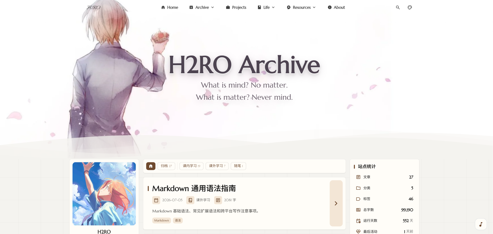

# H2RO Archive


[](https://nodejs.org/)
[](https://pnpm.io/)
[](https://astro.build/)
[](https://svelte.dev/)
[](https://www.typescriptlang.org/)
[](./LICENSE)

H2RO Archive 是一个基于 Astro 的个人公开成果档案站，用来归档学习、项目、生活中可以公开的 Markdown、PDF、项目记录和说明材料。

[**🖥️ 在线站点**](https://h2ro.cn/) / [**📚 维护文档**](./docs/README.md) / [**🌸 Mizuki 原项目**](https://github.com/LyraVoid/Mizuki)



## 🧾 项目说明

这个仓库由 [Mizuki](https://github.com/LyraVoid/Mizuki) 博客模板改造而来。Mizuki 提供了 Astro 静态站点、文章系统、归档页、搜索、RSS、特色页面、侧栏组件和 Markdown 增强能力；H2RO Archive 在此基础上重新整理了内容组织、视觉风格、分类 URL、PDF 归档流程和维护文档。

H2RO Archive 的方向不是通用博客模板，而是一个“公开档案”：

- 学习材料、课程报告、实验记录。
- 项目过程、复现笔记、工具链配置。
- 可公开的生活记录和说明页面。
- 原始 PDF 与网页预览并存的文档归档。

视觉上采用纸面、档案、审计、克制、可追踪的风格。

## ✨ 核心特性

- 基于 Astro 的静态站点，适合部署到 Vercel 等静态平台。
- Markdown / MDX 内容归档，统一放在 `src/content/posts/`。
- 分类 URL 规则固定为 `/%category%/%postname%/`。
- 分类入口集中在 `src/config/archiveCategories.ts`。
- PDF 文档使用 `docType: pdf`，支持原件下载和逐页 WebP 预览。
- 文章、项目、时间线、关于、友链、相册、设备、AI 工具等页面能力来自 Mizuki，并按 H2RO Archive 需求调整。
- 保留 Expressive Code、KaTeX、Mermaid、GitHub card、提示块等 Markdown 增强能力。
- 维护文档已整理为中文入口，内容、部署、组件规则分开记录。

## 🧰 技术栈

| 类型            | 技术                                     |
| --------------- | ---------------------------------------- |
| 框架            | Astro 7                                  |
| 交互组件        | Svelte 5                                 |
| 样式            | Tailwind CSS 4、Stylus、CSS 变量         |
| 内容            | Astro Content Collections、Markdown、MDX |
| 代码块          | Expressive Code                          |
| 搜索            | Pagefind                                 |
| 图标            | Iconify、astro-icon                      |
| 图片和 PDF 预览 | sharp、pdftocairo                        |
| 包管理          | pnpm 11.5.3                              |
| Node            | 22.15.x                                  |

## 📁 项目结构

```text
H2RO-Archive/
├── docs/                  # 中文维护文档
├── public/                # 静态资源、PDF 原件和预览工件
├── scripts/               # 本地脚本，如 PDF 预览生成
├── src/
│   ├── components/        # 组件
│   ├── config/            # 站点、导航、分类、侧栏等配置
│   ├── content/           # posts 和 spec 内容集合
│   ├── data/              # 特色页面结构化数据
│   ├── pages/             # Astro 路由
│   ├── plugins/           # Markdown / rehype / Expressive Code 插件
│   ├── styles/            # 全局样式和主题样式
│   └── utils/             # 工具函数
├── astro.config.mjs
├── package.json
└── README.md
```

## 📝 内容维护

普通文章和 PDF 文档都使用 `posts` 集合：

```text
src/content/posts/<slug>.md
```

推荐 frontmatter：

```yaml
---
title: 文章标题
published: 2026-01-01
description: 一句话说明这篇归档的内容。
tags: ["2026", 标签]
category: study
draft: false
lang: zh-CN
---
```

内容规则：

- `category` 使用 `src/config/archiveCategories.ts` 中的英文 slug。
- Markdown 表格、提示块、代码块和 frontmatter 字段必须使用本站支持的语法。
- 不要按其他编辑器或平台的习惯自造语法。
- 隐私和发布范围由维护者终审。

详细说明见 [内容维护规范](./docs/CONTENT_REPOSITORY.md)。

## 📄 PDF 归档

PDF 原件固定放在：

```text
public/artifacts/<slug>/original.pdf
```

然后在项目根目录执行：

```powershell
pnpm artifact <slug> "原始文件名.pdf"
```

脚本会生成：

```text
public/artifacts/<slug>/
├── original.pdf
├── manifest.json
└── preview/
    ├── p-01.webp
    ├── p-02.webp
    └── ...
```

PDF 预览只在本地生成，产物随内容一起提交；部署环境不负责运行 `pdftocairo`。

## 🛠️ 本地开发

项目固定版本：

- Node：`22.15.x`
- pnpm：`11.5.3`

进入克隆后的仓库目录：

```powershell
cd H2RO-Archive
```

安装依赖：

```powershell
pnpm install --frozen-lockfile
```

启动本地服务：

```powershell
pnpm dev --host 127.0.0.1
```

默认地址：

```text
http://127.0.0.1:3000/
```

## 📚 维护文档

主要入口：

- [文档中心](./docs/README.md)
- [内容维护规范](./docs/CONTENT_REPOSITORY.md)
- [部署维护指南](./docs/DEPLOYMENT.md)
- [开发规范索引](./docs/rule/README.md)
- [侧栏组件开发指南](./docs/rule/06-sidebar-widget-dev.md)
- [图标使用规范](./docs/rule/07-icon-usage-specification.md)

## 🙏 致谢

H2RO Archive 基于 [Mizuki](https://github.com/LyraVoid/Mizuki) 改造。感谢 Mizuki 提供的 Astro 博客骨架、页面体系、组件基础和 Markdown 增强能力。

Mizuki 本身基于 Fuwari，并吸收了多个优秀 Astro 博客模板的设计经验。H2RO Archive 保留这些基础能力，同时把内容组织和视觉表达调整为更适合个人公开档案的形态。
