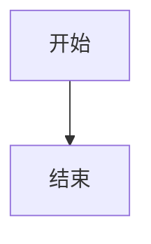

# H2RO Archive 内容维护规范

本文档记录当前 H2RO Archive 的内容组织方式。旧 Mizuki 模板支持独立内容仓库、submodule 和同步脚本，但当前维护主线不是那套流程；除非以后明确恢复内容分离，否则以下“当前规则”优先级最高。

## 当前规则

### 内容位置

- 普通 Markdown / MDX 文章放在 `src/content/posts/`。
- 特殊页面内容放在 `src/content/spec/`。
- PDF 原件和预览工件放在 `public/artifacts/<slug>/`。
- 分类配置只改 `src/config/archiveCategories.ts`。

文章文件名的 slug 应与内容主题稳定绑定。PDF 文章还要求文章 slug 与 `public/artifacts/<slug>/` 目录名一致。

### 分类规则

`src/config/archiveCategories.ts` 是分类的唯一权威入口。

```ts
export const archiveCategories = [
  {
    slug: "study",
    name: "课内学习",
    kicker: "01 / COURSE-STUDY",
    icon: "material-symbols:school",
  },
];
```

- `slug` 同时用于 frontmatter 的 `category` 和 URL 路径段。
- `name` 是页面显示中文名。
- `kicker` 用于纸墨档案风格的分类编号。
- `icon` 使用 Iconify 图标名。

新增或删除分类只改这张表，不要在组件里散落写死分类中文名。

### 固定链接

当前 `src/config/permalinkConfig.ts` 启用全局固定链接：

```ts
format: "%category%/%postname%"
```

因此一篇文章的公开路径通常是：

```text
/<category>/<post-slug>/
```

示例：

```text
/study/ai-introduction-lab/
```

当前已归档内容应使用 `archiveCategories` 中的英文 slug。发现旧模板分类或临时分类时，不要继续沿用，先归入现有分类或补充 `archiveCategories`。

## 普通文章

普通文章就是 `src/content/posts/<slug>.md` 或 `<slug>.mdx`。

推荐 frontmatter：

```yaml
---
title: 文章标题
published: 2026-01-01
description: 一句话说明这篇归档的内容。
tags: ["2026", 标签]
category: study
draft: false
lang: zh-CN
---
```

字段说明：

- `title`：页面标题。
- `published`：发布日期。
- `description`：摘要，列表页和 SEO 会用到。
- `tags`：标签数组。
- `category`：英文 slug，必须优先使用 `archiveCategories` 里的值。
- `draft`：草稿开关。
- `lang`：中文内容使用 `zh-CN`。

可选字段包括 `updated`、`image`、`pinned`、`comment`、`author`、`sourceLink`、`licenseName`、`licenseUrl`、`encrypted`、`password`、`passwordHint`、`permalink` 等。具体 schema 以 `src/content.config.ts` 为准。

## Markdown 写作语法约束

上传或新增 Markdown 时，必须按本站已经支持的语法写，不要按印象自造语法。拿不准时先参考现有文章，或把不确定点留给维护者确认。

### 表格

表格使用标准 Markdown 管道表格。表头、分隔行和每一行的数据列数必须一致，表格前后保留空行。

```markdown
| 项目 | 说明 |
|------|------|
| 分类 | 使用 `archiveCategories` 中的 slug |
| 路径 | `src/content/posts/<slug>.md` |
```

不要使用缩进模拟表格，也不要混用全角竖线、HTML 表格或未经确认的扩展写法。

### 提示块

提示块使用本站现有的 directive 写法：

```markdown
:::important[转换说明]
本文以原始 PDF 形式归档，网页仅保留文档预览与原文件下载。
:::
```

常用类型包括 `note`、`tip`、`important`、`warning`、`caution`。当前代码兼容 GitHub alert 风格的 `> [!NOTE]`，但本站归档内容统一优先使用上面的 directive 写法；不要使用 `!!! note` 或其他未验证格式。

### 代码块和 Mermaid

代码块使用三个反引号，并写真实语言标识：

````markdown
```ts
export const slug = "study";
```
````

PowerShell 示例用 `powershell`，Shell 示例用 `bash`，Astro 文件用 `astro`。如果确实需要 Mermaid，使用 fenced code block：

````markdown

````

不要使用随手编的语言名，也不要把 Mermaid、SVG 或 HTML 当作普通 Markdown 混进去。

### Frontmatter 和资源

- frontmatter 必须符合 `src/content.config.ts`，不要添加代码没有使用的“看起来有用”的字段。
- 图片优先使用普通 Markdown 图片语法或现有文章已经采用的资源组织方式。
- PDF 归档不要在正文里手写 PDF 嵌入，使用 `docType: pdf` 和 `public/artifacts/<slug>/` 工件流程。
- 原始 HTML 只在现有文章或组件已经验证支持时使用。

## PDF 文档归档

PDF 文档也是一篇 post，只是 frontmatter 增加：

```yaml
docType: pdf
```

推荐文章文件：

```yaml
---
title: 人工智能导论上机实验
published: 2025-12-01
description: 人工智能导论课程上机实验归档，围绕十五数码问题求解算法及性能比较展开。
tags: ["2025", 大三上, AI, 深度学习, C++]
category: study
draft: false
lang: zh-CN
docType: pdf
---

:::important[转换说明]
本文以原始 PDF 形式归档，网页仅保留文档预览与原文件下载。
:::
```

### PDF 目录结构

以 slug `ai-introduction-lab` 为例：

```text
src/content/posts/ai-introduction-lab.md
public/artifacts/ai-introduction-lab/
├── original.pdf
├── manifest.json
└── preview/
    ├── p-01.webp
    ├── p-02.webp
    └── ...
```

约束：

- `src/content/posts/<slug>.md` 的 `<slug>` 必须等于 `public/artifacts/<slug>/`。
- 原始 PDF 固定命名为 `original.pdf`。
- 预览图固定命名为 `preview/p-NN.webp`。
- `manifest.json` 记录页数、大小和来源文件名。

### 生成 PDF 预览

先把 PDF 放到：

```text
public/artifacts/<slug>/original.pdf
```

然后在 Astro 项目根目录执行：

```powershell
pnpm artifact <slug> "原始文件名.pdf"
```

脚本会：

- 用 `pdftocairo` 把 PDF 逐页渲染为临时 PNG。
- 用 `sharp` 转为 `preview/p-NN.webp`。
- 写入 `manifest.json`。
- 清理旧预览，避免页数残留。

依赖说明：

- `sharp` 已在项目依赖中。
- `pdftocairo` 需要本机环境提供，通常来自 TeX Live 或 Poppler。
- 预览转换只在本地跑；CI / Vercel 不负责生成 PDF 预览。

Windows 下如果临时 `raw-*.png` 因文件占用未能删除，等文件释放后手动清理 `public/artifacts/<slug>/preview/raw-*.png` 即可。

### 提交范围

一篇 PDF 归档通常需要一起提交：

- `src/content/posts/<slug>.md`
- `public/artifacts/<slug>/original.pdf`
- `public/artifacts/<slug>/manifest.json`
- `public/artifacts/<slug>/preview/p-NN.webp`

隐私和发布范围由维护者终审。文档流程只说明结构，不替代内容审查。

## 新增内容检查清单

- [ ] 文件放在 `src/content/posts/`。
- [ ] `category` 使用 `archiveCategories` 中的英文 slug。
- [ ] 页面 URL 符合 `/<category>/<post-slug>/`。
- [ ] PDF 文章设置 `docType: pdf`。
- [ ] PDF 目录名与文章 slug 一致。
- [ ] PDF 已生成 `manifest.json` 和 `preview/p-NN.webp`。
- [ ] Markdown 表格、提示块、代码块等语法已按本站支持格式检查，没有自造语法。
- [ ] 大文件、隐私内容、原件发布范围已由维护者确认。
- [ ] 不需要为新增内容修改组件逻辑。
- [ ] 不跑 `pnpm build`，除非维护者明确要求。

## 常用路径

| 用途 | 路径 |
|------|------|
| 文章集合 | `src/content/posts/` |
| 特殊页面集合 | `src/content/spec/` |
| 内容 schema | `src/content.config.ts` |
| 分类配置 | `src/config/archiveCategories.ts` |
| 固定链接配置 | `src/config/permalinkConfig.ts` |
| PDF 预览组件 | `src/components/features/artifacts/PdfPreview.astro` |
| PDF 工件目录 | `public/artifacts/<slug>/` |
| PDF 预览脚本 | `scripts/build-artifact.mjs` |
