### 第一章

#### 必做作业

> *解释下列术语*

- **编译程序**：编译程序是一种翻译程序，它将用高级语言（如 C 或 Java）书写的源程序转换为低级语言（如汇编语言或机器语言）的等价程序。这种转换过程称为编译，生成的程序可以直接在目标机器上执行，而编译和执行是两个独立的阶段。
- **源程序**：源程序是用源语言（如高级语言或汇编语言）编写的程序文本，它需要经过编译程序的翻译才能被计算机执行。
- **目标程序**：目标程序是用目标语言（如机器语言或汇编语言）书写的程序，由源程序经编译程序翻译生成，可直接在计算机上运行。
- **编译程序的前端**：前端是编译程序的分析阶段，主要依赖于源语言而与目标机器无关，包括词法分析、语法分析、语义分析以及中间代码生成等阶段，其目的是分析源程序的结构和含义，并生成中间表示形式。
- **编译程序的后端**：后端是编译程序的综合阶段，主要依赖于目标机器而与源语言无关，包括中间代码优化和目标代码生成等阶段，其目的是根据中间代码生成高效的目标机器代码。
- **遍**：遍是指对源程序或其等价的中间形式从头到尾扫描一遍，并完成规定任务（如加工处理生成新的中间形式或目标程序）的过程。一个编译过程可能由一遍、多遍组成，多遍编译有助于减少内存占用、简化结构并便于优化。


> *编译程序有哪些主要构成成分？各自的主要功能是什么？*

编译程序的主要构成成分通常分为前端和后端，具体包括以下几个核心部分：

| 成分          | 主要功能                                                                 |
|---------------|--------------------------------------------------------------------------|
| **词法分析** | 从源程序的字符流中扫描并识别单词符号（如关键字、标识符、运算符），生成记号流（token 序列），并跳过注释和空白，同时处理词法错误。 |
| **语法分析** | 根据源语言的语法规则（如上下文无关文法）检查记号流是否构成正确的语法结构，构建抽象语法树（AST），并报告语法错误。 |
| **语义分析** | 对语法正确的结构进行上下文相关审查，包括类型检查、作用域检查、符号表管理（如变量是否定义），收集类型信息并报告语义错误。 |
| **中间代码生成** | 根据语义分析结果，将抽象语法树转换为平台无关的中间代码（如三地址码），为后续优化和代码生成提供基础。 |
| **代码优化** | 对中间代码进行优化（如消除冗余计算、循环优化），提高目标程序的执行效率和资源利用率，可分为机器无关优化和机器相关优化。 |
| **目标代码生成** | 将优化后的中间代码转换为特定目标机器的汇编或机器代码，并处理符号表和错误，确保代码可直接执行。 |
这些成分共同完成从源程序到目标程序的翻译过程，表格管理和错误处理贯穿全程。


> *什么是解释程序？它与编译程序的主要不同是什么？*

**解释程序**：解释程序是一种计算机程序，它接受源程序作为输入，一条一条地读取、分析并立即执行源程序的语句，而不生成独立的中间文件或目标代码。它的工作模式是边解释边执行，特别适合交互式开发环境（如脚本语言），允许用户在执行过程中实时查看结果或修改程序。

**与编译程序的主要不同**：
- **执行方式**：编译程序先将整个源程序一次性翻译成目标代码，然后独立执行；解释程序则在运行时逐条解释和执行源代码，无需预先生成可执行文件。
- **效率**：编译程序执行速度更快，因为目标代码优化后可直接运行；解释程序效率较低，因为每次运行都需要重新解释代码。
- **灵活性与调试**：解释程序更灵活，便于调试和跨平台（如 JavaScript），源代码修改后立即生效；编译程序调试较复杂，但生成的程序更独立。
- **适用场景**：编译程序适合性能敏感的应用（如 C 语言）；解释程序适合快速原型开发（如 Python）。


> *对下列错误信息，请指出可能是编译的哪个阶段（词法分析、语法分析、语义分析、代码生成）报告的。*

1. **else 没有匹配的 if**：语法分析阶段。该错误涉及 if-else 语句的结构匹配，语法分析器在构建抽象语法树时检查语法规则（如括号或语句配对），发现 else 缺少对应的 if 时报告。

2. **数组下标越界**：代码生成阶段。该错误通常在运行时检测，但若为静态检查（如常量表达式），可能在代码生成时通过边界分析报告；编译期一般不严格检查动态下标。

3. **使用的函数没有定义**：语义分析阶段。该错误涉及符号表检查和作用域审查，语义分析器验证函数调用时是否在符号表中找到定义，否则报告未声明错误。

4. **在数中出现非数字字符**：词法分析阶段。该错误发生在扫描字符流时，词法分析器试图识别数字常量，但遇到非数字字符（如字母）时，无法形成有效 token 而报告。

---
### 第二章

#### 课后练习

> *试设计一文法 G，使得 L(G) 为能被 5 整除的整数集。*

由题目易知 $L(G)$ 中整数均以 0 或 5 结尾。这是一个正规语言，因此可以用上下文无关文法描述。该文法生成的语言 $L(G)$ 是**所有能被 5 整除的整数集合**，通过规定个位数字必须为 0 或 5 来保证其能被 5 整除，需要注意的有数字的十进制表示没有前导零、整数有正有负。

令文法 $G = (V_N, V_T, P, S)$，其中：

- **非终结符集** $V_N = \{S, Sign, A, B, N, D\}$

- **终结符集** $V_T = \{0, 1, 2, 3, 4, 5, 6, 7, 8, 9, -\}$

- **开始符号** $S$

- **产生式集** $P$ 如下：
	$S → SignA 0 ∣ SignA 5$
	$𝑆𝑖𝑔𝑛→𝜀 ∣ −$
	$𝐴→𝜀∣𝐵$
	$𝐵→𝑁∣𝐵𝐷$
	$𝑁→1∣2∣3∣4∣5∣6∣7∣8∣9$
	$𝐷→0∣1∣2∣3∣4∣5∣6∣7∣8∣9$


> *试设计一文法 G，该文法的生成语言为无符号整数和浮点数。*

由题目要求，我们需要设计一个文法 $G$，使得 $L(G)$ 为**无符号整数和浮点数的集合**。根据常见定义，无符号整数是数字序列（无前导零），浮点数包含整数部分、可选的小数部分和可选的指数部分。

令文法 $G = (V_N, V_T, P, S)$，其中：

- **非终结符集** $V_N = \{S, Int, Float, Sign, Digits, Digit, NonZeroDigit, FracPart, ExpPart, Exponent, OptSign\}$
- **终结符集** $V_T = \{0, 1, 2, 3, 4, 5, 6, 7, 8, 9, ., e, E, +, -\}$

- **开始符号** $S$

- **产生式集** $P$ 如下：
	$𝑆 → 𝐼𝑛𝑡 ∣ 𝐹𝑙𝑜𝑎𝑡$
	$𝐼𝑛𝑡 → 𝑁𝑜𝑛𝑍𝑒𝑟𝑜𝐷𝑖𝑔𝑖𝑡 ∣ 𝑁𝑜𝑛𝑍𝑒𝑟𝑜𝐷𝑖𝑔𝑖𝑡 \ 𝐷𝑖𝑔𝑖𝑡𝑠 ∣ 0$
	$𝐹𝑙𝑜𝑎𝑡 → 𝐼𝑛𝑡 \ 𝐹𝑟𝑎𝑐𝑃𝑎𝑟𝑡 ∣ 𝐼𝑛𝑡 \ 𝐹𝑟𝑎𝑐𝑃𝑎𝑟𝑡 \ 𝐸𝑥𝑝𝑃𝑎𝑟𝑡 ∣ 𝐼𝑛𝑡 \ 𝐸𝑥𝑝𝑃𝑎𝑟𝑡$
	$𝐹𝑟𝑎𝑐𝑃𝑎𝑟𝑡 → . \ 𝐷𝑖𝑔𝑖𝑡𝑠$
	$𝐸𝑥𝑝𝑃𝑎𝑟𝑡 → 𝐸𝑥𝑝𝑜𝑛𝑒𝑛𝑡 \ 𝑂𝑝𝑡𝑆𝑖𝑔𝑛 \ 𝐷𝑖𝑔𝑖𝑡𝑠$
	$𝐸𝑥𝑝𝑜𝑛𝑒𝑛𝑡 → e$
	$𝑂𝑝𝑡𝑆𝑖𝑔𝑛 → 𝜀 ∣ + ∣ -$
	$𝐷𝑖𝑔𝑖𝑡𝑠 → 𝐷𝑖𝑔𝑖𝑡 ∣ 𝐷𝑖𝑔𝑖𝑡𝑠 \ 𝐷𝑖𝑔𝑖𝑡$
	$𝐷𝑖𝑔𝑖𝑡 → 0 ∣ 𝑁𝑜𝑛𝑍𝑒𝑟𝑜𝐷𝑖𝑔𝑖𝑡$
	$𝑁𝑜𝑛𝑍𝑒𝑟𝑜𝐷𝑖𝑔𝑖𝑡 → 1 ∣ 2 ∣ 3 ∣ 4 ∣ 5 ∣ 6 ∣ 7 ∣ 8 ∣ 9$


> *试设计一文法 G，该文法的生成语言为标识符。*

根据程序设计语言中标识符的常见定义，标识符通常以字母或下划线开头，后跟字母、数字或下划线的序列。

令文法 $G = (V_N, V_T, P, S)$，其中：

- **非终结符集** $V_N = \{S, Identifier, FirstChar, RestChars, Char\}$
    
- **终结符集** $V_T = \{a, b, c, ..., z, A, B, C, ..., Z, 0, 1, 2, ..., 9, \_ \}$
    
- **开始符号** $S$
    
- **产生式集** $P$ 如下：
	$𝑆  → 𝐹𝑖𝑟𝑠𝑡𝐶ℎ𝑎𝑟 ∣ 𝐹𝑖𝑟𝑠𝑡𝐶ℎ𝑎𝑟 \ 𝑅𝑒𝑠𝑡𝐶ℎ𝑎𝑟𝑠$
	$𝐹𝑖𝑟𝑠𝑡𝐶ℎ𝑎𝑟 → a ∣ b ∣ c ∣ ... ∣ z ∣ A ∣ B ∣ C ∣ ... ∣ Z \mid \_$
	$𝑅𝑒𝑠𝑡𝐶ℎ𝑎𝑟𝑠 → 𝐶ℎ𝑎𝑟 ∣ 𝑅𝑒𝑠𝑡𝐶ℎ𝑎𝑟𝑠 \ 𝐶ℎ𝑎𝑟$
	$𝐶ℎ𝑎𝑟 → 𝐹𝑖𝑟𝑠𝑡𝐶ℎ𝑎𝑟 ∣ 0 ∣ 1 ∣ 2 ∣ ... ∣ 9$


#### 必做作业

> 文法 $G=(\{A, B, S\},\{a, b, c\}, P, S)$，其中 𝑃 为
   $𝑆→𝐴𝑐∣𝑎𝐵$
   $A→ab$
   $B→bc$
   写出 𝐿(𝐺[𝑆]) 的全部元素。

从 $S$ 出发进行推导：

1. 选择 $S→Ac$：  
    $A→ab$ 
    所以 $S⇒Ac⇒abc$
    
2. 选择 $S→aB$：  
    $B→bc$ 
    所以 $S⇒aB⇒abc$

综上可见答案就是 $abc$。


> 证明文法 $G=(\{E,O\},\{(,),+,∗,v,d\},P,E)$ 是二义的，其中 $P$ 为
   $E→EOE∣(E)∣v∣d$
   $O→+∣∗$

考虑句子：$v+v∗v$

第一种最左推导（先算 ∗）的语法树结构：
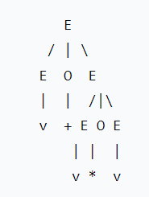

第二种最左推导（先算 +）：
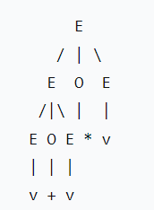

两棵语法树不同，因此文法是二义的。


> 一个上下文无关文法生成句子 $abbaa$ 的唯一语法书如下：
> 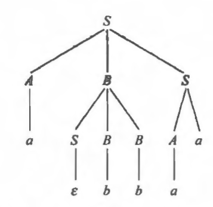
> （1）给出该句子相应的最左推导和最右推导；
> （2）该文法的产生式集合 $P$ 可能有哪些元素；
> （3）找出该句子所有的短语、简单短语和句柄；

（1）最左推导为：
```css
S
⇒ A B S                    (用 S → A B S)
⇒ a B S                    (用 A → a)
⇒ a (S B B) S              (用 B → S B B)
⇒ a (ε B B) S              (用该 B 下的 S → ε)
⇒ a B B S                  (去掉 ε)
⇒ a b B S                  (用左侧 B → b)
⇒ a b b S                  (用右侧 B → b)
⇒ a b b A a                (用 S → A a)
⇒ a b b a a                (用 A → a)
```

最右推导为：
```css
S
⇒ A B S                   (用 S → A B S)
⇒ A B A a                 (用右侧 S → A a)
⇒ A B a a                 (用该 A → a)
⇒ A (S B B) a a           (用 B → S B B)
⇒ A (S B b) a a           (用最右的 B → b)
⇒ A (S b b) a a           (用另一个 B → b)
⇒ A b b a a               (用 S → ε)
⇒ a b b a a               (用最左的 A → a)
```


（2）由树可以直接读出一组满足该树的产生式：

```css
S → A B S
S → A a
S → ε
B → S B B
B → b
A → a
```

说明：
- 根的三叉分裂对应 `S → A B S`；
- 右侧 `S` 有两个孩子 `A` 和终结符 `a`，对应 `S → A a`；
- 图中中间 `B` 的左子 `S` 生成了空串，所以需要 `S → ε`；
- 中间 `B` 内两个子 `B` 生成 `b`，所以 `B → b`；而该中间 `B` 本身展开为 `S B B`，因此 `B → S B B`；
- `A` 直接生成终结符 `a`，所以 `A → a`。


（3）
（a）所有短语（按树中的非终结符列出其所派生的终结符串），根据图中每个非终结符节点及其叶子得出：
```css
S ⇒ abbaa
A ⇒ a    (左侧)
B ⇒ bb
B ⇒ b    (两个不同的 B)
S ⇒ ε    (中间那个 S)
S ⇒ aa   (右侧 S)
A ⇒ a    (右侧 S 下的 A)
```

（b）简单短语
```css
A (左) ⇒ a 
B ⇒ b 
S ⇒ ε
A (右) ⇒ a
```

（c）句柄的标准定义：在从起始符号经若干步**最右推导**得到终结串的过程中，逆向回退时每一步要规约（替换）的字串就是句柄。把上面第 (1) 节的**最右推导**倒过来（即从句子 `abbaa` 归约回 `S`），可以找出各步被规约的子串（即句柄序列）。

我们用在 (1) 中得到的最右推导的逆序来列句柄（从完整句子开始，先规约的最右可规约串），把上面步骤逆转，从句子 `abbaa` 开始的规约（每一步规约的被替换子串即为句柄）为：

- `a₅`（规约为 `A`，对应产生式 `A → a`）
- `b₃`（规约为 `B`，对应 `B → b`）
- `b₂`（规约为 `B`，对应 `B → b`）
- `ε`（中间那个空，规约为 `S`，对应 `S → ε`）
- `S B B`（规约为中间 `B`，对应 `B → S B B`）
- `A a`（规约为右侧 `S`，对应 `S → A a`）
- `A B S`（覆盖整句，规约为根 `S`，对应 `S → A B S`）


> 构造产生如下语言的上下文无关文法各一个：
> (2) $\{a^m\ b^n∣m≥n≥0\}$
> (5) $\{a^n\ b^m∣n≥0,m≥0,且3n≥m≥2n\}$
> (6) $\{ww^R∣w∈\{a,b\}^∗\}$

(2) 先产生 $a^n\ b^n$（数量相等的 $a$ 和 $b$），然后在前面添加额外的 $a$。设开始符号为 $S$，可得出文法：
	$S→aS∣A$
	$A→aAb∣ε$

(5) 首先生成 $a^nX^n$，然后每个 $X$ 可以变成 $bb$ 或 $bbb$。设开始符号为 $S$，可得出文法：
	$S→aSX∣ε$
	$X→bb∣bbb$

(6) 这是经典的回文串，即两个相同部分的反向连接，$ww^R$ 就是长度为偶数的回文串（中心对称）。设开始符号为 $S$，可得出文法：$$S→aSa∣bSb∣ε$$

> 给出生成下述语言的一个3型文法：  $\{a^nb^m∣n,m≥1\}$

$L$ 的要求是至少一个 $a$ 后跟至少一个 $b$。**3 型文法**分为左线性和右线性，这里我采用右线性：$A→wB$ 或 $A→w$，其中 $w$ 是终结符串。由此设计非终结符：

- $S$：开始符号，生成第一个 $a$ 并进入 $A$
- $A$：继续生成 $a$ 或生成第一个 $b$ 并进入 $B$
- $B$：继续生成 $b$ 或结束

产生式如下：
	$S→aA$
	$A→aA∣B$
	$B→bB∣b​$

---
### 第三章

#### 必做作业

> 构造下列正规式相应的 DFA：$1(0|1)^*101$

这个正则式表示“以 1 开头且以后缀 101 结束的二进制串”。我们用一个状态机来跟踪当前读入串的最长后缀，该后缀同时是模式 101 的前缀，并单独保留起始前缀检查（防止以 0 开头）。

状态集与含义：
- $q_0​$：起始状态（还未读入第一个字符）。
- $dead$：陷阱态（如果第一位读到  0 ，直接进入，永不接受）。
- $s_0$ ​：当前最长匹配为空串（即最近的后缀不是 1，也不是 10）。
- $s_1$ ​：当前最长匹配为 1（后缀是 1，即已匹配 1 的前缀）。
- $s_2$ ​：当前最长匹配为 10（后缀是 10）。
- $s_3$ ​：当前最长匹配为 101（后缀是 101）—— 接受态。

起始态：$q_0$。  
接受态：$\{s_3\}$。
字母表：$\{0,1\}$。

 转移函数:

| 输入     | 0      | 1      |
| ------ | ------ | ------ |
| $q_0$  | `dead` | $s_1$  |
| $dead$ | `dead` | $dead$ |
| $s_0$  | $s_0$  | $s_1$  |
| $s_1$  | $s_2$  | $s_1$  |
| $s_2$  | $s_0$  | $s_3$  |
| $s_3$  | $s_2$  | $s_1$  |

由此画出状态图：
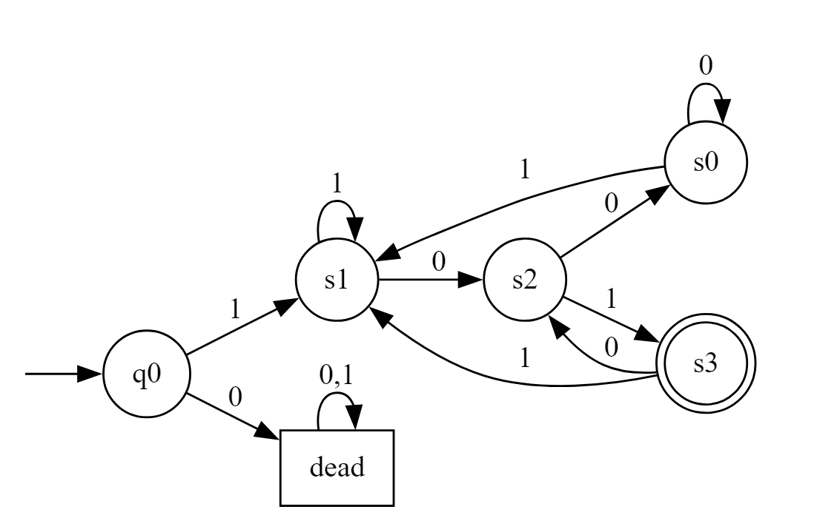


> 将下图的 NFA 确定化：
> 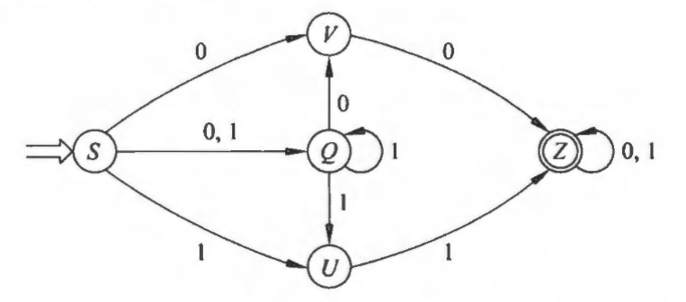

起始子集：${S}$。按发现顺序计算每个子集在 $0$ 和 $1$ 下的像：

1. 状态 $A={S}$
    
    - on $0$: $\delta({S},0)=\delta(S,0)={V,Q} \equiv B$
        
    - on $1$: $\delta({S},1)=\delta(S,1)={Q,U} \equiv C$
        
2. 状态 $B={Q,V}$
    
    - on $0$: $\delta({Q,V},0)=\delta(Q,0)\cup\delta(V,0)={V}\cup{Z}={V,Z}\equiv F$
        
    - on $1$: $\delta({Q,V},1)=\delta(Q,1)\cup\delta(V,1)={Q,U}\cup\varnothing={Q,U}\equiv C$
        
3. 状态 $C={Q,U}$
    
    - on $0$: $\delta({Q,U},0)=\delta(Q,0)\cup\delta(U,0)={V}\cup\varnothing={V}\equiv D$
        
    - on $1$: $\delta({Q,U},1)=\delta(Q,1)\cup\delta(U,1)={Q,U}\cup{Z}={Q,U,Z}\equiv G$
        
4. 状态 $F={V,Z}$（新）
    
    - on $0$: $\delta({V,Z},0)=\delta(V,0)\cup\delta(Z,0)={Z}\cup{Z}={Z}\equiv E$
        
    - on $1$: $\delta({V,Z},1)=\delta(V,1)\cup\delta(Z,1)=\varnothing\cup{Z}={Z}\equiv E$
        
5. 状态 $D={V}$（新）
    
    - on $0$: $\delta({V},0)={Z}\equiv E$
        
    - on $1$: $\delta({V},1)=\varnothing\equiv \varnothing$（空集，死态）
        
6. 状态 $G={Q,U,Z}$（新）
    
    - on $0$: $\delta({Q,U,Z},0)=\delta(Q,0)\cup\delta(U,0)\cup\delta(Z,0)={V}\cup\varnothing\cup{Z}={V,Z}\equiv F$
        
    - on $1$: $\delta({Q,U,Z},1)=\delta(Q,1)\cup\delta(U,1)\cup\delta(Z,1)={Q,U}\cup{Z}\cup{Z}={Q,U,Z}\equiv G$（自环）
        
7. 状态 $E={Z}$（新，包含终态）
    
    - on $0$: $\delta({Z},0)={Z}\equiv E$
        
    - on $1$: $\delta({Z},1)={Z}\equiv E$
        
8. 死态 $\varnothing$
    
    - on $0$: $\varnothing$
        
    - on $1$: $\varnothing$ 

整理成转移表：

| 状态            | on $0$        | on $1$        |
| ------------- | ------------- | ------------- |
| $A=\{S\}$     | $B$           | $C$           |
| $B=\{Q,V\}$   | $F$           | $C$           |
| $C=\{Q,U\}$   | $D$           | $G$           |
| $D=\{V\}$     | $E$           | $\varnothing$ |
| $E=\{Z\}$     | $E$           | $E$           |
| $F=\{V,Z\}$   | $E$           | $E$           |
| $G=\{Q,U,Z\}$ | $F$           | $G$           |
| $\varnothing$ | $\varnothing$ | $\varnothing$ |

其中起始态为 $A$，接受态为包含 $Z$ 的子集 $\{E,F,G\}$。状态图如下：
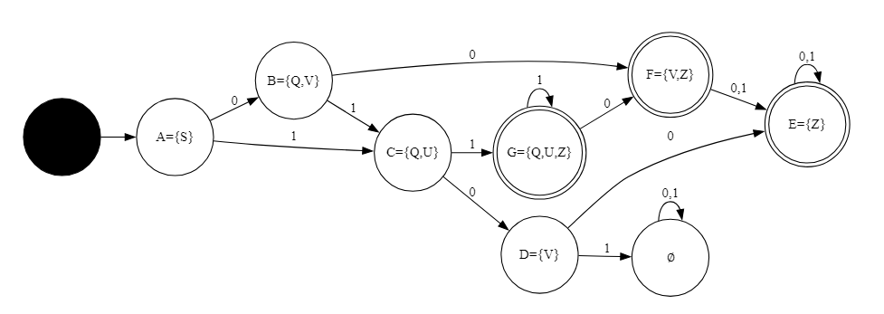


> 为正规文法 G[S]构造相应的最小 DFA。
> 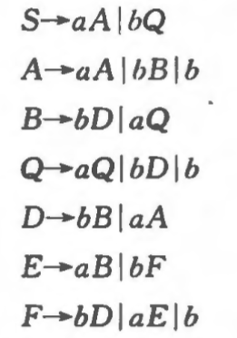

把每个非终结符看作 NFA 的状态，由产生式得到的 NFA 如下（只列出有用的转换）：
-  $S \xrightarrow{a} A,\quad S \xrightarrow{b} Q$
-  $A \xrightarrow{a} A,\quad A \xrightarrow{b} B,\quad A \xrightarrow{b} Z$
-  $B \xrightarrow{a} Q,\quad B \xrightarrow{b} D$
-  $Q \xrightarrow{a} Q,\quad Q \xrightarrow{b} D,\quad Q \xrightarrow{b} Z$
-  $D \xrightarrow{a} A,\quad D \xrightarrow{b} B$
-  $E \xrightarrow{a} B,\quad E \xrightarrow{b} F$
-  $F \xrightarrow{a} E,\quad F \xrightarrow{b} D,\quad F \xrightarrow{b} Z$

对子集构造（NFA 的幂集）得到的可达 DFA 状态（用原 NFA 状态子集表示）只有 7 个可达子集：$\{S\},\{A\},\{B\},\{D\},\{Q\},\{B,Z\},\{D,Z\}$。其中包含 $Z$ 的子集（$\{B,Z\},\{D,Z\}$）是接受子集。该 DFA 的部分转移为：

|    状态     | on ${a}$ | on ${b}$  |
| :-------: | :------: | :-------: |
|  $\{S\}$  | $\{A\}$  |  $\{Q\}$  |
|  $\{A\}$  | $\{A\}$  | $\{B,Z\}$ |
|  $\{Q\}$  | $\{Q\}$  |  ${D,Z}$  |
|  $\{B\}$  | $\{Q\}$  |  $\{D\}$  |
|  $\{D\}$  | $\{A\}$  |  $\{B\}$  |
| $\{B,Z\}$ | $\{Q\}$  |  $\{D\}$  |
| $\{D,Z\}$ | $\{A\}$  |  $\{B\}$  |

用同态划分把上面的 DFA 合并（等价类）为 4 个状态。为清楚说明，给每个等价类起名字：
-  $X = \{S\}$  
-  $Y = \{A,Q\}$  
-  $R = \{B,D\}$  
-  $F = \{\{B,Z\},\{D,Z\}\}$

最小化 DFA 转移表如下：

| 状态  | on ${a}$ | on ${b}$ |
| --- | -------- | -------- |
| $X$ | $Y$      | $Y$      |
| $Y$ | $Y$      | $F$      |
| $R$ | $Y$      | $R$      |
| $F$ | $Y$      | $R$      |

对应状态图为：
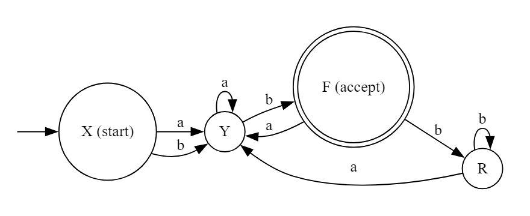


> 有一种用以证明两个正规表达式等价的方法，那就是构造它们的最小 DFA，表明这两个 DFA 是一样的（除了状态名不同外）。使用此方法。证明下面的正规表达式是等价的。  
   (1) $(a\mid b)^*$  
   (2) $(a^* \mid b^*)^*$

对 $(a\mid b)^*$ 进行最小化 DFA 构造：只有一个状态 $q_0$，对 $a$ 和 $b$ 都有自环，且 $q_0$ 同时是初态和接受态，即 $q_0 \xrightarrow{a} q_0,\quad q_0 \xrightarrow{b} q_0$ 。

对 $(a\mid b)^*$，按 Thompson 构造可得 NFA 仅含一状态 $q_0$，该状态既为初态又为终态，且有 $q_0\xrightarrow{a}q_0$、$q_0\xrightarrow{b}q_0$。该自动机显然接受 $\Sigma^*$。经子集构造得到的 DFA 仍只含一状态，对 $a,b$ 均自环，为接受态，故已为最小 DFA。

对 $(a^* \mid b^*)^*$，构造其 NFA。设状态集合 $\{s,p,A,B,q,\}$，其中 $s$ 为初态，$f$ 为终态。其转换如下：  $$s\xrightarrow{\varepsilon}p,\ s\xrightarrow{\varepsilon}f;\ p\xrightarrow{\varepsilon}A,\ p\xrightarrow{\varepsilon}B;\ A\xrightarrow{a}A,\ A\xrightarrow{\varepsilon}q;\ B\xrightarrow{b}B,\ B\xrightarrow{\varepsilon}q;\ q\xrightarrow{\varepsilon}p,\ q\xrightarrow{\varepsilon}f.$$ 由此可得 $\mathrm{EpsClosure}({s})=\{s,p,A,B,q,f\}$。对符号 $a$，从 $A$ 出发有 $A\xrightarrow{a}A$，其闭包仍为全体状态集合；对 $b$ 亦同。于是对任意输入符号 $x\in\{a,b\}$，有 $\mathrm{Move}(\{s,p,A,B,q,f\},x)$ 的闭包仍为 $\{s,p,A,B,q,f\}$。故经子集构造所得 DFA 仅含单一状态 $S_0=\{s,p,A,B,q,f\}$，其上对 $a,b$ 均为自环且为接受态。

因此， $(a\mid b)^*$ 和  $(a^* \mid b^*)^*$ 的最小 DFA 完全同构：均为单一接受状态，对 $a,b$ 自环。由最小 DFA 的唯一性定理，二者所表示的语言相同。


> 有如下 lex 描述文件的识别规则部分，请指出输入特定串后输出是什么。
> %%
> [0-9A-Fa-f]+H     { printf("Number "); }
> [A-Za-z][A-Za-z0-9]*    { printf("Identifier "); }
> "LET"    { printf("Keyword "); }
> "="      { printf("Operator "); }
> .        { }
> %%

在 Lex（词法分析器）中，匹配遵循**最长匹配优先**与**规则顺序优先**原则：

1. 对输入字符串，Lex 总是尝试匹配最长的可能子串；
2. 若长度相同，则按规则出现的顺序决定优先级（上在前的优先）。

规则解释如下：

| 正则表达式                  | 匹配内容                           | 动作              |
| ---------------------- | ------------------------------ | --------------- |
| `[0-9A-Fa-f]+H`        | 一串十六进制数字后接一个 `H`（如 `3AH`、`0H`） | 输出 `Number`     |
| `[A-Za-z][A-Za-z0-9]*` | 标识符（字母开头，后可跟数字或字母）             | 输出 `Identifier` |
| `"LET"`                | 关键字 LET                        | 输出 `Keyword`    |
| `"="`                  | 等号                             | 输出 `Operator`   |
| `.`                    | 其他任意单字符                        | 无动作（忽略）         |
由此可得该 lex 程序可识别十六进制常量（以 H 结尾）、关键字 LET、一般标识符、运算符 “=”。例如若输入 `3AH LET X1 = 5FH`，输出结果为 `Number Keyword Identifier Operator Number`。

---
### 第四章

#### 必做作业

> 对于文法 G[S]：$S​→a∣Λ∣(T)$, $T​→T\ S∣S$
> (1) 给出 $(a,(a,a))$ 和 $\bigl(((a,a),\Lambda,(a)),a\bigr)$ 的最左推导。  
> (2) 对文法 G 进行改写，然后对每个非终结符写出不带回溯的递归子程序。  
> (3) 改写后的文法是否为 LL(1)？给出其预测分析表。  
> (4) 给出输入串 (a,a)# 的分析过程，并说明该串是否为 G 的句子。

**(1) 最左推导**

（i） 对 $((a,(a,a)))$ 的最左推导：  

$S \Rightarrow (T)$
$\Rightarrow (T , S)\quad(\text{用 }T\to T,S)$
$\Rightarrow (S , S)$
$\Rightarrow (a , S)$
$\Rightarrow (a , (T))$
$\Rightarrow (a , (T , S))$
$\Rightarrow (a , (S , S))$
$\Rightarrow (a , (a , a))$


（ii） 对 $(\displaystyle \bigl(((a,a),\Lambda,(a)),a\bigr))$的最左推导：  
 
$S \Rightarrow (T)$
$\Rightarrow \bigl(T, S\bigr)$
$\Rightarrow \bigl(T, a\bigr)$
$\Rightarrow \bigl(T_1, a\bigr)\quad(T_1\text{ 表示第一个子 }T)$
$\Rightarrow \bigl(T_1^1, S, a\bigr)\quad(\text{展开 }T_1\to T_1^1,S)$
$\Rightarrow \bigl((S,S),; \Lambda,; (S),; a\bigr)$
$\Rightarrow \bigl(((a,a),\Lambda,(a)),a\bigr)$


**(2) 改写文法与不回溯的递归子程序（递归下降格式）**

为消除左递归并便于写预测分析程序，对 $T$ 做标准改写，改写后的文法如下：
	$S \to a \mid \Lambda \mid (T)$
	$T \to S; T'$
	$T'\to ;,; S; T' \mid \Lambda$

对应的不带回溯的递归下降子程序（伪代码，终结符直接匹配；$\texttt{lookahead}$ 表示当前输入符）：

```text
procedure S():
    if lookahead = 'a' then
        match('a')
    else if lookahead = '(' then
        match('('); T(); match(')')
    else
        /* S -> ε: do nothing */

procedure T():
    S()
    Tprime()

procedure Tprime():
    if lookahead = ',' then
        match(',')
        S()
        Tprime()
    else
        /* T' -> ε: do nothing */
```

其中 `match(x)` 消耗并校验当前输入符为 `x`；若不匹配则报错。该组子程序对所有产生式均为预测驱动，无回溯。


**(3) 是否为 LL(1) 及预测分析表**

先列出 FIRST 与 FOLLOW（仅列出用于表格所需项）：

- 终结符集 $\Sigma=\{a,',','(',')'\}$，用 $ 表示输入结束符。
    
- $\mathrm{FIRST}(S)=\{a,; '(', ;\Lambda\}$
    
- $\mathrm{FIRST}(T)=\mathrm{FIRST}(S)=\{a,; '(', ;\Lambda\}$
    
- $\mathrm{FIRST}(T')=\{',',;\Lambda\}$
    
- $\mathrm{FOLLOW}(S)=\{',',')',\$\}$ （S 可以出现在列表项后面或作为起始符号）。
    
- $\mathrm{FOLLOW}(T)=\{')'\}$
    
- $\mathrm{FOLLOW}(T')=\{')'\}$
    

由此构造预测分析表（非终结符为行，终结符为列；每格写用到的产生式）：

|        | $a$         | $($         | ,              | $)$               | $\$$           |
| ------ | ----------- | ----------- | -------------- | ----------------- | -------------- |
| **S**  | $S\to a$    | $S\to (T)$  | $S\to\Lambda$  | $S\to\Lambda$     | $S\to\Lambda$  |
| **T**  | $T\to S,T'$ | $T\to S,T'$ | —              | $T\to S,T'$ or —* | —              |
| **T'** | —           | —           | $T'\to ,,S,T'$ | $T'\to\Lambda$    | $T'\to\Lambda$ |

注释：表中 `—` 表示不适用/错误入口。对于T 在 `)` 列：因为 $\varepsilon\in\mathrm{FIRST}(S)$ 使得 $\varepsilon\in\mathrm{FIRST}(T)$，需要把 $T\to S T'$ 放到 `)` 列当且仅当 `)` 属于 FOLLOW(T)，而 `)` 的确在 FOLLOW(T) 中，因此该单一产生式也填在 `)` 列；表中未出现多个产生式落在同一格——无冲突。

由上表可见每个表格项最多有一个产生式，因此改写后的文法是 LL(1)。


**(4) 用预测分析表分析输入串 (a,a)#（记 # 或 $ 为结束符）并判断是否属于语言**

使用栈法（栈初始为 $S\ \$$，输入为 $(a,a) \$$。只列出关键步骤（栈 → 输入 → 动作）：

| 步骤  | 栈内容（自顶向下） | 输入串        | 动作说明                      |
| :-: | :-------: | :--------- | :------------------------ |
|  1  |   S \$    | $((a,a)\#$ | $S \to (T)$               |
|  2  |   (T)\$   | $((a,a)\#$ | 匹配 $($，输入移过 $($           |
|  3  |   T)\$    | $(a,a)\#$  | $T \to ST'$               |
|  4  |  ST')\$   | $(a,a)\#$  | $S \to a$                 |
|  5  |   T')\$   | $(,a)\#$   | 匹配 $a$                    |
|  6  |   T')\$   | $(,a)\#$   | $T' \to ,ST'$             |
|  7  |  ,ST')\$  | $(,a)\#$   | 匹配 $,$                    |
|  8  |  ST')\$   | $(a)\#$    | $S \to a$                 |
|  9  |   T')\$   | $()\#$     | 匹配 $a$                    |
| 10  |   T')\$   | $()\#$     | $T' \to \Lambda$（弹出 $T'$） |
| 11  |    )\$    | $()\#$     | 匹配 $)$                    |
| 12  |    \$     | $(\#$      | 匹配 $\#$（接受）               |

全过程无错误且栈与输入同时结束，因而 ((a,a)) 是文法 (G) 的句子。


> 证明下述文法不是 LL (1) 的：
> $S → C\$$  
> $C → bA | aB$  
> $A → a | aC | bAA$  
> $B → b | bC | aBB$  
> 能否构造一等价文法使其是 LL (1) 的？并给出判断过程。

先记文法为 (G)：  
	$S\to C\$$
	$C\to bA\mid aB$  
	$A\to a\mid aC\mid bAA$  
	$B\to b\mid bC\mid aBB$  

**一、证明 (G) 不是 LL(1)。**

为判定 LL(1)，对每一条产生式 $A\to\alpha$ 计算 $\operatorname{SELECT}(A\to\alpha)=\operatorname{FIRST}(\alpha)\cup(\varepsilon\in\operatorname{FIRST}(\alpha)\ ?\ \operatorname{FOLLOW}(A):\varnothing)$。因为此文法中没有产生空串的产生式（显然每条右部首符为终结符 $a$ 或 $b$ 或由它们导出，故无 $\varepsilon$），对每条产生式有 $\operatorname{SELECT}(A\to\alpha)=\operatorname{FIRST}(\alpha)$。

考察非终结符 (A) 的三条产生式：$A\to a,\qquad A\to aC,\qquad A\to bAA.$ 
由定义可得：$\operatorname{SELECT}(A\to a)=\{a\},\qquad  \operatorname{SELECT}(A\to aC)=\{a\}$.

两者交集非空，故在 LL(1) 的预测分析表中，对于非终结符 A 与输入符号 a 会出现多重条目，产生冲突。因此 G 不是 LL(1)。

（同样可直接用 (B) 的产生式 $B\to b$ 与 $B\to bC$ 在符号 $b$ 上产生冲突来证明；任一方式均足以说明非 LL(1)。）


**二、尝试寻找等价文法**

对 A 做左提取（消除两条以 a 开头的产生式）得到等价重写 $A\to aA'\mid bAA,\qquad A'\to \varepsilon\mid C.$

为使该重写成为 LL(1)，必须保证两条关于 A' 的产生式的 $\operatorname{SELECT}$ 集互不相交。计算得  
$\operatorname{FIRST}(C)={a,b}$（因为 $C\to aB\mid bA)$，所以 $\operatorname{SELECT}(A'\to C)={a,b}$；而  
$\operatorname{SELECT}(A'\to\varepsilon)=\operatorname{FOLLOW}(A')=\operatorname{FOLLOW}(A)$，故 $\operatorname{FOLLOW}(A')=\operatorname{FOLLOW}(A))$。若要避免冲突，则需有 $\operatorname{FOLLOW}(A)\cap{a,b}=\varnothing$。下面证明事实恰恰相反—— $\operatorname{FOLLOW}(A) 包含 \{a,b,\$\}$。

由文法给出 $\text{FOLLOW}$ 的约束：  
$S \to C\$$ 故 $\$ \in \text{FOLLOW}(C)$；  
$C \to bA$ 给出 $\text{FOLLOW}(A) \supseteq \text{FOLLOW}(C)$；  
$A \to aC$ 与 $B \to bC$ 给出 $\text{FOLLOW}(C) \supseteq \text{FOLLOW}(A) \cup \text{FOLLOW}(B)$；  
此外在产生式 $A \to bAA$ 中，第一个 $A$ 之后跟随一个 $A$，因此 $\text{FOLLOW}(\text{第1个 }A) \supseteq \text{FIRST}(\text{第2个 }A) = \{a,b\}$，于是 $\{a,b\} \subseteq \text{FOLLOW}(A)$。

合并上述关系可得 $\text{FOLLOW}(A) \supseteq \{a,b,\$\}$。因此 $\text{FOLLOW}(A)$ 与 $\text{FIRST}(C) = \{a,b\}$ 必定相交，故左提取后 $A' \to \varepsilon$ 与 $A' \to C$ 的 $\text{SELECT}$ 集仍然有交，冲突无法通过单纯左提取消除。

通过计算 $\text{FIRST}$ 与 $\text{FOLLOW}$ 并检查 $\text{SELECT}$ 集可断定原文法 $G$ 不是 LL (1)。对冲突部分进行左提取后仍无法消除，因为 $\text{FOLLOW}(A)$ 包含 $\{a,b\}$，使得消去冲突在本质上不可行。因此不存在与该文法等价的 LL (1) 文法。


> 对于一个文法若消除了左递归，提取了左公共因子后是否一定为 LL(1) 文法？试对下面的文法进行改写，并对改写后的文法进行判断。
> 	$S \rightarrow AS \mid b$  
> 	$A \rightarrow SA \mid a$

消除左递归并提取左公共因子并不必然得到 LL (1) 文法。

原文法 $G$：
$$
\begin{aligned}
&S \rightarrow AS \mid b, \\
&A \rightarrow SA \mid a.
\end{aligned}
$$

**一、判断原文法是否为 LL (1)**

计算 $\text{FIRST}$ 集：
- $\text{FIRST}(S) = \{a, b\}$（因为 $S \rightarrow AS$ 且 $\text{FIRST}(A) = \{a, b\}$，以及 $S \rightarrow b$）
- $\text{FIRST}(A) = \{a, b\}$（因为 $A \rightarrow SA$ 且 $\text{FIRST}(S) = \{a, b\}$，以及 $A \rightarrow a$）

对 $S$ 的产生式：
- $\text{FIRST}(AS) = \{a, b\}$
- $\text{FIRST}(b) = \{b\}$

由于 $\text{SELECT}(S \rightarrow AS) \cap \text{SELECT}(S \rightarrow b) = \{a, b\} \cap \{b\} = \{b\} \neq \varnothing$，在符号 $b$ 上冲突，故原文法 $G$ 不是 LL (1)。

**二、消除间接左递归**

按非终结符顺序 $[S, A]$ 进行代入：

将 $A \rightarrow SA$ 中的 $S$ 用 $S$ 的产生式替换：
$$
A \rightarrow ASA \mid bA \mid a
$$

现在 $A$ 有直接左递归：$A \rightarrow ASA \mid bA \mid a$。

引入 $A'$ 消除直接左递归：
$$
\begin{aligned}
A &\rightarrow bA A' \mid a A', \\
A' &\rightarrow SA A' \mid \varepsilon.
\end{aligned}
$$

改写后的文法 $G'$ 为：
$$
\begin{aligned}
S &\rightarrow AS \mid b, \\
A &\rightarrow bA A' \mid a A', \\
A' &\rightarrow SA A' \mid \varepsilon.
\end{aligned}
$$

**三、判断改写后的文法 $G'$ 是否为 LL (1)**

计算 $\text{FIRST}$ 和 $\text{FOLLOW}$ 集：

- $\text{FIRST}(S) = \{a, b\}$
- $\text{FIRST}(A) = \{a, b\}$
- $\text{FIRST}(A') = \{a, b, \varepsilon\}$
- $\text{FOLLOW}(S) = \{a, b, \$\}$
- $\text{FOLLOW}(A) = \{a, b\}$
- $\text{FOLLOW}(A') = \{a, b\}$

计算 $\text{SELECT}$ 集：

- $\text{SELECT}(S \rightarrow AS) = \{a, b\}$
- $\text{SELECT}(S \rightarrow b) = \{b\}$
- $\text{SELECT}(A \rightarrow bA A') = \{b\}$
- $\text{SELECT}(A \rightarrow a A') = \{a\}$
- $\text{SELECT}(A' \rightarrow SA A') = \{a, b\}$
- $\text{SELECT}(A' \rightarrow \varepsilon) = \{a, b\}$

存在两处冲突：
1. $S$ 的两条产生式在 $b$ 上冲突；
2. $A'$ 的两条产生式在 $\{a, b\}$ 上完全重合。

因此改写后的文法 $G'$ 仍不是 LL (1)。

**四、结论**

消除左递归和提取左公共因子不能保证文法成为 LL (1)。本例中，由于 $\text{FIRST}$ 和 $\text{FOLLOW}$ 集本质重叠，无法通过局部改写消除冲突，因此不存在与原文法等价的 LL (1) 文法。

---
### 第六章

#### 必做作业

> 已知文法  $A \rightarrow aAd \mid aAb \mid \varepsilon$ ，判断该文法是否是 SLR(1) 文法，若是，请构造相应分析表，并对输入串 $ab$ $ 给出分析过程。

记增广文法为 $S' \to A$（起始符号 $S'$），原文法产生式编号如下：  
$$
\begin{aligned}
(1)\quad & A \to aAd, \\
(2)\quad & A \to aAb, \\
(3)\quad & A \to \varepsilon.
\end{aligned}
$$

**一、计算 $\text{FOLLOW}(A)$**
由于 $A$ 为起始符号，且出现在产生式右部 $A \to aAd$ 与 $A \to aAb$ 中，可得：  
$$
\text{FOLLOW}(A) \supseteq \{d, b\} \quad \text{且} \quad \$ \in \text{FOLLOW}(A),
$$  
因此：  
$$
\text{FOLLOW}(A) = \{b, d, \$\}.
$$

**二、构造 LR (0) 项目集族**  
（“·”表示项目中的位置标记）

- $I_0$: $S' \to \cdot A$; $A \to \cdot aAd$; $A \to \cdot aAb$; $A \to \cdot$
- $I_1$（由 $I_0$ 经 $a$ 转移）: $A \to a \cdot Ad$; $A \to a \cdot Ab$; $A \to \cdot aAd$; $A \to \cdot aAb$; $A \to \cdot$
- $I_2$（由 $I_1$ 经 $A$ 转移）: $A \to aA \cdot d$; $A \to aA \cdot b$
- $I_3$（由 $I_2$ 经 $d$ 转移）: $A \to aAd \cdot$
- $I_4$（由 $I_2$ 经 $b$ 转移）: $A \to aAb \cdot$
- $I_5$（由 $I_0$ 经 $A$ 转移）: $S' \to A \cdot$

**三、构造 SLR (1) 分析表**  

终结符集合 $\{a, b, d, \$\}$，非终结符 $\{A\}$。

| state |  a  |  b   |  d   |  $   | GOTO(A) |
| :---: | :-: | :--: | :--: | :--: | :-----: |
|   0   | s1  | r(3) | r(3) | r(3) |    5    |
|   1   | s1  | r(3) | r(3) | r(3) |    2    |
|   2   |  —  |  s4  |  s3  |  —   |    —    |
|   3   |  —  | r(1) | r(1) | r(1) |    —    |
|   4   |  —  | r(2) | r(2) | r(2) |    —    |
|   5   |  —  |  —   |  —   | acc  |    —    |

**说明与理由要点：**

- 在 $I_0$ 与 $I_1$ 中存在完成项 $A \to \varepsilon$，按 SLR 方法，在这些状态上对所有 $x \in \text{FOLLOW}(A) = \{b, d, \$\}$ 执行规约 $r(3)$。由于在这些状态下对这些终结符没有移入动作（无移入-规约冲突），因此无冲突。
    
- 在 $I_3$、$I_4$ 上分别为完成项 $A \to aAd$ 与 $A \to aAb$，在 $\text{FOLLOW}(A)$ 上分别执行规约 $r(1)$ 和 $r(2)$。分析表中无任何移入-规约冲突或规约-规约冲突，故该文法为 SLR(1)。
    

**四、对输入串 $ab\$$ 的分析过程**  
（动作记法：shift 为 $s$，reduce 为 $r$，栈格式为“状态/符号”交替）

初始：栈 $[0]$，输入 $a b \$$

1. 状态 0，输入 $a$：ACTION$[0,a] = s1$，执行 shift  
    → 栈变为 $[0, a, 1]$，输入剩余 $b \$$
    
2. 状态 1，输入 $b$：ACTION$[1,b] = r(3)$（规约 $A \to \varepsilon$）  
    规约右侧长度为 0，不弹出符号；压入 $A$，查 GOTO$[1,A] = 2$  
    → 栈变为 $[0, a, 1, A, 2]$，输入仍为 $b \$$
    
3. 状态 2，输入 $b$：ACTION$[2,b] = s4$，执行 shift  
    → 栈变为 $[0, a, 1, A, 2, b, 4]$，输入剩余 $\$$
    
4. 状态 4，输入 $\$$：ACTION $[4,\$] = r(2)$（规约 $A \to aAb$）  
    规约右侧长度为 3，弹出 $b,4$、$A,2$、$a,1$，栈回到 $[0]$  
    压入 $A$，查 GOTO$[0,A] = 5$  
    → 栈变为 $[0, A, 5]$，输入仍为 $\$$
    
5. 状态 5，输入 $\$$：ACTION $[5,\$] = \text{acc}$，接受，结束。
    

由此，输入串 $ab\$$ 被成功归约并接受；同时分析表无冲突，因此文法是 SLR(1)。

**结论**：该文法为 SLR(1)。其 SLR(1) 分析表如上（表中 $s_i$ 表示移入到状态 $i$，$r(i)$ 表示按第 $i$ 条产生式规约，acc 表示接受）；针对 $ab\$$ 的分析过程如上所示。


> 考虑文法
   $S→AS∣b$
   $A→SA∣a$
   (1) 列出这个文法的所有 LR(0) 项目。  
   (2) 按 (1) 列出的项目构造识别这个文法活前缀的 NFA，把这个 NFA 确定化为 DFA，说明这个 DFA 的所有状态全体构成这个文法的 LR(0) 规范族。  
   (3) 这个文法是 SLR(1) 的吗？若是，构造出它的 SLR 分析表。  
   (4) 这个文法是 LALR(1) 或 LR(1) 的吗？

**文法**：
$$
\begin{aligned}
&S \to AS \mid b, \\
&A \to SA \mid a.
\end{aligned}
$$
为方便记号，列出编号（用于后文引用）：  
$$
\begin{aligned}
(0)\quad & S' \to S, \\
(1)\quad & S \to AS, \\
(2)\quad & S \to b, \\
(3)\quad & A \to SA, \\
(4)\quad & A \to a.
\end{aligned}
$$

**(1)**

每条产生式在“·”可处于各可能位置，得到以下 LR (0) 项目（共 14 个）：  
$$
\begin{aligned}
& S' \to \cdot S, \quad S' \to S \cdot; \\
& S \to \cdot AS, \quad S \to A \cdot S, \quad S \to AS \cdot; \\
& S \to \cdot b, \quad S \to b \cdot; \\
& A \to \cdot SA, \quad A \to S \cdot A, \quad A \to SA \cdot; \\
& A \to \cdot a, \quad A \to a \cdot.
\end{aligned}
$$


**(2)**

**对本文法的关键 NFA 边（按项目上的"移动"）**（仅列出有代表性的、驱动 DFA 构造的移动）：

- 从 $S' \to \cdot S$ 经符号 $S$ 到 $S' \to S \cdot$；
- 从 $A \to \cdot SA$ 经符号 $S$ 到 $A \to S \cdot A$；
- 从 $S \to \cdot AS$ 经符号 $A$ 到 $S \to A \cdot S$；
- 从 $S \to \cdot b$ 经符号 $b$ 到 $S \to b \cdot$；
- 从 $A \to \cdot a$ 经符号 $a$ 到 $A \to a \cdot$；

并且在每当点前为非终结符时有对应的 $\varepsilon$ -闭包到该非终结符的"点在最左"的项目集合（如 $S \to \cdot AS$、$S \to \cdot b$、$A \to \cdot SA$、$A \to \cdot a$ 会互相出现在闭包中）。

**确定化（子集构造）得到的 DFA：**  
把 NFA 的状态集合取任意 $\varepsilon$ -闭包的子集，进行子集构造（点向前移动产生有符号转移），会得到下列 DFA 状态（用集合表示，正是 LR (0) 的规范族——即各闭包项集）。取代表性的规范族（用 $I_0,\dots,I_6$ 标识）：
$$
\begin{aligned}
I_0 &= \text{closure}\{S' \to \cdot S\} \\
&= \{S' \to \cdot S,\ S \to \cdot AS,\ S \to \cdot b,\ A \to \cdot SA,\ A \to \cdot a\}, \\[4pt]
I_1 &= \text{closure}(\text{goto}(I_0,S)) \\
&= \{S' \to S \cdot,\ A \to S \cdot A,\ S \to \cdot AS,\ S \to \cdot b,\ A \to \cdot SA,\ A \to \cdot a\}, \\[4pt]
I_2 &= \text{closure}(\text{goto}(I_0,A)) \\
&= \{S \to A \cdot S,\ S \to \cdot AS,\ S \to \cdot b,\ A \to \cdot SA,\ A \to \cdot a\}, \\[4pt]
I_3 &= \{S \to b \cdot\}, \\[4pt]
I_4 &= \{A \to SA \cdot\}, \\[4pt]
I_5 &= \{A \to a \cdot\}, \\[4pt]
I_6 &= \{S \to AS \cdot\}.
\end{aligned}
$$
这些集合之间的带符号转移（DFA 边）与 NFA 的子集构造自然给出（例如 $\text{goto}(I_0,a) = I_5$，$\text{goto}(I_0,b) = I_3$，$\text{goto}(I_0,S) = I_1$，$\text{goto}(I_0,A) = I_2$ 等）。显然这些 DFA 状态恰是 LR (0) 规范族：每个 DFA 状态是若干 LR (0) 项目的闭包。于是完成了"先构造 NFA，再确定化得 DFA，且 DFA 状态全体就是 LR (0) 规范族"的要求。

（注：上面 $I_0,\dots,I_6$ 是通过子集构造得到的所有不同闭包，且已将等价的集合合并——它们正好覆盖前节 (1) 中列出的所有 LR (0) 项目的组织结构。）


**(3)**

我们先计算 **FOLLOW** 集合（用于 SLR 的规约合法域）：

- 由增广产生式 $S' \to S$ 得 $\$ \in \text{FOLLOW}(S)$。
- 观察产生式出现位置：
  - 在 $S \to A S$ 中，$\text{FOLLOW}(A) \supseteq \text{FIRST}(S)$；
  - 在 $A \to S A$ 中，$\text{FOLLOW}(S) \supseteq \text{FIRST}(A)$。

由于文法相互递归且 $S$ 与 $A$ 都能推导出以 $a$ 或 $b$ 开头的串，易得：
$$
\text{FIRST}(S) = \text{FIRST}(A) = \{a, b\}.
$$
由上关系可解得：
$$
\text{FOLLOW}(S) = \{a, b, \$\}, \qquad \text{FOLLOW}(A) = \{a, b\}.
$$
接着用第 (2) 中得到的 LR (0) 规范族 $I_0,\dots,I_6$ 构造 SLR (1) 的 ACTION / GOTO 表。先确定在各状态上有完整项（需要规约）的那些项及其对应的规约集合（规约在其左部的 FOLLOW 上有效）：

- $I_3 = \{S \to b \cdot\}$：在符号集 $\text{FOLLOW}(S) = \{a, b, \$\}$ 上规约 $r(2)$（按编号 (2)）。
- $I_6 = \{S \to AS \cdot\}$：在 $\{a, b, \$\}$ 上规约 $r(1)$。
- $I_4 = \{A \to SA \cdot\}$：在 $\text{FOLLOW}(A) = \{a, b\}$ 上规约 $r(3)$。
- $I_5 = \{A \to a \cdot\}$：在 $\{a, b\}$ 上规约 $r(4)$。
- $I_1$ 含 $S' \to S \cdot$，因此在 $\$$ 上接受（acc）。

因为在任何一个包含完成项的状态上，并不存在相同终结符既有移进动作又有规约动作（即没有 shift/reduce 重合），也没有两个不同产生式在同一状态对同一终结符上都要求规约，所以 SLR 表不会出现冲突。下面给出完整表（状态按 $I_0$ 到 $I_6$ 编号；记法：$s_j$ = shift 到状态 $j$，$r(k)$ = 按第 $k$ 条产生式规约，acc = 接受）：

**ACTION / GOTO 表**

|state|a|b|$|GOTO(A)|GOTO(S)|
|:-:|:-:|:-:|:-:|:-:|:-:|
|0(I0)|s5|s3||2|1|
|1(I1)|s5|s3|acc|4|1|
|2(I2)|s5|s3||2|6|
|3(I3)|r(2)|r(2)|r(2)|||
|4(I4)|r(3)|r(3)||||
|5(I5)|r(4)|r(4)||||
|6(I6)|r(1)|r(1)|r(1)|||

**解释：**
- 状态 0 的移入动作：从 $I_0$ 见到 $a$ 到 $I_5$，见到 $b$ 到 $I_3$，$\text{GOTO}(A) = I_2$，$\text{GOTO}(S) = I_1$（与 (2) 节的 goto 一致）。
- 状态 1 有 $S' \to S \cdot$ 所以在 $\$$ 上 `acc`。
- 完成项对应的规约如上，在规约时使用对应非终结符的 $\text{FOLLOW}$ 集作为适用列（SLR 规则）。

因为表中每个表格项均只有一个动作、无冲突，可见该文法为 SLR (1)。


**(4)**

关系链：$\text{SLR}(1) \subseteq \text{LALR}(1) \subseteq \text{LR}(1)$。既然文法已被证明是 SLR (1)（见上节），则它必然同时是 **LALR (1)** 与 **LR (1)**。换言之，本文法在更强的 LR (1) 与 LALR (1) 判别标准下也能被识别。


---
### 第七章

#### 必做作业

> 以下是简单表达式（只含加、减运算）计算的一个属性文法 $G(E)$：$$\begin{aligned}
 \quad & E \rightarrow T R \quad \{R.in := T.val; \quad E.val := R.val\} \\
 \quad & R \rightarrow +T R_1 \quad \{R_1.in := R.in + T.val; \quad R.val := R_1.val\} \\
 \quad & R \rightarrow -T R_1 \quad \{R_1.in := R.in - T.val; \quad R.val := R_1.val\} \\
 \quad & R \rightarrow \epsilon \quad \{R.val := R.in\} \\
 \quad &  T \rightarrow \text{num} \quad \{T.val := \text{lexval(num)}\}
 \end{aligned}$$ 其中，$\text{lexval(num)}$ 表示从词法分析程序得到的常数值。试给出 3+4-5 的语法分析树与相应的带标注语法分析树。
 
为便于表达，对在文法中出现的不同同名非终结符使用编号：把最外层的 $R$ 写为 $R_0$，其右侧递归的 $R$ 写为 $R_1$，再往右为 $R_2$（直到归约为 $\varepsilon$）。同理把三个数对应的 $T$ 写为 $T_0, T_1, T_2$。

**1. 语法分析树（仅显示符号）**

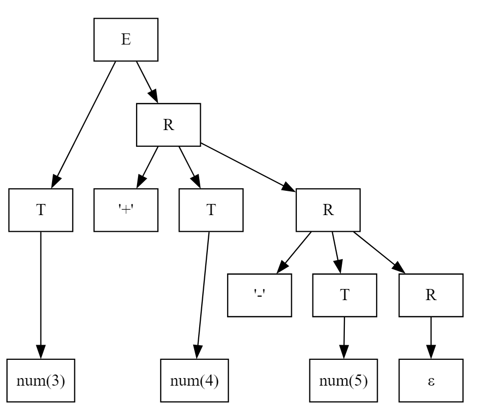

（等价的括号式表示：$E \Rightarrow (T_0)(R_0)$，$R_0 \Rightarrow +T_1R_1$，$R_1 \Rightarrow -T_2R_2$，$R_2 \Rightarrow \varepsilon$。）


**2. 带标注的语法分析树（写出属性赋值与计算）**

我们把语义规则再次列出（与题中一致）并给出计算顺序：

- $T \to \text{num}$：$T.val := \text{lexval(num)}$
- $E \to T R$：$R.in := T.val$；$E.val := R.val$
- $R \to +T R_1$：$R_1.in := R.in + T.val$；$R.val := R_1.val$
- $R \to -T R_1$：$R_1.in := R.in - T.val$；$R.val := R_1.val$
- $R \to \varepsilon$：$R.val := R.in$

用这些规则在树上自底向上计算（写出每步的具体数值）：

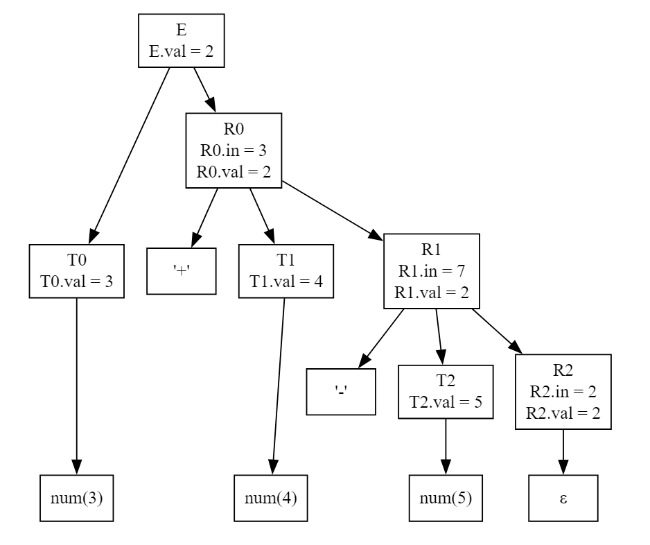

按自底向上计算并填入具体数值：

1. $T_0.val = \text{lexval}(3) = 3$
2. 由 $E \to T_0 R_0$ 得 $R_0.in := T_0.val = 3$
3. $T_1.val = \text{lexval}(4) = 4$
4. 由 $R_0 \to +T_1 R_1$ 得 $R_1.in := R_0.in + T_1.val = 3 + 4 = 7$
5. $T_2.val = \text{lexval}(5) = 5$
6. 由 $R_1 \to -T_2 R_2$ 得 $R_2.in := R_1.in - T_2.val = 7 - 5 = 2$
7. 由 $R_2 \to \varepsilon$ 得 $R_2.val := R_2.in = 2$
8. 回溯得到 $R_1.val := R_2.val = 2$
9. 再回溯 $R_0.val := R_1.val = 2$
10. 最后 $E.val := R_0.val = 2$

带标注语法树显示最终计算结果为：
$$
\boxed{E.val = 2}
$$
即表达式 $3+4-5$ 的值为 $2$。

#### 课外讨论

> *属性计算过程中获得的属性应如何管理？*

属性管理应围绕"载体、时序与作用域"三方面建立清晰约束。

**载体与时序方面**，应将语法制导定义的属性从抽象层面（如 $A.\mathrm{val}$、$R.\mathrm{in}$）落实为抽象语法树（AST）结点上的强类型字段，或以"结点 ID $\times$ 属性名 $\to$ 值"的侧表存储；符号相关的属性（类型、偏移、可赋值性等）则绑定在符号表条目上，形成"AST 局部属性 + 符号全局属性"的二元结构。时序上遵循属性文法的可计算性：对 S-attributed 定义采用自底向上的拓扑序（规约时计算），对 L-attributed 定义采用自顶向下/左到右的单遍传递（将继承属性以形参或环境记录线程化），通过"结点依赖图"进行静态可计算性检验并生成无环求值序列；对延迟信息（如短路布尔的跳转回填链）采用"占位符 + 回填（backpatch）"机制在安全点统一完成，保证单调性与无环依赖。

**作用域与工程实现方面**，继承属性对应"环境（environment）"的层次化视图：为每次进入非终结符构造一帧只读环境（包含当前函数返回类型、循环层级、break/continue 目标、类型别名映射等），在递归下降中按调用栈 Push/Pop；而综合属性则落回到结点本身（或其侧表条目），遵循"自底向上归集"的生命周期。实现中应避免"重复求值"与"悬空指针"：对代价较大的属性（类型、常量折叠、CFG/SSA 注解）启用只写一次（write-once）的缓存与脏标记；对跨结点共享的信息使用弱引用或唯一所有权，在树改写后触发局部失效重算。

**错误处理与目标**：与错误处理相关的属性（如"类型不匹配""未定义符号"）不应中断属性流，可将错误作为"底类型（error type）"向上传播，允许后续属性继续计算，提升诊断完整性。最终目标是：以"AST 字段 + 符号表条目 + 环境栈 + 回填链"的统一抽象，给出一次（或少量多遍）且无环的求值序，令属性既可被代码生成/优化复用，又可被错误恢复与 IDE 诊断稳定读取。


---
### 第八章

#### 必做作业

> 参考 8.3.3.6 节采用拉链与代码回填技术进行布尔表达式和控制语句（不含 break）翻译的 S-翻译模式片段及所用到的语义函数。设在该翻译模式基础上增加下列两条产生式及相应的语义动作集合：$$\begin{aligned}
S \rightarrow S' \quad \{S.\mathrm{nextlist} := S'.\mathrm{nextlist}\} \\
S' \rightarrow id := E' \quad \{S'.\mathrm{nextlist} := "\ "; \ \mathrm{emit}(id.\mathrm{place}\ ':='\ E'.\mathrm{place})\} 
\end{aligned}$$
> 其中，$E'$ 是生成算术表达式的非终结符（对应 8.3.3.1 节中的 $A$）。若在基础文法中增加对应 for 循环语句的产生式 $S \rightarrow \mathrm{for}(S'; E; S')S$，试给出相应该产生式的语义动作集合。
> 
> 注：for 循环语句的控制语义类似 C 语言中的 for 循环语句。

**一、背景与已给产生式**

根据题意，原翻译模式已新增：
$$
\begin{aligned}
S &\rightarrow S' \quad \{\, S.\mathrm{nextlist} := S'.\mathrm{nextlist} \,\}\\
S' &\rightarrow id := E' \quad \{\, S'.\mathrm{nextlist} := "\ "; \ \mathrm{emit}(id.\mathrm{place} := E'.\mathrm{place}) \,\}
\end{aligned}
$$
由此可知赋值语句执行后不引入跳转链，即 $$S'.\mathrm{nextlist} = "\ ".$$
采用的主要属性与语义函数包括：

- $E.\mathrm{truelist}$：$E$ 为真时跳转语句的地址链表。
- $E.\mathrm{falselist}$：$E$ 为假时跳转语句的地址链表。
- $S.\mathrm{nextlist}$：$S$ 执行完毕后需要跳转的地址链表。
- $\mathrm{makelist}(i)$：创建包含单个地址 $i$ 的链表。
- $\mathrm{merge}(p_1, p_2)$：连接两个链表。
- $\mathrm{backpatch}(p, i)$：将 $p$ 中所有未定目标的跳转语句地址回填为 $i$。
- $\mathrm{emit}(\dots)$：输出一条三地址语句并递增 $\mathrm{nextstmt}$。


**二、for 循环语义说明**

C 风格的 for 循环
$$
\mathrm{for}(S_1;\ E;\ S_2)\ S_3
$$
等价于如下控制结构：
$$
S_1;\ \mathrm{while}(E)\ \{\, S_3;\ S_2;\,\}
$$
其执行流程为：

1. 执行**初始化语句** $S_1$；
2. 计算**循环条件** $E$；
3. 若 $E$ 为真，进入循环体 $S_3$；
4. 循环体结束后，执行**更新语句** $S_2$；
5. 回到步骤 2，重新计算条件 $E$；
6. 若 $E$ 为假，退出循环。


**三、语义动作设计（使用临时标记）**

根据上述控制流，对产生式
$$
S \rightarrow \mathrm{for}(S_1;\ E;\ S_2)\ S_3
$$
给出如下语义动作（采用临时标记 $L_1, L_2, L_3$ 表示关键位置）：

```
S → for (S1; E; S2) S3
{
    翻译 S1;                         // 初始化（赋值语句，无需回填）
    L1 := nextstmt;                  // 标记条件 E 的入口
    翻译 E;
    
    L2 := nextstmt;                  // 标记循环体 S3 的入口
    backpatch(E.truelist, L2);       // E 为真时跳转到循环体
    
    翻译 S3;
    L3 := nextstmt;                  // 标记更新语句 S2 的入口
    backpatch(S3.nextlist, L3);      // S3 执行完后落入 S2
    
    翻译 S2;                         // 更新（赋值语句，无需回填）
    emit("goto " + L1);              // 回到条件判断
    
    S.nextlist := E.falselist;       // E 为假时退出循环
}
```

**说明：**
- 由于 $S_1$ 与 $S_2$ 均为赋值语句（对应非终结符 $S'$），故 $$S_1.\mathrm{nextlist} = S_2.\mathrm{nextlist} = "\ "，$$ 无需额外回填。
- $S.\mathrm{nextlist}$ 仅继承 $E.\mathrm{falselist}$，由外层语句继续回填。


**四、语义动作设计（使用标记产生式 $M$）**

为与 8.3.3.6 节的"标记+回填"写法完全一致，可引入标记产生式：
$$
M \rightarrow \varepsilon \quad \{\, M.\mathrm{instr} := \mathrm{nextstmt} \,\}
$$
则 for 循环的产生式与语义动作可改写为：
$$
\begin{aligned}
S \ \rightarrow\ &\mathrm{for}\ (\, S_1\ ;\ M_1\ E\ ;\ M_2\ S_2\,)\ M_3\ S_3 \\
&\{ \\
&\quad \text{// 初始化 } S_1 \text{ 为赋值，无跳转链}; \\
&\quad \text{// } M_1.\mathrm{instr} = \text{条件入口}; \\
&\quad \text{翻译 } E; \\
&\quad \text{// 回填真链到循环体}; \\
&\quad \mathrm{backpatch}(E.\mathrm{truelist},\ M_3.\mathrm{instr}); \\
&\quad \text{翻译 } S_3; \\
&\quad \text{// 循环体后继回填到更新入口}; \\
&\quad \mathrm{backpatch}(S_3.\mathrm{nextlist},\ M_2.\mathrm{instr}); \\
&\quad \text{翻译 } S_2; \\
&\quad \mathrm{emit}(\text{"goto "}\ \|\, M_1.\mathrm{instr}); \\
&\quad S.\mathrm{nextlist} := E.\mathrm{falselist}; \\
&\}
\end{aligned}
$$
其中 $M_1, M_2, M_3$ 分别标记**条件入口**、**更新入口**、**循环体入口**。


**五、控制流图**

整个 for 循环的控制流如下所示：

```
         ┌─────────┐
         │   S1    │  初始化
         └────┬────┘
              ↓
        (M1) 条件 E 评估
          ├──true──▶ (M3) S3（循环体）
          │             │
          │             ▼ S3.nextlist 回填到 M2
          │          (M2) S2（更新）
          │             │
          └──false──────┘ emit("goto M1")
              ↓
       [S.nextlist = E.falselist]
```

关键回填关系：
- $E.\mathrm{truelist}$ 回填到循环体入口 $M_3.\mathrm{instr}$；
- $S_3.\mathrm{nextlist}$ 回填到更新入口 $M_2.\mathrm{instr}$；
- $S.\mathrm{nextlist} := E.\mathrm{falselist}$ 留待外层继续回填。


**六、结论**

上述语义动作完整遵循 8.3.3.6 节的**拉链与代码回填机制**，正确刻画了 C 风格 for 循环的控制语义。其中：

- $E.\mathrm{truelist}$ 控制进入循环体；
- $E.\mathrm{falselist}$ 控制退出循环；
- $S_3.\mathrm{nextlist}$ 通过回填保证循环体执行完后进入更新语句 $S_2$；
- 无需对 $S_1, S_2$（赋值语句）单独回填。


#### 课外讨论

> *符号表的设计在编译器实现技术中非常重要，但为什么不是本课程的重点内容？*

符号表承载"名字到绑定（binding）"的映射，是编译器前端贯穿词法、语法与语义分析的基础设施；其关键操作不过是插入、查找、进入/退出作用域与属性绑定（类型、存储类、可见性、偏移等），并在中间表示生成与后端布局时被反复查询。从教学目标看，编译原理课程更强调"形式化方法与编译管线"的核心共性：文法与自动机、语法制导翻译、类型系统、IR 与数据流、优化与代码生成等；而符号表的"具体数据结构与工程实现"高度依赖语言细节与工程取舍（如开放寻址哈希 vs 平衡树、持久化映射 vs 池式分配、增量与并发支持、IDE 跨文件索引、模块/包系统、链接时可见性、调试/反射元数据等），这些更适合作为软件工程与大型系统实现的专题。

课程层面只需把握其抽象契约：在任意时刻，符号表能以 $O(1)$ 或 $O(\log n)$ 的复杂度支持"按当前词法/语义作用域"正确解析标识符，且能绑定并查询必要属性；进入/退出作用域具有栈式结构（可由链式表、栈化哈希表或可持久映射实现）；面向对象与泛型的高级语言，再扩展为多重表或层叠环境，以适配重载与实例化的分派规则。换言之，符号表虽重要，但其"如何实现得更快/更省"的工程手段并不改变编译原理的理论主线；教学更关注"应支持哪些抽象操作、满足哪些语义约束、如何与语法/语义/中端数据结构协同"。因此课程以抽象接口与小而美的实现为度，鼓励在课程项目中择一简洁策略达成正确性，把精力更多投入到可迁移的理论与方法中。


---
### 第九章

#### 必做作业

> 1. 若按照某种运行时组织方式，如下函数 $p$ 被激活时的过程活动记录如图 9.25 所示。其中 $d$ 是动态数组。
> 
> static int N;
> void p(int a) {
>     float b;
>     float c[10];
>     float d[N];
>     float e;
>     ……
> }
> 
> 试指出函数 $p$ 中访问 $d[i] (0 \leq i < N)$  时相对于活动记录基址的 Offset 值如何计算？若将数组 $c$ 和 $d$ 的声明次序颠倒，则 $d[i](0 \leq i < N)$ 又如何计算？（对于后一问题可选多种不同的运行时组织方式，回答可多样，但需要作相应的解释。）
> 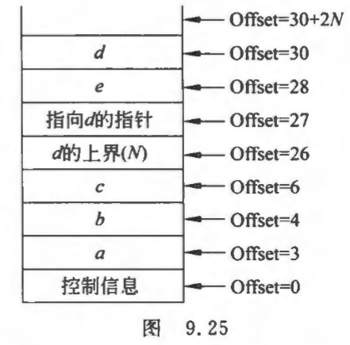

**一、活动记录布局分析**

取活动记录基址为 `base(p)`（偏移以“字”为单位，`float` 占 2 字）。经图示与更正，活动记录自低地址向高地址的关键项及其 Offset 如下：

- 控制信息（返回地址、动态链等）：`Offset = 0`。
    
- 形参 `a`：`Offset = 3`（占 1 字）。
    
- 局部 `b`：`Offset = 4`（float，2 字）。
    
- 静态数组 `c`：`Offset = 6`（占若干字，若为 `c[10]` 则占 `20` 字；若尺寸为 `m`，占 `2m` 字）。
    
- `d` 的上界 `N`（或为静态保存的长度信息）：`Offset = 26`（占 1 字）。
    
- 指向 `d` 的指针 `p_d`：`Offset = 27`（指针占 1 字，存放 `&d[0]`）。
    
- 局部 `e`：`Offset = 28`（float，2 字）。
    
- 动态数组数据区 `d` 的起始处：`Offset = 30`（数据区大小为 `2*N` 字，区域为 `[30, 30+2N)`）。


备注：图中既保存了指针 `p_d`（在 `Offset=27`），又给出了 `d` 数据区从 `Offset=30` 开始的布局。这说明运行时既将动态数组的数据放在活动记录中某连续区间（VLA 风格），又在固定位置存放了一个指向该区的指针以便快速间接寻址或传递给其他函数。


**二、访问 $d[i]\ (0 \leq i < N)$ 的 Offset 计算**

根据布局，有两种等价的寻址方式：

**(1) 直接计算法（假设数据区固定在 Offset 30）**

$$
\mathrm{Addr}(d[i]) = \mathrm{base} + 30 + 2i, \quad 0 \leq i < N
$$

其中 $2i$ 是元素偏移量（每个 $\mathrm{float}$ 占 2 字）。

**(2) 间接寻址法（通过指针 $p_d$）**

$$
\begin{aligned}
p_d &= *(\mathrm{base} + 27) = \mathrm{base} + 30, \\
\mathrm{Addr}(d[i]) &= p_d + 2i.
\end{aligned}
$$

**通用表达式**：无论采用哪种实现，最终地址均为
$$
\boxed{\mathrm{Addr}(d[i]) = \mathrm{base} + 30 + 2i}
$$
或通用形式（适用于 $p_d$ 不固定时）：
$$
\boxed{\mathrm{Addr}(d[i]) = p_d + 2i, \quad \text{where}\ p_d = *(\mathrm{base} + 27)}
$$


**三、Offset 值的计算规则（一般原则）**

活动记录中 $\mathrm{Offset}$ 的分配遵循如下规则：

1. **累加原则**：从控制信息起，按声明次序累加各对象大小（含对齐填充）。
2. **固定大小对象**（参数、标量、静态数组）在编译时确定 $\mathrm{Offset}$。
3. **变长对象**（如 $d[N]$）仅在运行时确定数据区大小，编译时只分配描述信息（上界 $N$、指针 $p_d$），数据区通常放在记录尾部或栈顶。

本题中的累加过程（以字为单位）：
$$
\begin{aligned}
\mathrm{Offset}(\text{控制信息}) &= 0, \quad \text{占 3 字}, \\
\mathrm{Offset}(a) &= 3, \quad \text{占 1 字}, \\
\mathrm{Offset}(b) &= 4, \quad \text{占 2 字}, \\
\mathrm{Offset}(c) &= 6, \quad \text{占 20 字}, \\
\mathrm{Offset}(N) &= 26, \quad \text{占 1 字}, \\
\mathrm{Offset}(p_d) &= 27, \quad \text{占 1 字}, \\
\mathrm{Offset}(e) &= 28, \quad \text{占 2 字}, \\
\mathrm{Offset}(d\ \text{数据区}) &= 30, \quad \text{占 } 2N \text{ 字（运行时确定）}.
\end{aligned}
$$


**四、若将 $c$ 与 $d$ 的声明顺序颠倒**

当 $d$ 在 $c$ 之前声明时，由于 $d$ 的大小在编译时未知，需选择运行时组织策略。常见方案有**描述符固定 + 数据区后置**：

- **布局**：在固定位置先存 $N$ 与 $p_d$（占固定空间），随后分配 $c$、$b$、$e$ 等静态对象，最后在记录尾部为 $d$ 的数据区分配 $2N$ 字节。
- **访问 $d[i]$**：与原布局一致，使用 $$\mathrm{Addr}(d[i]) = p_d + 2i$$
- **访问 $c[j]$**：$\mathrm{Offset}(c)$ 仍为编译时常量，不受 $N$ 影响。
- **优点**：静态对象偏移保持固定，编译简单高效；符合图 9.25 的实现思想。


#### 课外讨论

> *编译程序如何组织目标代码才利于操作系统如何调用程序？*

编译程序组织目标代码应从"可装载、可调用"的系统接口视角出发，确保代码易于被操作系统加载器正确装入并完成控制权移交。

**二进制格式与段组织方面**，编译器和链接器必须产出符合平台规范的可执行格式（Linux/ELF、Windows/PE、macOS/Mach-O），在文件头与程序头中准确描述入口地址、段映射、对齐与权限，以便加载器据此完成映射与重定位。代码与数据应分离并赋予合理的页权限与对齐：`.text` 映射为可执行只读（R-X）、`.rodata` 只读（R--）、`.data` 可写（RW-）、`.bss` 以零填充的匿名页；同时按体系结构要求进行对齐，避免跨页或未对齐访问的陷阱。符号与重定位信息要完整，以支持静态链接的绝对修补与动态装载时的延迟绑定。对动态链接的二进制，需提供过程链接表/全局偏移表（PLT/GOT）或等价机制，并将外部引用降解为可由加载器解析的重定位条目，从而既满足可重定位性，又与地址空间布局随机化（ASLR）相容。

**ABI 与调用约定方面**，可执行文件不仅要符合格式规范，更要在用法上遵循平台 ABI：参数传递寄存器/栈的约定、栈对齐（如 SysV x 86-64 的 16 字节）、被调用者/调用者保存寄存器集、返回值位置、变参约定等，均需在代码生成阶段严格执行。程序入口通常不是 `main`，而是由入口符号（如 `_start`、CRT 启动例程）承接，完成运行时环境搭建：堆栈与 TLS 初始化、`.init_array` 与 `.fini_array` 构造/析构函数调用、语言运行库桥接（如 `__libc_start_main` / `mainCRTStartup`），再将控制权转交用户 `main`；退出路径需通过约定的系统调用或运行库（`exit` / `_exit`）清理资源并返回状态码。为配合现代装载策略，推荐生成位置无关代码/可执行（PIC/PIE），将对全局数据与外部函数的引用经由 GOT/PLT 间接化，以便加载器在任意基址高效修补；同时提供线程局部存储（TLS）段与初始化向量，使运行时可为每个线程正确布置 TLS。

**元数据与健壮性方面**，异常/栈展开与调试信息（如 DWARF 的 CFI、`.eh_frame` 或 Windows 的 `.pdata` / `.xdata`）应与代码一致，保证发生异常、信号或剖析时能正确回溯栈帧；这类元数据虽非 OS 直接调用所必需，却是与运行库、异常机制及诊断工具协作的关键。安全相关的段属性与链接选项（NX/DEP、RELRO、PIE、栈保护 canary、符号版本化等）应当与目标平台和运行库策略兼容，既不破坏加载器假设，又提升整体运行安全。对静态与动态链接的取舍，应依据部署与更新策略；动态链接需保证符号可见性与版本协商一致，静态链接则要避免重复运行时初始化与符号冲突。

概言之，面向操作系统的"可装载、可调用"的目标代码组织，等价于三条底线：其一，产出符合平台二进制格式与装载器契约的镜像（头、段、重定位、入口、权限、对齐齐备）；其二，严格遵循 ABI 的调用约定与启动/收尾序列（入口运行时、`main` 交接、退出路径、TLS/构造析构）；其三，配齐动态装载与运行期协作所需的元数据与安全属性（PLT/GOT、PIC/PIE、异常/调试信息、段权限与安全强化）。编译器后端与链接器据此协同，既能被 OS 正确加载，又能与运行库、装载器和工具链在同一 ABI 生态中稳定互操作。

