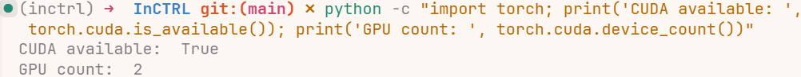
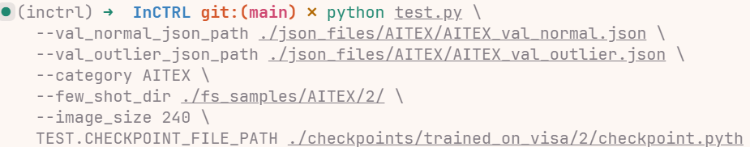
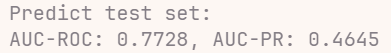
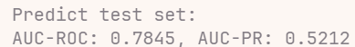
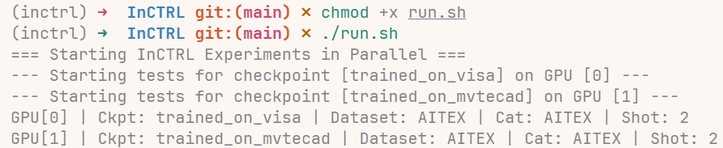
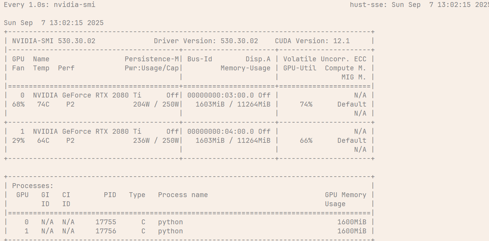
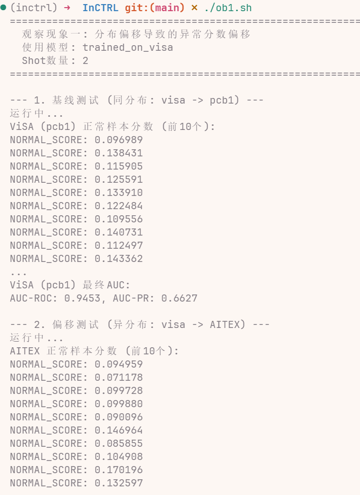
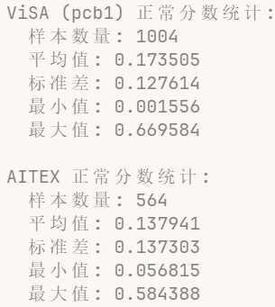

> **标题**：[基于上下文残差学习与少样本提示的通用异常检测](https://arxiv.org/abs/2403.06495)
>
> **摘要**：本文探讨了*通用异常检测（GAD）*问题，旨在训练一个单一的检测模型，该模型无需对目标数据进行任何进一步训练即可泛化到检测来自不同应用领域的各种数据集中的异常。一些最近的研究表明，大型预训练视觉-语言模型（VLMs），例如 *CLIP*，在检测来自各种数据集的工业缺陷方面具有强大的**泛化**能力，但它们的方法严重依赖于手工制作的关于缺陷的文本提示，这使得它们难以泛化到其他应用中的异常，例如医疗图像异常或自然图像中的语义异常。在这项工作中，作者提出了一种*使用少量正常图像作为样本提示*来进行各种数据集上即时异常检测（AD）的 GAD 模型训练方法。为此，作者引入了一种新颖的方法，该方法学习用于 GAD 的上下文残差学习模型，称为 InCTRL。它在一个辅助数据集上进行训练，以**基于查询图像和少量正常样本提示之间残差的整体评估**来区分异常和正常样本。不管数据集如何，根据异常的定义，异常的残差都应大于正常样本，从而使 InCTRL 能够在无需进一步训练的情况下跨不同领域进行泛化。作者在九个 AD 数据集上进行了全面的实验，以建立一个 GAD 基准，该基准涵盖了在单对多和多类设置中对工业缺陷异常、医疗异常和语义异常的检测，其中 InCTRL 表现最佳，并且显著优于最先进的竞争方法。代码可在 [mala-lab/InCTRL](https://github.com/mala-lab/InCTRL) 获取。
>
> **关键词**：小样本学习，残差学习，通用异常检测

## 一、基础知识

以下是本论文涉及的基础知识点，也是作者构建 InCTRL 模型的基石。

### 1. 通用异常检测

GAD 的目标是训练一个*单一的通用模型*，该模型能够直接应用于来自不同应用领域（如工业、医疗、自然图像）的多个数据集，以检测其中的异常，而无需在这些新的目标数据集上进行任何额外的训练或微调。GAD 可以解决传统异常检测方法的局限性。本文提到的 InCTRL 就是专门应对 GAD 问题的方法。

### 2. 视觉语言模型

CLIP 因为其在海量数据上的预训练，获得了强大的泛化能力，能够理解广泛的视觉概念。InCTRL 正是利用了 CLIP 的这种能力作为实现 GAD 的基础。其中的**图像编码器**用于提取查询图片和正常样本提示的视觉特征；**文本编码器**则用于提取文本提示的语义特征，作为辅助判别信息。在训练 InCTRL 时，CLIP 本身的参数是被*冻结*的，只训练附加的少量适配器层。

尽管以 CLIP 为代表的 VLM 无需在目标数据上进行任何微调或适应，可以在不同缺陷检测数据集上实现显著的泛化，但一个显著局限性是它们依赖于大量针对缺陷专门定制的提示。这使得它们在检测其他数据域中的异常时具有挑战性，例如医学图像异常、一对一设置或多类设置中的语义异常。

### 3. 上下文学习

上下文学习（ICL）是一种新兴的学习范式，尤其在 LLM 和 NLP 中得到推广。它的核心思想是，模型可以在不改变自身参数，即不进行训练或微调的情况下，通过在输入中提供几个示例（上下文提示）来快速适应并执行新的任务。InCTRL 将 ICL 范式从 NLP 领域引入并改造，用于解决通用的视觉异常检测问题。本文提供的几个正常图片不是被当作任务指令，而是被定义为特定于该数据集的正常模式代表。整个模型学习的目标是识别查询图片与这些正常模式之间的差异（残差）。

### 4. 少样本提示

在推理（测试）阶段，我们可以从目标数据集中获得非常少量的正常样本，例如 2、4 或 8 个。它们被用作样本提示，定义为特定数据集的正常模式，而不是特定任务的指令，为通用模型提供动态的参考标准。通过观察提示样本，模型能迅速理解在当前这个特定数据集中何为正常模式，从而做出更准确的判断。注意这些少样本提示仅在*推理*时使用，不参与任何形式的模型训练或微调。这与传统的少样本学习方法有本质区别，后者通常会用这些样本来微调模型，可能导致过拟合。

### 5. 残差学习

残差学习是 InCTRL 内部的核心计算机制，其核心是学习并建模两个输入之间的差异或残差。作者认为，一个异常样本与正常模式之间的残差必然会比一个正常样本与正常模式之间的残差要大，这是 InCTRL 实现泛化的**关键假设**。这个基本原则在不同领域的数据集中都应该成立，从而使得通过学习残差来进行判断的方法具有泛化性。InCTRL 模型通过精心设计的网络结构，在图像的局部（patch-level）和全局（image-level）两个层面上，计算查询图片和正常样本提示之间的残差，并将这些残差信息作为判断异常的核心依据。


InCTRL 训练概述：首先，它使用查询图像和从辅助训练数据中随机抽取的少量正常样本提示来模拟上下文学习场景。然后，它执行多层补丁级和图像级残差学习，以捕捉查询图像与正常提示之间的局部和全局残差。最后，这些残差信息与文本编码器引导的文本提示先验知识相结合，用于整体异常分数学习。

## 二、InCTRL 详解

InCTRL（上下文残差学习）的计算流程是：

1. 首先通过[多层补丁级残差学习](#1-多层补丁级残差学习)得到局部的差异图 $M_x$。
2. 然后通过[图像级残差学习](#2-图像级残差学习)得到全局的差异分数 $s_i(x)$，并在此过程中产生一个训练损失 $\mathcal{L}_{IRL}$。
3. 同时，通过[融合基于文本提示的先验知识](#3-融合基于文本提示的先验知识)得到一个基于语义的判断分数 $s_a(x)$。
4. 最后，在[训练和推理](#4-训练和推理)阶段，将上述三者融合得到最终分数 $s(x)$，并使用总损失 $\mathcal{L}_{InCTRL}$ 进行端到端的优化。

### 1. 多层补丁级残差学习

为了有效地捕获查询图像和正常图像提示之间的细粒度上下文残差，作者在 InCTRL 中引入了一个多层补丁级残差学习组件。这部分的目标是计算查询图像在局部上与正常样本的差异。

**公式（1）**：

$$
M_x^l(i,j) =
1 -
\left\langle
T_x^l(i,j),
h\left(T_x^l(i,j) \mid P'\right)
\right\rangle
$$

解析：

- $M_x^l(i,j)$：代表查询图像 $x$ 在第 $l$ 层的第 $(i,j)$ 个位置，即一个 patch 的残差分数。
- $T_x^l(i,j)$：查询图像 $x$ 经过视觉编码器第 $l$ 层后，在 $(i,j)$ 位置的 patch 特征向量。它包含了这个 patch 的视觉信息。
- $P'$：作为“提示”的 $K$ 个正常样本集合。
- $h(T_x^l(i,j) \mid P')$：核心函数，目标是在所有正常样本 $P'$ 的第 $l$ 层的所有 patch 特征向量中，找到与查询 patch $T_x^l(i,j)$ 最相似的那一个，并返回其特征向量。
- $\langle \cdot, \cdot \rangle$：代表余弦相似度计算，介于 $-1$ 和 $1$ 之间，值越大表示两个向量越相似。

作用：这个公式计算了查询图像的一个 patch 与所有正常样本中最相似的那个小块之间的差异。如果查询图像是正常的，那么它的每个小块应该都能在正常样本集中找到一个非常相似的对应块，此时余弦相似度接近 $1$，残差分数就接近 $0$。反之，如果某个小块是异常的，它在正常样本中找不到相似的对应，余弦相似度较低，残差分数就会变高。

**公式（2）**：

$$
M_x = \frac{1}{n}\sum_{l=1}^{n} M_x^l
$$

解析：

- $M_x$：最终的融合了多层信息的块状残差图。
- $n$：视觉编码器中的总层数。
- $M_x^l$：公式（1）计算出的第 $l$ 层残差图。

作用：将视觉编码器每一层计算出的残差图取平均。因为不同层级的特征捕捉的信息不同，浅层偏向纹理，深层偏向语义，综合起来可以让残差评估更鲁棒。

### 2. 图像级残差学习

这部分的目标是从全局视角判断查询图像的异常。作者引入一个图像级残差学习组件来捕获 $x$ 和 $P'$ 之间的更高级别差异，使用视觉编码器**最后一个块的类别标记嵌入**作为特征输入。其中包括一个由 $\Theta_{\psi}$ 参数化的适配器层 $\psi(\cdot)$，以进一步使图像表示适应异常检测。此外，使用少量样本提示的原型特征而不是单个样本的特征来学习上下文残差。

**公式（3）**：

$$
I_p =
\frac{1}{K}
\sum_{x_k' \in \mathcal{P}'}
\psi\left(f_v(x_k');\Theta_{\psi}\right)
$$

解析：

- $I_p$：所有 $K$ 个正常样本提示的**原型特征向量**，可以理解为平均正常样本的特征。
- $f_v(x_k')$：视觉编码器对一个正常样本 $x_k'$ 提取的**图像级特征向量**。
- $\psi(\cdot;\Theta_{\psi})$：一个可学习的适配器层，本质上是一个小型神经网络，参数为 $\Theta_{\psi}$。
- $K$：正常样本的数量。

作用：首先用 CLIP 提取每个正常样本的全局特征，然后用一个可学习的适配器 $\psi$ 对这些特征进行微调，使之更适用于异常检测任务。最后将所有微调后的正常样本特征取平均，得到一个代表该场景下标准的特征向量。

**公式（4）**：

$$
F_x = I_x \ominus I_p
$$

解析：

- $F_x$：查询图像 $x$ 的图像级残差特征。
- $I_x = \psi(f_v(x);\Theta_{\psi})$：查询图像 $x$ 经过 CLIP 和适配器 $\psi$ 后的特征向量。
- $\ominus$：逐元素相减。

作用：计算查询图像的特征和标准正常原型的特征之间的差异。如果查询图像是正常的，它的特征 $I_x$ 会和 $I_p$ 非常接近，相减后的结果 $F_x$ 会是一个接近于零的向量。

**公式（5）**：

$$
\mathcal{L}_{IRL}
=
\frac{1}{N}
\sum_{x \in X_{train}}
\mathcal{L}_b\left(\eta(F_x;\Theta_\eta), y_x\right)
$$

解析：

- $\mathcal{L}_{IRL}$：图像级残差学习的训练损失。
- $\eta(\cdot;\Theta_\eta)$：另一个可学习的分类器，它接收图像级残差特征 $F_x$ 作为输入，并输出一个异常分数。
- $\mathcal{L}_b$：二元分类损失函数，论文中默认使用 Focal Loss。
- $y_x$：图像 $x$ 的真实标签，$0$ 代表正常，$1$ 代表异常。
- $N$：训练集中的样本总数。

作用：用来训练分类器 $\eta$，目标是让 $\eta$ 学会当输入的残差特征 $F_x$ 来自一个真正的异常样本时输出高分，当来自正常样本时输出低分。

### 3. 融合基于文本提示的先验知识

这部分将文本信息、局部视觉信息和全局视觉信息融合起来，得到最终的异常分数。

**公式（6）**：

$$
s_a(x)
=
\frac{
\exp\left(\mathbf{F}_a^T f_v(x)\right)
}{
\exp\left(\mathbf{F}_n^T f_v(x)\right)
+
\exp\left(\mathbf{F}_a^T f_v(x)\right)
}
$$

解析：

- $s_a(x)$：基于文本提示，判断图像 $x$ 是异常的概率。
- $f_v(x)$：查询图像 $x$ 的 CLIP 图像特征。
- $\mathbf{F}_n, \mathbf{F}_a$：分别是正常文本提示和异常文本提示经过 CLIP 文本编码器后得到的**原型特征向量**。

作用：利用 CLIP 的图文对齐能力，直接从语义上判断图像更符合正常描述还是异常描述。这是一个与前述视觉残差完全独立的判别维度。

### 4. 训练和推理

**公式（7）**：

$$
M_x^+ = M_x \oplus s_i(x) \oplus s_a(x)
$$

解析：

- $M_x^+$：融合了所有信息的整体残差图。
- $M_x$：公式（2）计算出的纯视觉块状残差图。
- $s_i(x)=\eta(F_x;\Theta_\eta)$：公式（5）中分类器 $\eta$ 输出的图像级异常分数。
- $s_a(x)$：公式（6）计算出的文本级异常概率。
- $\oplus$：逐元素相加。

作用：将三个不同维度的判据，即局部视觉差异 $M_x$、全局视觉差异 $s_i(x)$ 和文本语义差异 $s_a(x)$，融合到一个统一的特征图上。

**公式（8）**：

$$
s(x)
=
\phi(\mathbf{M}_x^+;\Theta_\phi)
+
\alpha s_p(x)
$$

解析：

- $s(x)$：图像 $x$ 的最终异常分数。
- $\phi(\cdot;\Theta_\phi)$：最终的异常评分函数，它接收整体残差图 $M_x^+$ 作为输入，并输出一个分数。
- $s_p(x)=\max(M_x)$：在纯视觉的块状残差图 $M_x$ 中取最大的残差值，即图像补丁级基于最大残差分数的细粒度异常分数。
- $\alpha$：一个超参数，用于调节 $s_p(x)$ 的权重。

作用：计算最终的输出分数。它由两部分组成：一部分是 $\phi$ 对融合了所有信息的整体报告 $M_x^+$ 进行综合判断后给出的分数；另一部分是直接把局部检查报告中最严重的那一项 $s_p(x)$ 拿出来，乘以一个权重 $\alpha$ 再加上，确保即使是一个非常微小但极其明显的局部瑕疵也不会被忽略。

**公式（9）**：

$$
\mathcal{L}_h
=
\frac{1}{N}
\sum_{x\in X_{train}}
\mathcal{L}_b(s(x), y_x)
$$

解析：

- $\mathcal{L}_h$：代表**整体损失**，用来优化最终异常分数。
- $s(x)$：图像 $x$ 的**最终异常分数**，由公式（8）计算得出。
- $y_x$：图像 $x$ 的真实标签，$0$ 为正常，$1$ 为异常。
- $\mathcal{L}_b$：和公式（5）中一样，是二元分类损失函数。
- $N$：训练集中的样本总数。

作用：这个公式是用来训练最终评分函数 $\phi(\cdot)$ 的。它的目标是让模型输出的最终分数 $s(x)$ 尽可能地与真实标签 $y_x$ 保持一致。如果模型对一个异常样本给出了低分，或者对一个正常样本给出了高分，这个损失函数就会产生一个较大的值，从而在反向传播中促使模型调整参数。

**公式（10）**：

$$
\mathcal{L}_{InCTRL}
=
\mathcal{L}_{IRL}
+
\mathcal{L}_h
$$

解析：

- $\mathcal{L}_{InCTRL}$：整个 InCTRL 模型在训练时需要最小化的**总损失**。
- $\mathcal{L}_{IRL}$：公式（5）中定义的**图像级残差学习损失**。它负责训练从全局视觉差异中判断异常的分支。
- $\mathcal{L}_h$：公式（9）定义的**整体异常分数损失**。它负责训练融合了所有信息后进行最终裁决的分支。

作用：这个公式将两个关键部分的损失简单相加，形成一个统一的优化目标。在训练过程中，通过最小化这个总损失，梯度会同时反向传播到模型的各个可学习部分，即适配器层 $\psi$、$\eta$ 和 $\phi$，协同地更新它们的参数。这确保了模型的两个主要学习部件，即图像级残差分析器和最终决策器，都能得到充分训练。

## 三、复现思路

### 1. 环境配置与数据预处理

首先搭建可运行此项目的 Python 环境，参照 README 文档和代码完成 `requirements.txt` 文件，并安装好所有必需的库。通过 README 文档提供的链接下载好数据集，并对每个数据集进行相应处理。所有下载的数据集都需要被转换成 MVTec AD 的数据格式，可以利用作者在 `datasets/preprocess/` 目录下提供的转换脚本。

`datasets/` 主要负责完成从读取和转换数据集到生成最终输入给模型的张量的全部过程。

为了验证 InCTRL 的有效性，论文在九个真实世界的 AD 数据集上进行全面实验，包括五个工业缺陷检测数据集（MVTec AD、VisA、AITEX、ELPV、SDD）、两个医学图像数据集（BrainMRI、HeadCT）以及两个语义异常检测数据集（MNIST 和 CIFAR-10），并在一对多和多类协议下进行。在一对多协议下，一个类别被视为正常，其他类别被视为异常；在多类协议下，MNIST 中偶数类的图像和 CIFAR-10 中与动物相关类别的图像被视为正常，其他类别的图像被视为异常。

为了评估 GAD 的性能，使用 MVTec AD 的*完整数据集*（包括训练集和测试集）作为辅助训练数据，在上述数据集上训练 AD 模型，然后在没有进一步训练的情况下，对其他八个数据集的*测试集*进行评估。在评估 MVTec AD 的性能时，在 VisA 的完整数据集上训练模型。针对目标数据的少量正常提示从目标数据集的训练集中随机采样，并且对所有模型保持一致，以确保公平比较。

数据集格式要求（MVTec AD 格式）：

```text
datasets_mvtec_format/
    dataset_name/
        train/
            good/             # 正常样本
        test/
            good/             # 正常测试样本
            defect_type_1/    # 异常样本类型 1
            defect_type_2/    # 异常样本类型 2
            ...
```

每个数据集需要 4 个 JSON 文件：

- `*_normal.json`：训练用正常样本
- `*_outlier.json`：训练用异常样本
- `*_val_normal.json`：验证用正常样本
- `*_val_outlier.json`：验证用异常样本

### 2. 训练与推理

#### 2.1 预训练模型准备

根据配置文件 `open_clip/config/defaults.py`，需要下载预训练模型 `vit_b_16_plus_240-laion400m_e32-699c4b84.pt`，将其放置在项目根目录，或修改 `TRAIN.CHECKPOINT_FILE_PATH` 配置直接使用作者提供的预训练模型。

#### 2.2 训练流程

1. **模型与训练架构**
    - 基础模型：基于 OpenCLIP 的 `ViT-B-16-plus-240` 架构。
    - 核心机制：**上下文残差学习**。模型通过比较查询图像和上下文提示（few-shot 正常样本）之间的残差来判断异常。
    - 损失函数：Cross Entropy Loss。
2. **训练流程概览**
    - 数据加载：`IC_dataset` 类负责加载训练和验证数据。
    - 上下文采样：在训练的每一步，为每个查询图像动态采样 $k$ 个同类别的正常图像作为上下文提示。
    - 前向传播：模型同时接收查询图像和 $k$ 个上下文图像，计算并输出一个异常分数。
    - 损失计算：使用 Cross Entropy Loss 计算模型输出与真实标签（正常/异常）之间的损失。
    - 反向传播：根据损失更新模型权重。
3. **关键配置与参数**（在 `defaults.py` 中定义或通过命令行传入）
    - 训练控制：
        - `TRAIN.BATCH_SIZE`：训练批次大小，默认为 `16`。
        - `SOLVER.MAX_EPOCH`：最大训练轮数，默认为 `400`。
        - `TRAIN.CHECKPOINT_FILE_PATH`：初始权重路径，用于加载预训练的 CLIP 模型，例如 `vit_b_16_plus_240-laion400m_e32-699c4b84.pt`。
    - 优化器：
        - `SOLVER.BASE_LR`：基础学习率，默认为 `0.00025`。
        - `SOLVER.WEIGHT_DECAY`：权重衰减，默认为 `0.05`。
        - `SOLVER.LR_POLICY`：学习率策略，默认为 `cosine`。
4. **环境与执行**
    - 依赖：确保已安装所有依赖。
    - 硬件：推荐使用 NVIDIA RTX 3090 或同等级别的 GPU。
    - GPU 检查：确认 PyTorch 能正确识别 GPU。



5. **训练启动与监控**

启动命令：

```bash
python main.py \
    --model ViT-B-16-plus-240 \
    --pretrained ./checkpoints/checkpoint_10.pyth \
    --normal_json_path "$normal_json_files_for_training" \
    --outlier_json_path "$abnormal_json_files_for_training" \
    --val_normal_json_path "$normal_json_files_for_testing" \
    --val_outlier_json_path "$abnormal_json_files_for_testing" \
    --shot 2 \
    --image_size 240 \
    --steps_per_epoch 100
```

监控要点：

- 日志输出：关注终端打印的 `train_loss` 和验证集指标，如 `AUC`、`AP` 等。
- 检查点：训练好的模型权重会定期保存在 `C.OUTPUT_DIR` 指定的目录，默认为 `./tmp`。

#### 2.3 测试流程

这里我直接使用已经在 MVTec AD 和 VisA 上预训练好的模型进行测试。

推理流程：

1. **加载模型**：加载在训练阶段保存的 InCTRL 模型检查点。
2. **准备提示**：从 `--few_shot_dir` 路径加载为特定测试类别预先准备好的正常样本提示。这些是固定的，而不是像训练时那样随机抽取。
3. **推理**：对于测试集中的每一张“查询图像”，模型都会将其与预先加载的正常样本提示进行比较，并计算输出一个异常分数（残差）。
4. **评估**：收集所有测试图像的异常分数和真实标签，最后计算评估指标，如 **AUC-ROC**（受试者工作特征曲线下面积）和 **AUC-PR**（精确率-召回率曲线下面积），以衡量模型的检测性能。

```bash
python test.py \
    --model ViT-B-16-plus-240 \
    --val_normal_json_path ./json_files/AITEX/AITEX_val_normal.json \
    --val_outlier_json_path ./json_files/AITEX/AITEX_val_outlier.json \
    --shot 2 \
    --image_size 240 \
    --few_shot_dir ./visa \
    --category aitex \
    TEST.CHECKPOINT_FILE_PATH /path/to/your/*.pth
```

以下是一次测试的运行过程和结果显示：







编写脚本实现自动化测试每个 `checkpoint × dataset × category × shot` 的组合，即分别使用在 MVTec AD 和 VisA 预训练好的模型，在其中五个数据集 VisA、AITEX、ELPV、BrainMRI 和 HeadCT 上进行测试，并在两个 GPU 上并行执行。





以下是跑分结果。这里直接将 MVTec AD 和 VisA 的预训练模型跑出的结果取平均数，和论文结果大致吻合。由于只跑了一次部分数据，结果和论文可能没有完全吻合；有的 8-shot 数据反而没有 4-shot 高，可能是因为 4-shot 覆盖的情况已经较全面，使用 8-shot 提供的信息反而没有 4-shot 多。

| Dataset | Shot | Avg AUC-ROC | Avg AUC-PR |
| --- | --- | --- | --- |
| AITEX | 2 | 0.7787 | 0.5514 |
|  | 4 | 0.7817 | 0.5538 |
|  | 8 | 0.8198 | 0.5286 |
| ELPV | 2 | 0.8335 | 0.9139 |
|  | 4 | 0.8670 | 0.9259 |
|  | 8 | 0.8506 | 0.9157 |
| HeadCT | 2 | 0.9199 | 0.9774 |
|  | 4 | 0.9346 | 0.9820 |
|  | 8 | 0.9256 | 0.9776 |
| BrainMRI | 2 | 0.9157 | 0.9830 |
|  | 4 | 0.9026 | 0.9746 |
|  | 8 | 0.9079 | 0.9792 |
| VisA/candle | 2 | 0.9016 | 0.8180 |
|  | 4 | 0.9349 | 0.8790 |
|  | 8 | 0.9552 | 0.8952 |
| VisA/capsules | 2 | 0.8028 | 0.5281 |
|  | 4 | 0.8345 | 0.5856 |
|  | 8 | 0.8570 | 0.7132 |
| VisA/cashew | 2 | 0.9682 | 0.9237 |
|  | 4 | 0.9735 | 0.9311 |
|  | 8 | 0.9649 | 0.9167 |
| VisA/chewinggum | 2 | 0.9745 | 0.9579 |
|  | 4 | 0.9740 | 0.9592 |
|  | 8 | 0.9743 | 0.9610 |
| VisA/fryum | 2 | 0.9481 | 0.8947 |
|  | 4 | 0.9520 | 0.8950 |
|  | 8 | 0.9508 | 0.8944 |
| VisA/macaroni 1 | 2 | 0.8408 | 0.5709 |
|  | 4 | 0.8697 | 0.5677 |
|  | 8 | 0.9147 | 0.8175 |
| VisA/macaroni | 2 | 0.8307 | 0.6365 |
|  | 4 | 0.8558 | 0.6259 |
|  | 8 | 0.8610 | 0.6795 |
| VisA/pcb 1 | 2 | 0.8998 | 0.9315 |
|  | 4 | 0.9277 | 0.9397 |
|  | 8 | 0.9456 | 0.9574 |
| VisA/pcb 2 | 2 | 0.6890 | 0.6742 |
|  | 4 | 0.6942 | 0.6952 |
|  | 8 | 0.6873 | 0.7983 |
| VisA/pcb 3 | 2 | 0.7289 | 0.7954 |
|  | 4 | 0.7451 | 0.8125 |
|  | 8 | 0.7846 | 0.8042 |
| VisA/pcb 4 | 2 | 0.9481 | 0.9547 |
|  | 4 | 0.9549 | 0.9674 |
|  | 8 | 0.9583 | 0.9596 |
| VisA/pipe_fryum | 2 | 0.8905 | 0.9534 |
|  | 4 | 0.9241 | 0.9788 |
|  | 8 | 0.9253 | 0.9731 |

## 四、验证实验设计

### 1. 研究背景

在 InCTRL 模型的实验过程中，我们观察到两个重要现象：

> 1. **分布偏移导致的异常分数偏移**：当测试样本和训练样本不是同分布时，异常分数出现系统性偏移，虽然 AUC 很高但固定阈值下性能下降。
>
> 2. **One-shot 条件下的对称性现象**：交换参考图像和测试图像在 one-shot 设置下有显著效果提升。

### 2. 理论分析

#### 2.1 分布偏移导致的异常分数偏移

1. **特征空间的域特征**
    - 像 CLIP 这样的视觉基础模型通过在海量数据上进行预训练，学习到了一个丰富的特征空间。然而，这个空间并非完全平坦的。来自特定领域，如 VisA 数据集中的 PCB、胶囊，图像特征会聚集在特征空间的特定区域。
    - 当模型在 VisA 上进行微调或训练时，它会学习到在该特定区域内区分正常与异常的“残差”或“距离”概念。
    - 当这个模型用于一个完全不同的领域，其特征向量本身就可能位于一个远离 VisA 特征簇的新区域。
2. **残差的系统性偏移**
    - InCTRL 的核心是计算查询图像与 few-shot 正常样本之间的残差。这个残差本质上是特征空间中的距离。
    - 由于域的偏移，一个正常图像与正常样本提示之间的距离，其绝对值可能系统性地高于一个正常图像与其样本之间的距离。
    - 这就导致了**异常分数的整体漂移**。所有来自新域的样本，其分数都可能被抬高或压低。
3. **AUC vs 固定阈值**
    - AUC 作为排序指标，衡量的是模型将正样本（异常）排在负样本（正常）前面的能力，而不关心分数的绝对值。只要在另一个数据集内部，异常样本的分数仍然普遍高于正常样本，那么模型的排序能力就是好的，因此 AUC 依然会很高。
    - 固定阈值则是一个**分类指标**。它依赖于分数的绝对值。如果根据最初的训练集设定了一个阈值，例如分数大于 $0.5$，但由于分布偏移，一个全新领域的数据集样本的分数都在 $0.8$ 以上，那么这个阈值就会失效，导致大量误报。

#### 2.2 One-shot 条件下的对称性现象

该现象可能源于**特征提取器的非对称性**和**样本代表性**问题。

1. **特征提取的非对称性**
    - 虽然理想中 `distance(A, B)` 应等于 `distance(B, A)`，但 InCTRL 的计算过程存在隐式的非对称性。
    - 在 `forward` 流程中，测试图像的特征 `image_features`，即变量 `x`，扮演了 Query 的角色。而 few-shot 样本的特征 `ref_features` 则同时扮演了 Key 和 Value 的角色。
    - 注意力机制本质上是非对称的。`attn(q, K, V)` 的计算过程是拿 `q` 去查询 `K`，并根据查询结果加权聚合 `V`。`q` 和 `K` 的角色是完全不同的，交换 Query 和 Key/Value 的角色，输出结果自然是不同的。
2. **样本代表性**
    - 在 one-shot 场景下，选择的正常样本对结果的影响是巨大的。如果这个样本恰好是该类别中一个比较边缘或非典型的正常样本，那么很多其他的正常样本与它计算出的残差可能会很大，甚至超过某些异常样本的残差，从而导致性能下降。
    - 反之，如果测试图像恰好是一个更中心、更典型的正常样本，当把它作为参考时，它能更好地代表*正常*这个概念，从而使得其他正常样本的残差变小，异常样本的残差变大，性能因此提升。

### 3. 论文启发与实验验证

- InCTRL 的**设计初衷**：这正是本论文试图解决的核心问题，上下文残差学习就是解决方案。通过提供目标域的 few-shot 正常样本作为 prompts，模型不再依赖于一个全局的正常概念，而是动态地、在上下文中判断异常。它比较的是查询图像与当前域正常样本的相对距离。
- **自适应阈值**：这个现象告诉我们，对于一个要部署到多变环境中的 GAD 模型，固定阈值是不可靠的。理想的策略应该是动态或自适应阈值。
- Few-shot 的**鲁棒性**：这个现象凸显了 few-shot 方法中样本选择的重要性，在 one-shot 时尤其脆弱。本论文测试了 2、4、8-shot 的情况，在失败案例分析时也提到了增加 shot 的数量可以极大地缓解这个问题，因为多个正常样本的平均特征会更稳定、更具代表性，选到一个坏样本的影响会被稀释。

设计实验验证以上理论：

1. 基线测试：使用 `trained_on_visa` 模型测试 VisA 数据集的一个类别 `pcb1`。
2. 偏移测试：使用 `trained_on_visa` 模型测试 AITEX 数据集。





结果显示，AITEX（异分布）正常样本的平均异常分数比 VisA `pcb1`（同分布）降低了约 20.5%，但两者的标准差非常接近。这说明正常样本分数的离散程度是相似的，进一步佐证了分数的变化是系统性的整体偏移，而不是随机变化。
