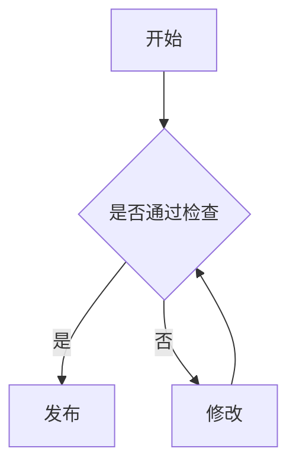

这篇文章记录 Markdown 的通用写法。

同时，它也顺便展示 H2RO Archive 当前支持的 Markdown 渲染能力，包括表格、任务列表、代码块、数学公式、Mermaid 图、提示块、隐藏内容和 GitHub 仓库卡片等。

它不是完整的标准手册，而是一份面向日常写作的速查笔记：哪些属于 Markdown 基础语法，哪些属于 GitHub Flavored Markdown 或具体平台的扩展，遇到图片、表格、代码块、数学公式和图表时应该怎么写，才能让文档长期可读、可维护。

## 1. 基本原则

Markdown 文档应优先满足三件事：

- 内容结构清楚，标题层级不要跳跃。
- 语法尽量使用 CommonMark / GitHub Flavored Markdown 的常见写法。
- 需要特殊展示时，先确认目标平台是否支持对应扩展。

写作时可以把 Markdown 当成一份「可审阅的源文件」，而不是只追求当前预览效果的富文本。

## 2. Frontmatter

很多静态站点、知识库和笔记工具支持 frontmatter，用来记录标题、日期、标签等元信息。

```yaml
---
title: 文章标题
published: 2026-07-05
updated: 2026-07-05
description: 一句话说明这篇文章记录什么。
tags: [Markdown, 语法]
category: self-study
draft: false
lang: zh-CN
---
```

常见字段：

| 字段            | 说明                          |
| --------------- | ----------------------------- |
| `title`       | 文档标题                      |
| `published`   | 发布时间，使用 `YYYY-MM-DD` |
| `updated`     | 可选，内容有明显更新时再填    |
| `description` | 摘要，尽量一两句话说清        |
| `tags`        | 主题标签，由内容决定          |
| `category`    | 大分类或文档集合              |
| `draft`       | 是否为草稿                    |
| `lang`        | 文档语言，例如 `zh-CN`      |

Frontmatter 不是 Markdown 核心语法，而是很多工具共同采用的扩展约定。

## 3. 标题层级

标题使用 `#` 表示层级。

```markdown
## 二级标题

### 三级标题

#### 四级标题
```

建议每个 `#` 后面留一个空格。不要为了让字号变大而滥用标题，标题是结构，不是装饰。

## 4. 段落、换行和分隔线

普通段落之间留一个空行。

```markdown
这是第一段。

这是第二段。
```

如果只是想在同一段中强制换行，可以在行尾使用两个空格，但一般不建议频繁使用。

分隔线使用三个短横线：

```markdown
---
```

## 5. 强调、删除线和行内代码

```markdown
这是 **粗体**，这是 *斜体*，这是 ~~删除线~~。

命令、路径、变量和短代码使用 `inline code`。
```

示例：

这是 **粗体**，这是 *斜体*，这是 ~~删除线~~。

命令、路径、变量和短代码使用 `inline code`。

## 6. 列表和任务列表

无序列表：

```markdown
- 第一项
- 第二项
- 第三项
```

有序列表：

```markdown
1. 第一步
2. 第二步
3. 第三步
```

任务列表：

```markdown
- [x] 已完成
- [ ] 待处理
```

效果：

- [x] 已完成
- [ ] 待处理

任务列表适合记录清单，不建议把整篇文章写成待办事项。

## 7. 引用

引用使用 `>`。

```markdown
> 这是一段引用。
>
> 可以包含多个段落。
```

引用适合放来源摘录、定义、警示性说明。普通正文不要全部放进引用块。

## 8. 链接和图片

外部链接：

```markdown
[Astro 文档](https://docs.astro.build/)
```

相对链接适合同一文档目录内的文件：

```markdown
[查看附录](./appendix.md)
```

图片使用标准 Markdown 图片语法：

```markdown

```

建议：

- 图片必须有说明文字。
- 图片路径尽量使用相对路径。
- 图片说明不要留空，方便搜索、朗读和后续维护。
- Obsidian 的 `![[image.png]]` 不是通用 Markdown 语法，跨平台发布时应转成标准图片语法。

## 9. 表格

表格使用 GitHub Flavored Markdown 写法。

```markdown
| 字段 | 说明 |
| --- | --- |
| `title` | 文章标题 |
| `tags` | 文章标签 |
```

效果：

| 字段 | 说明 |
| --- | --- |
| `title` | 文章标题 |
| `tags` | 文章标签 |

长表格可以横向滚动，但不要把复杂数据表强塞进正文。特别大的表格更适合拆成 PDF、CSV 或单独文档。

## 10. 代码块

代码块使用三个反引号，并指定语言。

````markdown
```python
def hello() -> None:
    print("hello")
```
````

常用语言名：

| 场景       | 推荐语言名     |
| ---------- | -------------- |
| Shell 命令 | `bash`       |
| PowerShell | `powershell` |
| Python     | `python`     |
| JavaScript | `js`         |
| TypeScript | `ts`         |
| JSON       | `json`       |
| YAML       | `yaml`       |
| TOML       | `toml`       |
| LaTeX      | `latex`      |
| 普通文本   | `text`       |

注意：

- 代码围栏必须成对闭合。
- 不要把标题、解释文字写在反引号同一行当作语言名。
- 语言名尽量使用小写。

错误示例：

````markdown
```这里是说明文字
some code
```
````

推荐写法：

````markdown
这里是说明文字：

```bash
some command
```
````

## 11. 数学公式

很多 Markdown 工具通过 KaTeX 或 MathJax 支持数学公式。

行内公式：

```markdown
质能方程可以写成 $E = mc^2$。
```

效果：

质能方程可以写成 $E = mc^2$。

公式块：

```markdown
$$
\sum_{i=1}^{n} i = \frac{n(n+1)}{2}
$$
```

效果：

$$
\sum_{i=1}^{n} i = \frac{n(n+1)}{2}
$$

对于复杂公式，优先使用公式块，不要把很长的公式塞进行内。

## 12. Mermaid 图

很多文档系统支持 Mermaid 代码块。

````markdown

````

效果：


适合使用 Mermaid 的场景：

- 流程图
- 时序图
- 状态机
- 甘特图
- 简单类图

Mermaid 不是 Markdown 核心语法，而是常见扩展。使用前需要确认目标平台是否支持。

## 13. 提示块

很多技术文档系统支持提示块，但具体语法因平台而异。

容器指令写法示例：

```markdown
:::note
这是一条补充说明。
:::

:::warning
这是一条需要注意的风险说明。
:::
```

效果：

:::note
这是一条补充说明。
:::

:::warning
这是一条需要注意的风险说明。
:::

GitHub 风格写法示例：

```markdown
> [!NOTE]
> 这是一条说明。

> [!TIP]
> 这是一条提示。
```

效果：

> [!NOTE]
> 这是一条说明。

> [!TIP]
> 这是一条提示。

可用类型：

| 类型          | 用途               |
| ------------- | ------------------ |
| `note`      | 补充说明           |
| `tip`       | 建议和技巧         |
| `important` | 重要信息           |
| `warning`   | 风险提醒           |
| `caution`   | 负面后果或谨慎操作 |

## 14. 常见平台扩展：隐藏内容

部分平台支持行内隐藏内容：

```markdown
这段文字里 :spoiler[有一段默认隐藏的内容]。
```

效果：

这段文字里 :spoiler[有一段默认隐藏的内容]。

隐藏内容适合放剧透、答案、可选提示，不适合藏关键正文。

## 15. 常见平台扩展：GitHub 仓库卡片

部分博客系统或文档系统可以用 GitHub card 展示仓库：

```markdown
::github{repo="owner/repo"}
```

效果示例：

::github{repo="withastro/astro"}

仓库卡片适合放项目资料或源码入口。如果目标平台不支持，使用标准链接即可。

## 16. HTML

Markdown 中可以写少量 HTML，但本站文章不建议依赖大段 HTML。

可以接受的场景：

- 很少量的 `<br>`。
- 无法用 Markdown 表达的短行内标记。

应该避免的场景：

- 大段 `<div>` 布局。
- 内联样式。
- iframe 或外部脚本。

如果一篇文章需要大量 HTML，说明它可能不适合做普通 Markdown 文章。

## 17. 兼容性说明

Markdown 的麻烦在于“方言”很多。下面这些常见功能不一定每个平台都支持：

| 功能 | 是否核心语法 | 常见支持情况 |
| --- | --- | --- |
| 标题、段落、列表、引用 | 是 | 基本都支持 |
| 链接、图片、行内代码、代码块 | 是 | 基本都支持 |
| 表格 | 否 | GFM 和多数文档工具支持 |
| 删除线 | 否 | GFM 常见支持 |
| 任务列表 | 否 | GFM 常见支持 |
| 脚注 | 否 | 部分工具支持 |
| 数学公式 | 否 | 依赖 KaTeX / MathJax |
| Mermaid | 否 | 依赖渲染器 |
| 提示块 | 否 | 平台差异较大 |
| Frontmatter | 否 | 静态站点和笔记工具常见支持 |
| 标签 | 否 | 笔记软件常见支持 |

写需要跨平台迁移的文档时，越依赖扩展，迁移成本越高。写个人笔记时，可以根据工具能力自由使用，但最好知道哪些是通用 Markdown，哪些是平台能力。

## 18. H2RO Archive 中的显示增强

H2RO Archive 中的 Markdown 可以使用基础语法，也支持一些常见增强：

- 代码块高亮、行号、复制按钮和浅色代码框。
- Mermaid 图。
- KaTeX 数学公式。
- GitHub 风格提示块。
- 容器指令形式的提示块。
- GitHub 仓库卡片。
- 行内隐藏内容。
- 表格自动包裹，避免宽表格撑破页面。

这些能力属于网站渲染层扩展，不等于通用 Markdown。写需要跨平台迁移的笔记时，应优先使用基础语法；写本站正式文章时，可以按需要使用这些增强。

## 19. 写作检查

发布前至少检查这些点：

- 如果使用 frontmatter，字段应完整且格式正确。
- 代码块围栏成对闭合。
- 图片路径可访问。
- 如果从 Obsidian 迁移，确认没有残留 `[[...]]` 或 `![[...]]`。
- 表格没有被错误换行破坏。
- Mermaid、数学公式和提示块能在目标平台正常渲染。
- 私密内容、账号、密钥、恢复码没有进入正文。

Markdown 的好处是简单，坏处是宽松。写完后多做一次语法卫生，后面就少很多麻烦。
