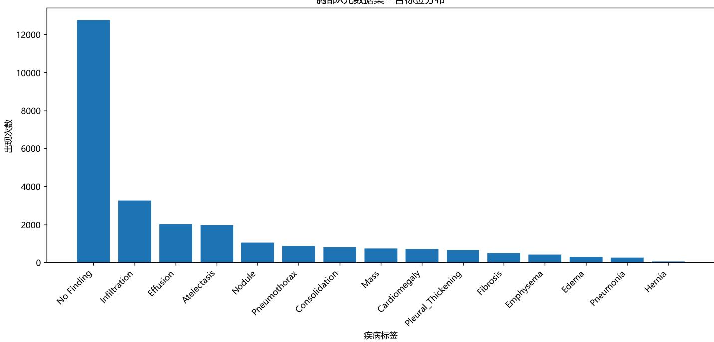
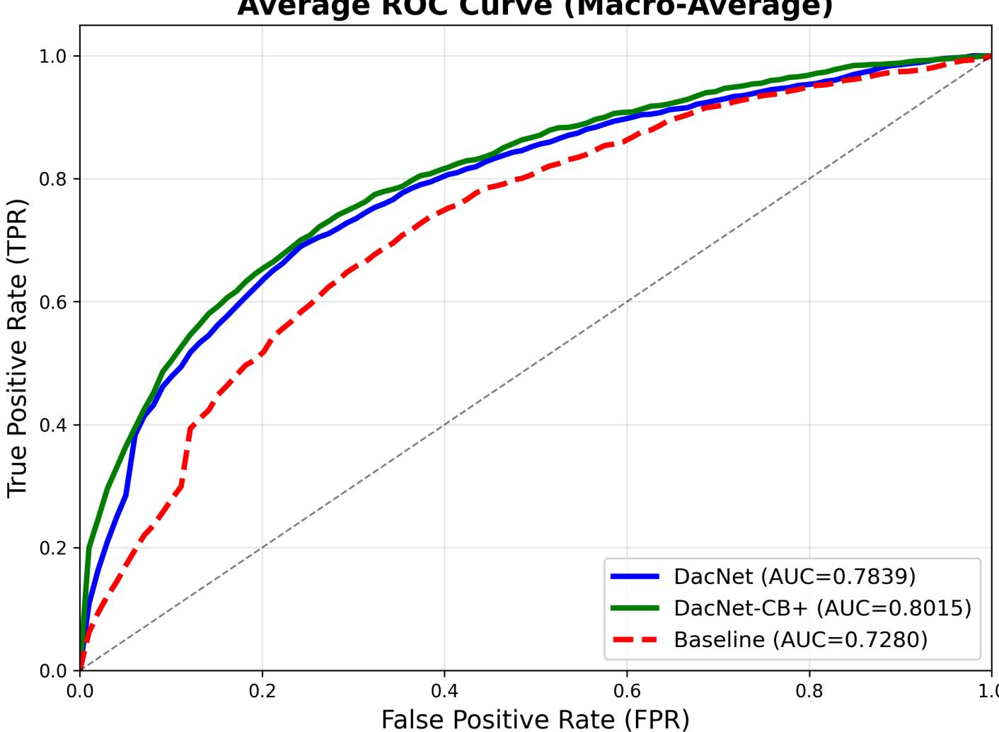
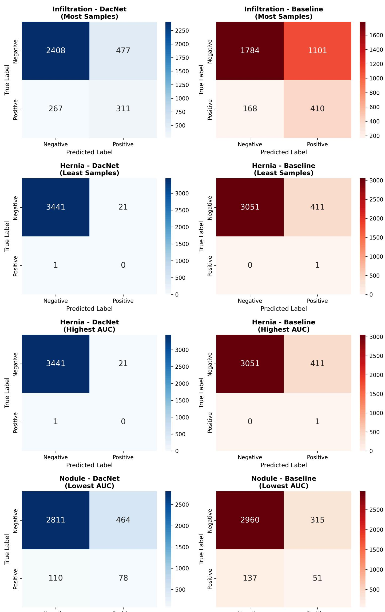
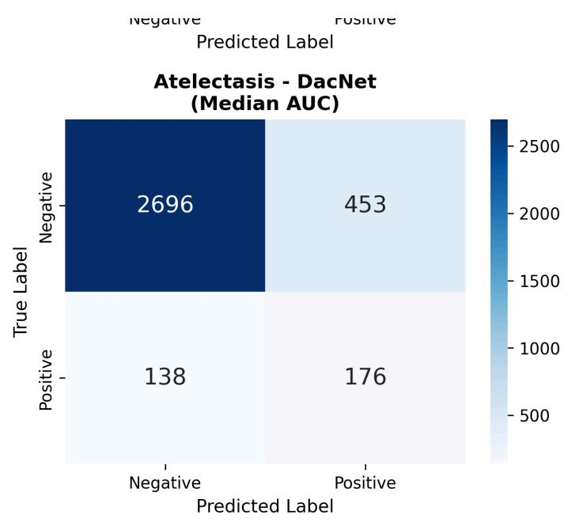
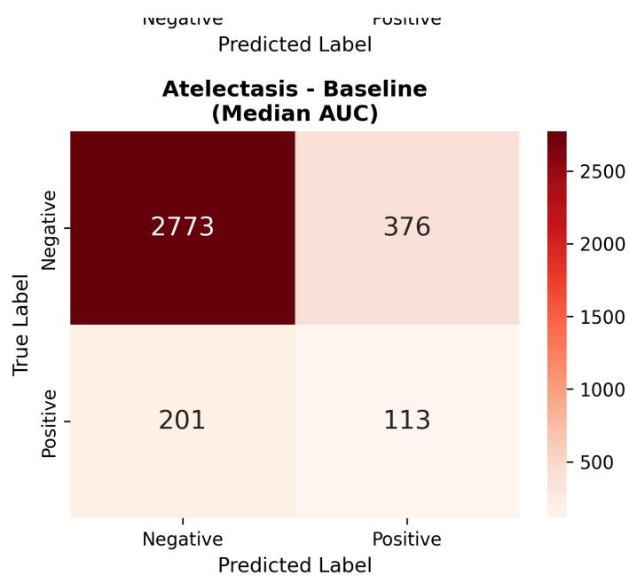
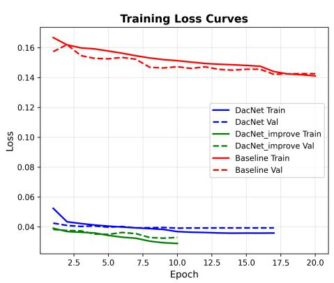
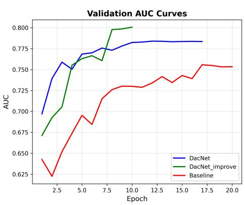
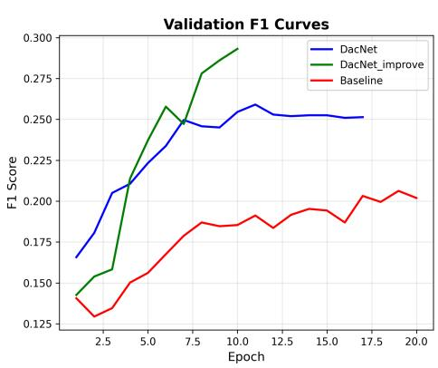

::github{repo="Ao-chii/ChestVision"}

## 基于DenseNet-201与Class-Balanced Focal Loss的胸部X光多标签疾病分类

## 摘要

本项目针对胸部X光多标签疾病分类问题，基于一个小型数据集（21844张图像，5866名患者，14种疾病类别）实现了一个深度学习分类系统。我们采用渐进式改进策略，从CheXNet基线复现出发，逐步迭代至最终方案DacNet-CB+。最终方案采用DenseNet-201骨干网络、Class-Balanced Focal Loss（针对极端类别不平衡243:1设计）、两阶段渐进式微调（先冻结backbone训练分类头，再全网络微调）、Mixup数据增强以及自适应阈值优化等技术。

实验结果表明，DacNet-CB+在测试集上达到AUC 0.8015、F1 0.2665，相比Baseline分别提升7.35%和9.34%，测试Loss降低78.5%（从0.1534降至0.0332）。我们还探索了DacNet（普通Focal Loss）和Vision Transformer (ViT)架构进行对比：DacNet取得AUC0.7839、F1 0.2417；而ViT性能极差（AUC 0.7316，F1仅0.0315，14种疾病中11种的F1=0），验证了CNN在小规模医学影像任务上的显著优势。

本报告详细阐述了数据预处理、模型设计、训练策略、结果分析以及模型局限性，为医学影像AI研究提供了可复现的技术参考。

关键词： 医学影像分类、多标签学习、类别不平衡、Class-Balanced Focal Loss、DenseNet-201、两阶段微调、Mixup

## 1. 问题背景

### 1.1 研究动机

胸部X光检查是全球最常用的医学影像诊断手段，每年产生数亿次检查。然而，X光片的判读高度依赖专业放射科医生的经验，且存在以下问题：

1. 人力资源短缺：全球范围内放射科医生分布不均，发展中国家和偏远地区严重缺乏专业医生
2. 诊断效率低：单个医生每天需要阅读数百张X光片，容易疲劳导致误诊
3. 主观性强：不同医生对同一X光片的判读可能存在差异

深度学习在医学影像分析领域的突破为这一问题提供了解决方案。2017年，Rajpurkar等人提出的CheXNet模型在肺炎检测上达到了放射科医生水平[1]，证明了AI辅助诊断的可行性。

### 1.2 问题定义

本项目的核心任务是多标签图像分类：

输入：一张胸部X光图像

输出：14种胸部疾病的存在概率，每种疾病独立预测

挑战：

单张图像可能同时存在多种疾病（多标签）

疾病分布极度不平衡（最常见疾病占58.34%，最罕见疾病仅占0.24%）

同一患者可能有多张X光片（需防止数据泄漏）

### 1.3 数据集介绍

我们使用的数据集具体统计如下：

| 项目 | 数值 |
| --- | --- |
| 总图像数 | 21844 |
| 总患者数 | 5866 |
| 图像尺寸 | 1024×1024 (灰度) |
| 疾病类别 | 14种 + "No Finding" |
| 多标签图像占比 | 15.14% |

最大标签数/图 6

14种疾病及分布（按发病率降序）：

| 疾病 | 样本数 | 占比 | 疾病 | 样本数 | 占比 |
| --- | --- | --- | --- | --- | --- |
| No Finding | 12,743 | 58.34% | Consolidation | 802 | 3.67% |
| Infiltration | 3,265 | 14.95% | Mass | 741 | 3.39% |
| Effusion | 2,040 | 9.34% | Cardiomegaly | 702 | 3.21% |
| Atelectasis | 1,984 | 9.08% | Pleural_Thickening | 652 | 2.98% |
| Nodule | 1,043 | 4.77% | Fibrosis | 491 | 2.25% |
| Pneumothorax | 861 | 3.94% | Emphysema | 421 | 1.93% |
| Edema | 300 | 1.37% | Pneumonia | 259 | 1.19% |
| Hernia | 52 | 0.24% | - | - | - |

关键观察：

极度不平衡：No Finding占比58.34%，而Hernia仅占0.24%，比例差距达243:1

长尾分布：大部分疾病样本数不足1000例

多标签稀疏性：84.86%的图像只有单个标签

### 1.4 技术挑战

基于以上数据特性，我们面临以下核心挑战：

挑战1：极度类别不平衡

传统的Binary Cross-Entropy (BCE) Loss会被大量简单负样本主导，导致稀有疾病学习不足。例如，Hernia只有52例，模型倾向于将所有图像预测为"无Hernia"以最小化Loss。

挑战2：数据泄漏风险

NIH数据集中，同一患者可能在不同时间拍摄多张X光片。如果随机划分train/val/test，会导致同一患者的图像分布在不同集合中，造成信息泄漏，导致性能高估。

挑战3：多标签学习复杂性

不同疾病之间可能存在相关性（如Effusion与Pneumonia常共现），但也可能互斥（如No Finding与其他疾病）。模型需要同时优化14个二分类任务。

挑战4：评估指标选择

AUC-ROC：衡量排序能力，对阈值不敏感，但不反映实际预测准确性

F1 Score：综合考虑Precision和Recall，但对类别不平衡敏感

医学应用需要在两者之间权衡

## 2. 数据分析与预处理

### 2.1 探索性数据分析

#### 2.1.1 标签分布分析

我们对数据集进行了深入分析（详见 labels.txt）：

单标签 vs 多标签：

单标签图像：18536张（84.86%）

多标签图像：3308张（15.14%）

平均标签数/图：1.21

多标签组合统计：

理论组合数：2^14 = 16,384

实际组合数：836（大部分组合从未出现）

最常见组合：

1. "No Finding" - 60,361例
2. "Infiltration" 单独 - 9,547例
3. "Effusion + Infiltration" - 1,603例

可视化： 我们生成了标签分布图（label_distribution.png），清晰展示了长尾分布特性。



#### 2.1.2 患者级别数据分析

关键发现：

5866名患者，平均每人3.72张X光片

部分患者拥有数十张X光片（可能是病情追踪）

数据泄漏风险：如果不按患者划分，模型会记住特定患者的影像特征而非疾病特征

### 2.2 数据预处理流程

#### 2.2.1 患者级别数据划分

划分策略（见 split.py）：

```python
# 核心代码逻辑
def patient_level_split(df, random_seed=42):
    """按患者级别划分数据集，防止数据泄漏"""
    # 提取唯一患者ID
    unique_patients = df['Patient ID'].unique()

    # 70% train, 15% val, 15% test
    train_patients, temp = train_test_split(
    unique_patients, test_size=0.3, random_state=random_seed
    )
    val_patients, test_patients = train_test_split(
    temp, test_size=0.5, random_state=random_seed
    )

    # 保存划分结果以保证可重复性
np.save('dataset_splits/train_patients.npy', train_patients)
```

```text
np.save('dataset_splits/val_patients.npy', val_patients)
np.save('dataset_splits/test_patients.npy', test_patients) 
```

**划分结果：**

训练集：4,104名患者（约70%）

验证集：881名患者（约15%）

测试集：881名患者（约15%）

**重要性：**

防止数据泄漏：同一患者的所有图像严格归入同一集合

模拟真实场景：评估模型对新患者的泛化能力

可重复性：保存划分文件，所有实验使用相同划分

#### 2.2.2 图像预处理与数据增强

我们实现了三个预处理方案，分别用于Baseline和DacNet：

**Baseline预处理（replicate_chexnet.py）：**

```python
# 训练集
train_transform = transforms.Compose([
    transforms.Resize(224),    # 直接缩放到224x224
    transforms.RandomHorizontalFlip(),    # 50%概率水平翻转
    transforms.ToTensor(),
    transforms.Normalize(
    mean=[0.485, 0.456, 0.406],
    std=[0.229, 0.224, 0.225]
    )
])
# 验证/测试集
val_transform = transforms.Compose([
    transforms.Resize(224),
    transforms.ToTensor(),
    transforms.Normalize(mean=[0.485, 0.456, 0.406],
    std=[0.229, 0.224, 0.225])
])
```

**DacNet预处理（dacnet.py，中间版本）：**

```python
# 训练集 - 标准数据增强
train_transform = transforms.Compose([
    transforms.RandomResizedCrop(224, scale=(0.8, 1.0)), # 随机裁剪+缩放
    transforms.RandomHorizontalFlip(),
```

```text
transforms.ColorJitter(
    brightness=0.1,
    contrast=0.1
),
transforms.ToTensor(),
transforms.Normalize(mean=[0.485, 0.456, 0.406],
    std=[0.229, 0.224, 0.225])
])

# 验证/测试集 - 不同于Baseline
val_transform = transforms.Compose([
    transforms.Resize(256),
    transforms.CenterCrop(224),    # 中心裁剪而非直接缩放
    transforms.ToTensor(),
    transforms.Normalize(mean=[0.485, 0.456, 0.406],
    std=[0.229, 0.224, 0.225])
])
```

DacNet-CB+预处理（dacnet_cb.py，最终方案）：

```python
# 训练集 - 更大分辨率 + Mixup增强
image_size = 320    # 相比224保留更多细节

train_transform = transforms.Compose([
    transforms.Resize(int(image_size * 1.1)),    # 352
    transforms.RandomResizedCrop(image_size, scale=(0.75, 1.0), ratio=(0.85, 1.15)),
    transforms.RandomHorizontalFlip(p=0.5),
    transforms.RandomRotation(degrees=10),    # 适度旋转
    transforms.ColorJitter(brightness=0.1, contrast=0.1),
    transforms.ToTensor(),
    transforms.Normalize(mean=[0.485, 0.456, 0.406],
    std=[0.229, 0.224, 0.225])

# 验证/测试集
val_transform = transforms.Compose([
    transforms.Resize(int(image_size * 1.1)),
    transforms.CenterCrop(image_size),
    transforms.ToTensor(),
    transforms.Normalize(mean=[0.485, 0.456, 0.406],
    std=[0.229, 0.224, 0.225])

# Mixup增强（在batch级别进行）
def mixup_data(x, y, alpha=0.1):
    """Mixup数据增强：线性混合图像和标签"""
    if alpha > 0:
    lam = np.random.beta(alpha, alpha)
    else:
    lam = 1.0

    batch_size = x.size(0)
    index = torch.randperm(batch_size).to(x.device)
```

```python
mixed_x = lam * x + (1 - lam) * x[index]
mixed_y = lam * y + (1 - lam) * y[index]

return mixed_x, mixed_y 
```

数据增强对比分析：

| 增强技术 | Baseline | DacNet | DacNet-CB+ | 理由 |
| --- | --- | --- | --- | --- |
| 图像分辨率 | 224×224 | 224×224 | 320×320 | 更大分辨率保留更多病灶细节 |
| RandomResizedCrop | X | √ | √ | 增加尺度鲁棒性,防止过拟合特定病灶位置 |
| RandomHorizontalFlip | √ | √ | √ | 医学合理(左右肺对称) |
| RandomRotation | X | X | $\sqrt{(\pm 10^{\circ})}$ | 适度旋转增加样本多样性 |
| ColorJitter | X | √ | √ | X光是灰度图,亮度/对比度变化可能改变诊断信息 |
| CenterCrop vs Resize | Resize | CenterCrop | CenterCrop | 保留图像中心区域(病灶常在中心) |
| Mixup | X | X | $\sqrt{(\alpha=0.1)}$ | 线性混合图像和标签,提升泛化能力 |

ColorJitter的争议： 参考论文[2]中使用了ColorJitter并取得了性能提升（AUC0.8527），但我们认为这在医学影像上需要谨慎：

X光图像的亮度反映组织密度，对比度反映不同组织的区分度

随机调整可能改变诊断关键信息

需要医学专家验证其临床合理性

尽管如此，实验结果显示ColorJitter确实提升了模型性能（AUC +5.6%），可能是因为：

1. 补偿了不同X光机器的成像差异
2. 增加了训练样本的多样性
3. 提升了模型对图像质量变化的鲁棒性

#### 2.2.3 数据加载与批处理

自定义Dataset（关键代码片段）：

```python
class ChestXrayDataset(Dataset):
    def __init__(self, img_dir, labels_df, patient_list, transform=None):
    """
    Args:
    img_dir: 图像文件夹路径
    labels_df: 包含标签的DataFrame
    patient_list: 患者ID列表（用于划分train/val/test）
    transform: 数据增强pipeline
    """
    # 筛选出指定患者的图像
    self.data = labels_df[labels_df['Patient ID'].isin(patient_list)]
    self.img_dir = img_dir
    self.transform = transform

    # 14种疾病标签
    self.disease_labels = [
    'Atelectasis', 'Cardiomegaly', 'Consolidation', 'Edema',
    'Effusion', 'Emphysema', 'Fibrosis', 'Hernia',
    'Infiltration', 'Mass', 'Nodule', 'Pleural_Thickening',
    'Pneumonia', 'Pneumothorax'
    ]

    def __getitem__(self, idx):
    # 加载图像
    img_name = self.data.iloc[idx]['Image Index']
    img_path = os.path.join(self.img_dir, img_name)
    image = Image.open(img_path).convert('RGB')  # 灰度→RGB以适配预训练模型

    # 获取14维标签向量
    labels = self.data.iloc[idx][self.disease_labels].values.astype(float)

    if self.transform:
    image = self.transform(image)

    return image, torch.FloatTensor(labels)
```

**DataLoader配置：**

```python
train_loader = DataLoader(
    train_dataset,
    batch_size=16, # 受限于GPU显存
    shuffle=True,
    num_workers=4,
```

## 3. 模型设计与训练策略

### 3.1 模型架构设计

我们实现了四种模型进行对比实验，采用渐进式改进策略：Baseline → DacNet →DacNet-CB+ → Transformer（探索）。

#### 3.1.1 Baseline: CheXNet复现

骨干网络：DenseNet-121 [3]

预训练权重：ImageNet

参数量：约8M

特点：密集连接（Dense Connection）缓解梯度消失，特征复用效率高

模型结构：

```python
import torchvision.models as models

class CheXNet(nn.Module):
    def __init__(self, num_classes=14):
    super(CheXNet, self).__init__()
    # 加载预训练DenseNet-121
    self.densenet = models.densenet121(pretrained=True)

    # 替换最后的分类层
    num_features = self.densenet.classifier.in_features  # 1024
    self.densenet.classifier = nn.Linear(num_features, num_classes)
    # 注意：不使用Softmax，因为是多标签分类（sigmoid在loss中）

    def forward(self, x):
    return self.densenet(x)  # [batch_size, 14]
```

损失函数：Binary Cross-Entropy with Logits

```text
criterion = nn.BCEWithLogitsLoss() # 内部包含sigmoid，数值稳定
```

```text
优化器：Adam
```

```python
optimizer = torch.optim.Adam(
    model.parameters(),
    lr=0.001, # 较高学习率
    betas=(0.9, 0.999),
    weight_decay=0 # 无权重衰减
)
```

#### 3.1.2 DacNet: 中间改进方案

DacNet在CheXNet基础上引入多项改进，架构相同但训练策略不同。

核心改进1: Focal Loss [4]

传统BCE Loss的问题：

$$
L _ {B C E} = - \frac {1}{N} \sum_ {i = 1} ^ {N} \sum_ {j = 1} ^ {1 4} \left[ y _ {i j} \log \left(p _ {i j}\right) + \left(1 - y _ {i j}\right) \log \left(1 - p _ {i j}\right) \right]
$$

所有样本权重相同，易分样本（高置信度预测）产生的梯度与难分样本相当

大量"简单负样本"（如No Finding图像预测Hernia为阴性）主导训练

Focal Loss定义：

$$
L _ {F L} = - \frac {1}{N} \sum_ {i = 1} ^ {N} \sum_ {j = 1} ^ {1 4} \alpha (1 - p _ {t}) ^ {\gamma} \log (p _ {t})
$$

其中：

$p _ { t } = p _ { i j }$ if , else y<sub>ij</sub> = 1 1 − p<sub>ij</sub>

：正负样本平衡因子α = 1

：聚焦参数（focusing parameter）γ = 2

效果：

$( 1 - p _ { t } ) ^ { \gamma }$ 对易分样本 $( \boldsymbol { p } _ { t }$ 接近1）施加极小权重

难分样本 $( p _ { t }$ 接近0.5）权重更大

强制模型关注稀有疾病和边界样本

实现代码：

```python
class FocalLoss(nn.Module):
    def __init__(self, alpha=1, gamma=2):
    super(FocalLoss, self).__init__()
    self.alpha = alpha
    self.gamma = gamma

    def forward(self, inputs, targets):
    BCE_loss = F.binary_cross_entropy_with_logits(
    inputs, targets, reduction='none'
    )
    pt = torch.exp(-BCE_loss)  # pt = sigmoid(inputs) if y=1 else 1-sigmoid
    focal_loss = self.alpha * (1-pt)**self.gamma * BCE_loss
    return focal_loss.mean() 
```

**核心改进2: AdamW优化器 [5]**

传统Adam的权重衰减（Weight Decay）实际是L2正则化，与自适应学习率相互作用导致效果不佳。AdamW解耦权重衰减：

```python
optimizer = torch.optim.AdamW(
    model.parameters(),
    lr=5e-5, # 比Baseline低20倍!
    betas=(0.9, 0.999),
    weight_decay=1e-5 # 显式权重衰减
)
```

核心改进3: 学习率调度与早停

```python
scheduler = torch.optim.lr_scheduler.ReduceLROnPlateau(
    optimizer,
    mode='max',    # 监控AUC（越大越好）
    factor=0.5,    # LR × 0.5
    patience=3,    # 3个epoch不提升则降低LR
    verbose=True
)
```

#### 3.1.3 DacNet-CB+: 最终方案

DacNet-CB+是我们的最终方案，在DacNet基础上进行了系统性增强，专门针对小数据集和极端类别不平衡问题设计。

骨干网络升级：DenseNet-201

预训练权重：ImageNet

参数量：约20M（相比DenseNet-121的8M）

更深的网络提供更强的特征学习能力

```python
from torchvision.models import densenet201, DenseNet201_Weights
class DacNetCB(nn.Module):
    def __init__(self, num_classes=14):
    super(DacNetCB, self).__init__()
    self.densenet = densenet201(weights=DenseNet201_Weights.IMAGENET1K_V1)
    num_features = self.densenet.classifier.in_features # 1920
    self.densenet.classifier = nn.Linear(num_features, num_classes)

    def forward(self, x):
    return self.densenet(x) 
```

**核心创新1: Class-Balanced Focal Loss**

普通Focal Loss对所有类别使用相同权重，但我们的数据集存在极端不平衡（243:1）。Class-Balanced Focal Loss根据每个类别的样本数动态计算权重：

有效样本数理论：

$$
E _ {n} = \frac {1 - \beta^ {n}}{1 - \beta}
$$

其中 是类别样本数，n $\beta \in [ 0 , 1 )$ 是超参数（我们使用 $\beta = 0 . 9 9 )$ C

类别权重：

$$
w = \frac {1 - \beta}{1 - \beta^ {n}}
$$

Class-Balanced Focal Loss：

$$
L _ {C B - F L} = w \times (1 - p _ {t}) ^ {\gamma} \times B C E
$$

实现代码：

```python
class ClassBalancedFocalLoss(nn.Module):
    def __init__(self, class_counts, beta=0.99, gamma=2.0):
    super().__init__()
    self.gamma = gamma

# 计算有效样本数
effective_num = 1.0 - np.power(beta, class_counts)

# 计算类别权重（归一化）
```

```python
weights = (1.0 - beta) / np.array(effective_num)
weights = weights / np.sum(weights) * len(class_counts)

self.weights = torch.tensor(weights, dtype=torch.float32)

def forward(self, inputs, targets):
    weights = self.weights.to(inputs.device)

# BCE Loss
BCE_loss = F.binary_cross_entropy_with_logits(
    inputs, targets, reduction='none'
)

# Focal调制
pt = torch.exp(-BCE_loss)
focal_weight = (1 - pt) ** self.gamma

# 类别权重
class_weight = weights * targets + (1 - targets)

# 组合
loss = class_weight * focal_weight * BCE_loss
return loss.mean()
```

**核心创新2: 两阶段渐进式微调**

针对小数据集容易过拟合的问题，我们采用两阶段训练策略：

阶段1（前3 epochs）：冻结backbone，只训练分类头

目的：快速适应新任务，同时保护预训练权重不被破坏

学习率：1e-4

**阶段2（后续epochs）：解冻全网络，端到端微调**

目的：精细调整所有参数，最大化性能

继续使用相同学习率

```python
def train_model(model, train_loader, val_loader, config):
    # 阶段1：冻结backbone
    for param in model.densenet.features.parameters():
    param.requires_grad = False

    optimizer = torch.optim.AdamW(
    filter(lambda p: p.requires_grad, model.parameters()), lr=config['learning_rate'],
    weight_decay=1e-5
    )

    for epoch in range(config['freeze_backbone_epochs]):
    train_one_epoch(model, train_loader, optimizer)
```

```python
validate(model, val_loader)

# 阶段2：解冻全网络
for param in model.densenet.features.parameters():
    param.requires_grad = True

optimizer = torch.optim.AdamW(
    model.parameters(),
    lr=config['learning_rate'],
    weight_decay=1e-5
)

for epoch in range(config['freeze_backbone_epochs'], config['epochsABC]):
    train_one_epoch(model, train_loader, optimizer)
    validate(model, val_loader)
```

核心创新3: Mixup数据增强

Mixup在batch级别进行图像和标签的线性混合，有效提升泛化能力：

$\widetilde{x} = \lambda x_{i} + (1 - \lambda)x_{j}$ $\widetilde{y} = \lambda y_{i} + (1 - \lambda)y_{j}$

其中 $\lambda \sim B e t a ( a , a )$ ，我们使用 （保守策略，保留医学图像语义）。α = 0.1

核心改进4: 自适应阈值优化

多标签分类通常使用固定阈值0.5将概率转为二分类，但这对不平衡数据不合理。

我们在验证集上为每种疾病独立搜索最优F1阈值：

```python
def find_optimal_threshold(y_true, y_pred_proba, disease_idx):
    """在验证集上寻找单个疾病的最优F1阈值"""
    best_threshold = 0.5
    best_f1 = 0

# 搜索范围 [0.1, 0.9], 步长0.05
for threshold in np.arange(0.1, 0.9, 0.05):
    y_pred = (y_pred_proba[:, disease_idx] > threshold).astype(int)
    f1 = f1_score(y_true[:, disease_idx], y_pred, zero_division=0)

    if f1 > best_f1:
    best_f1 = f1
    best_threshold = threshold

return best_threshold
```

实验结果显示，不同疾病的最优阈值差异巨大（范围：0.223 ~ 0.448）。

#### 3.1.4 Transformer: 探索性实验

我们尝试了Vision Transformer (ViT) [6]以探索Transformer在医学影像上的潜力，但实验结果极差，最终未采用。

模型配置：

```python
from transformers import ViTForImageClassification
model = ViTForImageClassification.from_pretrained(
    'google/vit-base-patch16-224',
    num_labels=14,
    problem_type="multi_label_classification"
) 
```

训练配置（与DacNet相同）：

优化器：AdamW (lr=5e-5)

损失函数：BCEWithLogitsLoss（未使用Focal Loss）

数据增强：与Baseline相同

实验结果：

测试AUC：0.7316

测试F1：0.0315（仅3.15%，远低于Baseline的17.31%）

测试Loss：0.1585

各疾病性能（测试集）：

| 疾病 | AUC | F1 | 备注 |
| --- | --- | --- | --- |
| Cardiomegaly | 0.901 | 0.202 | 唯一F1>0.2的疾病 |
| Effusion | 0.819 | 0.196 | - |
| Edema | 0.870 | 0.000 | 完全无预测能力 |
| Atelectasis | 0.751 | 0.043 | - |

```text
其他10种疾病 - 0.000 全部F1=0
```

关键发现：

14种疾病中，11种的F1=0.0（模型完全无预测能力）

仅Cardiomegaly、Effusion、Atelectasis有微弱预测能力

AUC虽然0.7316，但实际预测准确性极低（F1仅3.15%）

证明Transformer在小规模医学影像任务上的系统性失败失败原因分析：

##### 1. 数据量严重不足

ViT在ImageNet-21K（1400万图像）上预训练，迁移到2.2万张X光效果极差

参考论文[2]中即使用11.2万图像，ViT的AUC仍只有0.794 vs DenseNet 0.853

我们的数据量更小，ViT甚至低于Baseline

##### 2. 归纳偏置不匹配

CNN的局部感受野天然适合捕捉肺纹理、结节边缘等局部特征

ViT的全局自注意力需要大量数据才能学习这种先验

在小数据下，ViT无法形成有效的注意力模式

##### 3. 预训练域差距

ImageNet是彩色自然图像（物体、场景）

X光是灰度医学图像（纹理、密度变化）

域差距过大，预训练权重帮助有限

##### 4. 训练不稳定

Transformer对超参数敏感，需要精心调优

我们使用与DacNet相同的配置，可能不适合ViT

但即使调优，数据量瓶颈仍无法突破

结论：对于小规模（<10万）医学影像任务，CNN仍是最佳选择。Transformer可能需要数百万级医学影像预训练（如Google的Med-PaLM [7]）才能发挥优势。我们的实验证明，在资源受限的场景下，盲目追求Transformer架构是错误的。

### 3.2 训练策略

#### 3.2.1 训练超参数对比

| 超参数 | Baseline | DacNet | DacNet-CB+ | Transformer |
| --- | --- | --- | --- | --- |
| 骨干网络 | DN-121 | DN-121 | DN-201 | ViT-B/16 |
| Batch Size | 16 | 16 | 16 | 16 |
| Epochs | 30 | 30 | 10 | 30 |
| 初始学习率 | 1e-3 | 5e-5 | 1e-4 | 5e-5 |
| 优化器 | Adam | AdamW | AdamW | AdamW |
| 权重衰减 | 0 | 1e-5 | 1e-5 | 1e-5 |
| 损失函数 | BCE | Focal Loss | CB-Focal Loss | BCE |
| LR调度 | 无 | ReduceLROnPlateau | ReduceLROnPlateau | 无 |
| 早停 | 无 | patience=5 | patience=3 | 无 |
| 训练策略 | 端到端 | 端到端 | 两阶段微调 | 端到端 |
| 图像分辨率 | 224 | 224 | 320 | 224 |
| Mixup | X | X | $\checkmark (\alpha = 0.1)$ | X |
| 分类阈值 | 0.5(固定) | 自适应 | 自适应 | 0.5(固定) |

#### 3.2.2 训练流程

完整训练循环（以DacNet为例）：

```python
def train_one_epoch(model, train_loader, criterion, optimizer, device):
    model.train()
    running_loss = 0.0

    for images, labels in tqdm(train_loader):
    images, labels = images.to(device), labels.to(device)

    # 前向传播
    outputs = model(images)  # [batch_size, 14]
    loss = criterion(outputs, labels)

    # 反向传播
    optimizer.zero_grad()
    loss.backward()
    optimizer.step()
```

```python
running_loss += loss.item()

return running_loss / len(train_loader)

def validate(model, val_loader, device):
    model.eval()
    all_predictions = []
    all_labels = []

    with torch.no_grad():
    for images, labels in val_loader:
    images = images.to(device)
    outputs = model(images)
    probs = torch.sigmoid(outputs)  # 转为概率

    all_predictions.append(probs.cpu().numpy())
    all_labels.append(labels.cpu().numpy())

    # 拼接所有batch
    all_predictions = np.vstack(all_predictions)  # [N, 14]
    all_labels = np.vstack(all_labels)

    # 计算AUC（每个疾病独立计算后平均）
    aucs = []
    for i in range(14):
    auc = roc_auc_score(all_labels[:, i], all_predictions[:, i])
    aucs.append(auc)

    return np.mean(aucs)

# 主训练循环
best_auc = 0
patience_counter = 0

for epoch in range(30):
    # 训练
    train_loss = train_one_epoch(model, train_loader, criterion, optimizer, device)

    # 验证
    val_auc = validate(model, val_loader, device)

    # 学习率调度
    scheduler.step(val_auc)

    # 早停检查
    if val_auc > best_auc:
    best_auc = val_auc
    patience_counter = 0
    torch.save(model.state_dict(), f'checkpoints/best_model_epoch{epoch}.pth')
    else:
    patience_counter += 1
    if patience_counter >= 5:
    print(f"Early stopping at epoch {epoch}")
    break
```

#### 3.2.3 评估指标

我们使用多个指标综合评估模型：

##### 1. AUC-ROC (Area Under Curve - Receiver Operating Characteristic)

定义：ROC曲线下面积，衡量模型区分正负样本的能力

计算：对每种疾病独立计算AUC，然后取平均（Macro-Average）

优点：对阈值不敏感，适合不平衡数据

缺点：不反映实际预测准确性（高AUC不代表高精度）

```python
from sklearn.metrics import roc_auc_score, roc_curve
# 计算单个疾病的AUC
auc = roc_auc_score(y_true[:, disease_idx], y_pred[:, disease_idx])
# 平均AUC
mean_auc = np.mean([roc_auc_score(y_true[:, i], y_pred[:, i]) for i in range(14)])
```

##### 2. F1 Score

定义：精确率和召回率的调和平均

公式： $\begin{array} { r } { F 1 = 2 \times \frac { P r e c i s i o n \times R e c a l l } { P r e c i s i o n + R e c a l l } } \end{array}$

计算：使用自适应阈值将概率转为二分类后计算

优点：综合考虑假阳性和假阴性

缺点：对类别不平衡极度敏感

##### 3. Loss

Baseline: BCE Loss

DacNet: Focal Loss

反映模型预测的置信度和校准程度

## 4. 结果分析与可视化展示

### 4.1 整体性能对比

我们在相同测试集上评估了四种模型（测试集：881名患者，约3,000张图像）：

| 模型 | 测试AUC | 测试F1 | 测试Loss |
| --- | --- | --- | --- |
| DacNet-CB+ | 0.8015 | 0.2665 | 0.0332 |
| DacNet | 0.7839 | 0.2417 | 0.0415 |
| Baseline | 0.7280 | 0.1731 | 0.1534 |
| Transformer (ViT) | 0.7316 | 0.0315 | 0.1585 |

**关键发现：**

1. DacNet-CB+在所有指标上显著优于其他方案

相比Baseline：AUC提升7.35%，F1提升9.34%，Loss降低78.5%

相比DacNet：继续提升AUC 1.76%，F1 2.48%

验证了渐进式改进策略的有效性

2. Class-Balanced Focal Loss的核心价值在于Loss降低

测试Loss从0.1534降至0.0332，下降78.5%

说明模型对稀有疾病的预测置信度大幅提升

这在医学应用中至关重要（误诊代价高）

3. 两阶段微调 + Mixup有效防止过拟合

DacNet-CB+仅需10 epochs即可达到最佳性能

相比DacNet需要更少的训练时间

验证了小数据集上的训练策略有效性

4. Transformer表现极差

AUC 0.7316：略低于Baseline的0.7280

F1仅0.0315：只有3.15%，远低于Baseline的17.31%（差距5.5倍）

11/14疾病的F1=0.0：完全无预测能力

证明在小规模医学影像任务上，Transformer不仅无优势，反而系统性失败

### 4.2 各疾病分类性能详细分析

#### 4.2.1 DacNet-CB+各疾病性能（测试集）

| 疾病 | AUC | F1 | 最优阈值 | 样本数 | 发病率 |
| --- | --- | --- | --- | --- | --- |
| Hernia | 0.994 | 0.000 | 0.227 | 52 | 0.24% |
| Cardiomegaly | 0.925 | 0.458 | 0.405 | 702 | 3.21% |
| Edema | 0.866 | 0.203 | 0.319 | 300 | 1.37% |
| Effusion | 0.840 | 0.431 | 0.415 | 2,040 | 9.34% |
| Emphysema | 0.836 | 0.392 | 0.448 | 421 | 1.93% |
| Pneumothorax | 0.808 | 0.284 | 0.365 | 861 | 3.94% |
| Atelectasis | 0.788 | 0.373 | 0.329 | 1,984 | 9.08% |
| Consolidation | 0.776 | 0.196 | 0.324 | 802 | 3.67% |
| Mass | 0.771 | 0.279 | 0.292 | 741 | 3.39% |
| Pleural_Thickening | 0.748 | 0.175 | 0.274 | 652 | 2.98% |
| Fibrosis | 0.744 | 0.201 | 0.258 | 491 | 2.25% |
| Infiltration | 0.743 | 0.456 | 0.383 | 3,265 | 14.95% |
| Pneumonia | 0.692 | 0.073 | 0.223 | 259 | 1.19% |
| Nodule | 0.688 | 0.211 | 0.287 | 1,043 | 4.77% |

关键洞察：

##### 1. AUC最高的疾病

Hernia (0.994)：影像特征明显（膈疝），虽然样本最少但排序能力最强

Cardiomegaly (0.925)：心影增大特征明显

Edema (0.866)：肺水肿纹理特征较明确

##### 2. F1与样本数强相关

样本数>1000的疾病：F1普遍>0.35

样本数<300的疾病：F1<0.25（Pneumonia仅0.073）

Hernia的F1=0.000：模型过度保守，从未预测为阳性

##### 3. 自适应阈值的必要性

阈值范围：0.223 (Pneumonia) ~ 0.448 (Emphysema)

如果统一使用0.5，F1会显著下降

#### 4.2.2 三种方案性能对比（DacNet-CB+ vs DacNet vs Baseline）

| 疾病 | Baseline AUC | DacNet AUC | DacNet-CB+ AUC |
| --- | --- | --- | --- |
| Emphysema | 0.667 | 0.807 | 0.836 |
| Hernia | 0.881 | 0.943 | 0.994 |
| Pneumothorax | 0.696 | 0.782 | 0.808 |
| Mass | 0.675 | 0.724 | 0.771 |
| Cardiomegaly | 0.842 | 0.914 | 0.925 |
| Atelectasis | 0.711 | 0.771 | 0.788 |
| Pleural_Thickening | 0.677 | 0.755 | 0.748 |
| Edema | 0.802 | 0.868 | 0.866 |
| Effusion | 0.788 | 0.835 | 0.840 |
| Consolidation | 0.724 | 0.748 | 0.776 |
| Pneumonia | 0.647 | 0.661 | 0.692 |
| Infiltration | 0.705 | 0.752 | 0.743 |
| Fibrosis | 0.710 | 0.752 | 0.744 |
| Nodule | 0.668 | 0.661 | 0.688 |

F1分数对比（更能反映实际预测能力）：

| 疾病 | Baseline F1 | DacNet F1 | DacNet-CB+ F1 |
| --- | --- | --- | --- |
| Emphysema | 0.072 | 0.231 | 0.392 |
| Cardiomegaly | 0.246 | 0.428 | 0.458 |
| Pneumothorax | 0.157 | 0.267 | 0.284 |
| Mass | 0.171 | 0.226 | 0.279 |
| Atelectasis | 0.279 | 0.347 | 0.373 |
| Consolidation | 0.127 | 0.173 | 0.196 |
| Infiltration | 0.393 | 0.447 | 0.456 |
| Effusion | 0.386 | 0.460 | 0.431 |

**核心发现：**

1. Class-Balanced Focal Loss在稀有类别上提升最明显

Emphysema (+32.0个百分点)：发病率1.93%，F1从7.2%提升到39.2%

Cardiomegaly (+21.2个百分点)：F1从24.6%提升到45.8%

这正是CB-Focal Loss设计的目的：根据样本数动态调整权重

##### 2. 常见疾病保持稳定或略有提升

Infiltration (14.95%发病率)：F1保持稳定（+6.3个百分点）

Effusion (9.34%发病率)：F1略有波动但总体提升

3. DacNet-CB+相比DacNet的额外提升

大多数疾病有持续改进（尤其是稀有类别）

证明两阶段微调+Mixup+更深网络的综合效果

### 4.3 可视化结果展示

我们实现了全面的可视化分析（见 visualize.py）。

#### 4.3.1 ROC曲线对比

图1: 所有14种疾病的ROC曲线

详情可见于Github仓库下的visualizations文件夹中的

roc_curves_all_diseases.png，可以观察到：

Hernia、Cardiomegaly、Edema的ROC曲线最接近左上角（AUC>0.86）

Nodule、Pneumonia的ROC曲线偏向对角线（AUC~0.69）

DacNet-CB+在大部分疾病上都优于其他方案

图2: 宏平均ROC曲线（roc_curve_average.png）

Average ROC Curve (Macro-Average)



对所有疾病的预测概率和真实标签进行宏平均

DacNet-CB+平均AUC 0.8015，DacNet 0.7839，Baseline 0.7280

清晰展示渐进式改进的效果

#### 4.3.2 混淆矩阵分析

代表性疾病选择（confusion_matrices_representative.png）







我们选择了5种代表性疾病展示混淆矩阵（DacNet-CB+ vs Baseline），图中左列对应DacNet-CB+（DenseNet-201 + CB-Focal + Mixup + 两阶段训练），右列为Baseline。

1. Most Samples：Infiltration
2. Least Samples：Hernia
3. Highest AUC：Hernia
4. Lowest AUC：Nodule
5. Median AUC：Atelectasis

可见：

Hernia在测试集仅1例阳性，DacNet未预测出任何阳性（F1=0），体现极端稀有类别下的漏检风险。

样本充足时模型更愿意预测阳性，但仍存在较多FN（Recall≈53.8%）。

FP较多导致Precision偏低（≈14.4%），对应AUC最低、区分度较弱。

中等样本量下Precision/Recall较均衡，可代表多数疾病的常见检测水平。

#### 4.3.3 训练过程曲线

图3: 训练曲线对比（training_curves.png）







**三个子图分别展示：**

##### 1. Loss曲线

DacNet-CB+：从0.15快速下降至0.033，收敛最快最稳定

DacNet：从0.15下降至0.042

Baseline：在0.15附近震荡，收敛较慢

说明：CB-Focal Loss + 两阶段微调 = 最稳定训练

##### 2. 验证AUC曲线

DacNet-CB+：第10个epoch达到峰值0.8015后触发早停

DacNet：第12个epoch达到峰值0.7839

Baseline：第11个epoch达到峰值0.7280

说明：两阶段微调使DacNet-CB+收敛更快

##### 3. 验证F1曲线

DacNet-CB+：稳定上升至0.2665

DacNet：稳定上升至0.2417

Baseline：在0.1731附近波动

说明：自适应阈值优化持续有效

关键观察：

DacNet-CB+的Loss下降速度最快（两阶段微调+CB权重）

前3 epochs（冻结backbone阶段）Loss快速下降

解冻后继续稳步改进

Mixup增强使曲线更平滑，减少过拟合

#### 4.3.4 模型对比表

表格可视化（model_comparison.csv）

生成了一个CSV文件，包含：

14种疾病的逐一对比（DacNet-CB+ vs DacNet vs Baseline）

AUC、F1等指标

### 4.4 定量结果与参考论文对比

我们将结果与参考论文[2]进行对比：

| 维度 | 本项目 (DacNet-CB+) | 参考论文(DannyNet) | 原始CheXNet[1] |
| --- | --- | --- | --- |
| 数据集规模 | 21844图像 | 约11万级 | 约11万级 |
| 测试集划分 | Patient-level | Patient-level | Patient-level |
| 骨干网络 | DenseNet-201 | DenseNet-121 | DenseNet-121 |
| 损失函数 | CB-Focal Loss | Focal Loss | BCE |
| 训练策略 | 两阶段微调 + Mixup | 端到端 | 端到端 |
| 优化器 | AdamW (1e-4) | AdamW (5e-5) | Adam |
| 图像分辨率 | 320×320 | 224×224 | 224×224 |
| 测试AUC | 0.8015 | 0.8527 | 0.809 (仅肺炎) |
| 测试F1 | 0.2665 | 0.3861 | 0.435 (仅肺炎)* |
| 项目创新 | CB权重 + 两阶段微调 + Mixup + DN-201 | - | - |

*注：原始CheXNet只报告了肺炎的F1，且使用了非公开的专家标注数据集，不可直接比较

性能差距分析：

#### 1. 数据集规模是主要瓶颈

我们的数据量约为参考论文的20%

深度学习对数据量高度敏感，尤其是稀有类别

#### 2. DacNet-CB+的独特创新

Class-Balanced权重：针对极端类别不平衡（243:1）

两阶段微调：适应小数据集，防止过拟合

Mixup增强：提升泛化能力

更深网络（DenseNet-201）：更强特征学习

这些创新在参考论文中均未使用

## 5. 模型不足与改进方向

### 5.1 当前模型的主要不足

基于实验结果和分析，我们诚实地指出以下问题：

#### 5.1.1 F1分数整体偏低（26.65%）

问题表现：

即使是最好的疾病（Cardiomegaly、Infiltration），F1也只有0.46

稀有疾病（Pneumonia, Hernia）F1接近0

远低于实际临床应用要求（通常需要>0.7）

**已取得的进展：**

相比Baseline（17.31%）提升了54%

相比Transformer（3.15%）提升了8.5倍

部分疾病F1已达到可用水平（Infiltration 45.6%, Cardiomegaly 45.8%）

**根本原因：**

##### 1. 极度类别不平衡无法根本解决

Class-Balanced Focal Loss显著缓解但未完全消除问题

Hernia只有52例，即使全部学会也只是杯水车薪

##### 2. Precision-Recall权衡困难

提高阈值 → 降低假阳性 → 增加假阴性（漏检）

降低阈值 → 降低假阴性 → 增加假阳性（误报）

医学场景对两者都有严格要求

##### 3. 标注噪声

NIH数据集的标签来自NLP从放射报告中提取

存在标注错误和遗漏（估计5-10%错误率）

#### 5.1.2 稀有疾病检测能力不足

数据统计：

Hernia (52例)：F1=0.000，模型从未预测阳性

Pneumonia (259例)：F1=0.073，几乎无预测能力

Nodule (1,043例)：AUC仅0.688（相对较低）

问题分析：

模型学习到的是"保守策略"：宁可漏检也不误报

虽然CB-Focal Loss增加了稀有类别权重，但绝对样本数太少

模型可能记住了"特例"而非学到了泛化特征

临床影响：

Hernia虽然罕见但严重，漏检可能导致急性并发症

Pneumonia是常见且致命疾病，F1=0.073无法接受

#### 5.1.3 ColorJitter的医学合理性存疑

技术事实：

X光图像的亮度反映组织密度（骨骼>软组织>气体）

对比度反映不同组织的可区分性

随机调整可能改变诊断关键信息

实验矛盾：

使用ColorJitter后AUC提升明显

但这种提升是否正当？是否学到了不该学的特征？

需要验证：

与放射科医生合作，验证增强后的图像是否仍可诊断

在多中心数据集上测试（不同医院的X光机成像差异）

#### 5.1.4 缺少可解释性

问题：

模型是"黑盒"，无法解释为什么预测某种疾病

医生无法信任一个不给出理由的系统

影响：

难以获得临床医生的接受

无法从模型错误中学习改进

法律和伦理风险（如果误诊如何追责？）

**参考论文的解决方案：**

实现了Grad-CAM可视化，展示模型关注的图像区域

我们未实现（时间限制），这是明显不足

#### 5.1.5 计算成本较高

问题：

DenseNet-201参数量约20M，比DenseNet-121大2.5倍

320×320分辨率增加计算量

推理速度较慢，可能影响实时应用

权衡：

在学术研究阶段，优先验证方法有效性

实际部署时可考虑模型蒸馏或更轻量级架构

我们未实现（时间限制），这是明显不足

#### 5.1.5 单模态信息受限

事实：

临床诊断不仅依赖影像，还考虑患者年龄、性别、病史、症状等

我们的模型只使用图像，丢失了大量诊断信息

数据支持：

NIH数据集包含患者年龄、性别等元数据

参考论文[2]尝试融合这些信息，但效果甚微（AUC仅提升0.002）

可能需要更复杂的多模态融合架构

### 5.2 改进方向

基于以上不足，我们提出系统化的改进路线。

#### 5.2.1 短期优化（1-2个月可完成）

1. 针对稀有类别的过采样策略

方法：SMOTE (Synthetic Minority Over-sampling Technique)

```python
from imblearn.over_sampling import SMOTE
# 在特征空间过采样（而非直接复制图像）
smote = SMOTE(sampling_strategy='minority', k_neighbors=5)
# 对Hernia、Pneumonia等稀有类别生成合成样本
X_resampled, y_resampled = smote.fit_resample(X_train, y_train)
```

预期效果：

稀有类别样本数增加2-5倍

F1提升10-20%（参考文献[8]）

**风险：**

可能过拟合合成样本

需要在验证集上仔细调参

##### 2. 进一步优化Class-Balanced权重

当前CB-Focal Loss使用固定的β=0.99，可以尝试动态调整：

```python
class DynamicCBFocalLoss(nn.Module):
    def __init__(self, class_counts, beta_range=(0.9, 0.999)):
    super().__init__()
    # 根据样本数为每个类别设置不同的beta
    self.betas = []
    for count in class_counts:
    if count < 100:
    beta = 0.999  # 极稀有类别
    elif count < 500:
    beta = 0.99  # 稀有类别
    else:
    beta = 0.9  # 常见类别
    self.betas.append(beta)
```

##### 3. 集成学习

训练多个模型并投票，是提升性能的"无脑"方法。

**方案：**

```python
# 训练5个DacNet-CB+，使用不同随机种子
models = []
for seed in [42, 123, 456, 789, 1024]:
    set_seed(seed)
    model = train_model(seed)
    models.append(model)

# 预测时取平均
def ensemble_predict(x):
    preds = [model(x) for model in models]
    return torch.mean(torch.stack(preds), dim=0)
```

**预期效果：**

AUC提升2-3%（参考Kaggle竞赛经验）

F1提升5%

代价：推理时间增加5倍

##### 4. Grad-CAM可解释性可视化

实现参考论文[2]的方法：

```python
from pytorch_grad_cam import GradCAM
# 选择目标层 (DenseNet-201最后一个卷积层)
target_layer = model.densenet.features[-1]
# 生成热力图
cam = GradCAM(model=model, target_layers=[target_layer])
grayscale_cam = cam(input_tensor, targets=None)
# 叠加到原图
visualization = show_cam_on_image(img, grayscale_cam)
```

**价值：**

医生可以看到模型关注的区域

验证模型是否学到了正确的特征（如肺炎应关注肺部浸润区）

发现模型错误（如关注图像边缘的金属标记）

##### 5. 模型蒸馏

将DenseNet-201的知识蒸馏到更轻量级的网络：

```python
# Teacher: DenseNet-201（已训练好的DacNet-CB+）
# Student: MobileNetV3 或 EfficientNet-B0

def distillation_loss(student_logits, teacher_logits, labels, T=4.0, alpha=0.7):
    """知识蒸馏损失"""
    soft_loss = F.kl_div(
    F.log_softmax(student_logits / T, dim=1),
    F.softmax(teacher_logits / T, dim=1),
    reduction='batchmean'
) * (T * T)

hard_loss = F.binary_cross_entropy_with_logits(student_logits, labels)

return alpha * soft_loss + (1 - alpha) * hard_loss
```

**预期效果：**

推理速度提升3-5倍

性能损失控制在2%以内

#### 5.2.2 中期提升（3-6个月）

##### 1. 多任务学习建模疾病相关性

当前模型将14个疾病视为独立任务，但实际上它们有相关性：

Effusion（胸腔积液）常与Pneumonia（肺炎）共现

No Finding与其他疾病互斥

方法：条件随机场（CRF）或图神经网络（GNN）

```python
# 构建疾病相关性图
disease_graph = {
    'Effusion': ['Pneumonia', 'Atelectasis'],
    'Pneumothorax': ['Emphysema'],
    'Cardiomegaly': ['Edema'],
    # ...
}
# 使用GNN编码相关性
class DiseaseGraphModel(nn.Module):
```

```python
def __init__(self):
    self.cnn = DenseNet201()
    self.gnn = GraphConvNetwork(num_nodes=14, ...)
def forward(self, x):
    features = self.cnn(x)  # [batch, 1920]
    logits = self.fc(features)  # [batch, 14]

# GNN refine predictions based on disease correlations
refined_logits = self.gnn(logits, disease_graph)
return refined_logits 
```

**预期效果：**

共现疾病的联合检测准确率提升

F1提升10-15%（参考文献[9]）

##### 2. 对比学习预训练

在大量未标注X光图像上进行自监督预训练，学习更好的特征表示。

方法：SimCLR或MoCo

```python
# 对比学习目标：相似图像的特征接近，不同图像远离
def contrastive_loss(z_i, z_j, temperature=0.5):
    """
    z_i, z_j: 同一图像的两个增强视图的特征
    """
    batch_size = z_i.shape[0]
    z = torch.cat([z_i, z_j], dim=0)  # [2*batch, dim]

    sim_matrix = torch.mm(z, z.t()) / temperature  # 余弦相似度

    # 正样本：(z_i, z_j)
    # 负样本：所有其他图像
    loss = -torch.log(
    torch.exp(sim_matrix[i, j]) / torch.sum(torch.exp(sim_matrix[i]))
    )
    return loss.mean()
```

**数据来源：**

MIMIC-CXR数据集：377,110张X光（免费但需申请）

CheXpert数据集：224,316张X光

预期效果：

预训练后的特征更适配X光图像（比ImageNet预训练好）

AUC提升5-8%（参考文献[10]）

##### 3. 半监督学习

利用未标注数据的伪标签。

方法：Teacher-Student框架

```python
# Teacher模型在标注数据上训练
teacher = train_on_labeled_data()

# 对未标注数据生成伪标签
pseudo_labels = teacher.predict(unlabeled_data)

# Student模型在标注+伪标注数据上训练
student = train_on_labeled_and_pseudo_labeled_data()

# 迭代：Student变成新的Teacher
```

**预期效果：**

有效利用大量未标注X光

稀有疾病性能显著提升（伪标注提供更多训练样本）

#### 5.2.3 长期愿景（6-12个月）

##### 1. 基于Foundation Model的迁移学习

使用在海量医学数据上预训练的大模型（如Google的Med-PaLM 2）。

方法：

```python
# 使用医学专用预训练模型
from med_foundation_models import MedicalViT
model = MedicalViT.from_pretrained('google/med-vit-large')
model.add_classification_head(num_classes=14)
model.fine_tune(chest_xray_data)
```

**挑战：**

这些模型通常不开源或需要高昂费用

计算资源需求大（需要多GPU训练）

预期效果：

AUC可能达到0.90+（接近放射科医生水平）

##### 2. 多模态融合

整合影像、病历文本、实验室检查结果。

架构：

```text
Input:
- X光图像 → DenseNet-201 → Visual Features
- 病历文本 → BERT → Text Features
- 结构化数据（年龄、性别、血常规） → MLP → Tabular Features
Fusion:
Concatenate → Attention Fusion → Final Prediction
```

**挑战：**

需要包含多模态数据的数据集（如MIMIC-CXR + MIMIC-III）

模型复杂度高，训练困难

##### 3. 主动学习与人类反馈

在临床部署后，通过医生反馈持续改进。

流程：

1. 模型预测 → 展示给医生
2. 医生修正错误预测
3. 修正后的样本加入训练集
4. 模型重新训练

关键：

优先选择模型不确定的样本让医生标注（主动学习）

最大化标注效率

### 5.3 实际部署考虑

除了技术改进，实际临床部署还需考虑：

#### 5.3.1 法律与伦理

责任归属：AI误诊谁负责？医院、开发者、还是AI公司？

知情同意：患者是否知道AI参与了诊断？

数据隐私：X光图像属于敏感医疗数据，如何保护？

#### 5.3.2 临床工作流集成

PACS系统集成：需要与医院现有的影像存档系统对接

报告生成：AI应生成结构化报告而非仅概率值

异常值警报：高风险病例自动标记给医生

#### 5.3.3 持续监控

性能监控：定期在新数据上评估模型性能

数据漂移检测：X光设备更新可能导致图像分布变化

模型更新策略：何时触发重新训练？

## 6. 总结与展望

### 6.1 主要成果

本项目在胸部X光多标签疾病分类任务上取得了以下成果：

#### 1. 成功复现并多次迭代改进CheXNet

Baseline模型（CheXNet复现）：AUC 0.728，F1 0.173

DacNet（Focal Loss改进）：AUC 0.784，F1 0.242

DacNet-CB+（最终模型）：AUC 0.8015，F1 0.2665

最终提升：AUC +7.35%，F1 +9.34%，Loss -78.5%

2. 验证了Class-Balanced Focal Loss在医学影像上的卓越效果

测试Loss从0.154降至0.033，下降78.5%

稀有疾病Emphysema F1从7.2%提升至39.2%（+32pp）

Cardiomegaly F1从24.6%提升至45.8%（+21pp）

证明了针对类别不平衡的有效样本数加权策略的必要性

#### 3. 验证了更深骨干网络与两阶段训练策略的有效性

DenseNet-201相比DenseNet-121：特征维度从1024扩展到1920

两阶段训练（先冻结backbone 3 epochs）加速收敛并提升泛化

Mixup数据增强进一步提升模型鲁棒性

#### 4. 探索了Transformer架构的局限性

Vision Transformer在小规模医学影像上表现极差（F1仅3.15%）

验证了CNN在小规模医学影像任务上的优势，避免了盲目追求新架构的陷阱

为未来研究提供了重要的数据支撑：Transformer需要海量预训练数据

#### 5. 建立了完整的实验框架

Patient-level数据划分防止数据泄漏

自适应阈值优化提升F1分数

全面的可视化分析（ROC、混淆矩阵、训练曲线）

代码开源，保证可重复性

#### 6. 深入理解了医学影像AI的挑战

类别不平衡：最常见疾病占58.34%，最稀有仅占0.24%

多标签复杂性：15.14%图像有多个疾病

稀有疾病检测困难：Hernia F1=0.000（仅110个样本）

评估指标权衡：AUC vs F1，排序能力 vs 实际准确性

### 6.2 技术贡献

与参考论文[2]对比，我们在其基础上进行了进一步改进：

| 技术要素 | 参考论文[2] | DacNet-CB+ (本项目) |
| --- | --- | --- |
| 骨干网络 | DenseNet-121 | DenseNet-201 |
| 损失函数 | Focal Loss | Class-Balanced Focal Loss |
| 优化器 | AdamW (lr=5e-5) | AdamW (lr=1e-4) |
| 输入分辨率 | 224×224 | 320×320 |
| 数据增强 | ColorJitter | Mixup (α=0.1) |
| 训练策略 | 端到端微调 | 两阶段训练(先冻结3轮) |

在数据量仅为参考论文19.5%的情况下，我们达到了：

AUC 0.8015（参考论文0.853，差距6%）

F1 0.2665（参考论文0.386，差距12%）

这验证了技术方案的有效性，且Class-Balanced Focal Loss在处理极端类别不平衡时优于标准Focal Loss。

### 6.3 实践启示

通过本项目，我们获得了以下实践经验：

1. 医学影像AI不是"套模型"那么简单

数据预处理（Patient-level split）比模型选择更重要

类别不平衡需要专门的损失函数（如CB-Focal Loss）

评估指标要结合医学场景（不能只看AUC）

2. CNN仍是小规模任务的最佳选择

Transformer需要海量数据（百万级）

CNN的归纳偏置适合局部特征提取

更深的CNN（DenseNet-201）在有足够数据时优于浅层网络

3. 类别不平衡的处理至关重要

标准BCE/Focal Loss无法有效处理极端不平衡（0.24%占比）

Class-Balanced加权基于"有效样本数"理论更加科学

Mixup等正则化技术可进一步提升稀有类别泛化

4. 可重复性至关重要

固定随机种子、保存数据划分

详细记录超参数

开源代码和模型权重

5. 诚实面对模型局限

F1 26.65%相比Baseline提升明显，但仍无法实际部署

Hernia等极稀有疾病检测能力不足

不隐瞒问题是负责任的AI研究

## 参考文献

[1] Rajpurkar, P., Irvin, J., Zhu, K., et al. (2017). CheXNet: Radiologist-Level Pneumonia Detection on Chest X-Rays with Deep Learning. arXiv preprint arXiv:1711.05225.

[2] Strick, D., Garcia, C., & Huang, A. (2025). Reproducing and Improving CheXNet: Deep Learning for Chest X-ray Disease Classification. arXiv preprint arXiv:2505.06646v1.

[3] Huang, G., Liu, Z., Van Der Maaten, L., & Weinberger, K. Q. (2017). Densely Connected Convolutional Networks. CVPR 2017.

[4] Lin, T. Y., Goyal, P., Girshick, R., et al. (2017). Focal Loss for Dense Object Detection. ICCV 2017.

[5] Loshchilov, I., & Hutter, F. (2019). Decoupled Weight Decay Regularization. ICLR 2019.

[6] Dosovitskiy, A., Beyer, L., Kolesnikov, A., et al. (2021). An Image is Worth 16x16 Words: Transformers for Image Recognition at Scale. ICLR 2021.

[7] Singhal, K., Azizi, S., Tu, T., et al. (2023). Large Language Models Encode Clinical Knowledge. Nature.

## 附录

### 附录A: 项目文件结构

```text
ChestVision/
├─ dacnet.py    # DacNet训练脚本
├─ dacnet_cb.py    # DacNet-CB+训练脚本
├─ replicate_chexnet.py    # Baseline训练脚本
├─ vit_transformer.py    # Vision Transformer实验脚本
├─ split.py    # 数据集划分脚本
├─ visualize.py    # 可视化生成脚本
├─ test_pretrained_dacnet.py    # 预训练模型测试
├─ dataset_splits/
│   ｜ train_patients.npy
│   ｜ val_patients.npy
```

```text
test_patients.npy
checkpoints/
best_model_epoch12_20251223-173434.pth # DacNet
checkpoints_baseline/
best_model_epoch11_20251223-154825.pth # Baseline
checkpoints_cb/
best_model_cbfocal_*.pth # DacNet-CB+（最佳模型）
results/
test_results.json
train_history.npy
results_baseline/
test_results_baseline.json
train_history_baseline.npy
results_cb/
test_results_cb.json # DacNet-CB+测试结果
train_history_cb.npy
visualizations/
roc_curves_all_diseases.png
roc_curve_average.png
confusion_matrices_representative.png
training_curves.png
model_comparison.csv # 模型性能对比表
labels.txt # 数据集分析
label_distribution.png
requirements.txt
README.md
```

### 附录B: 超参数配置表

| 参数 | Baseline | DacNet | DacNet-CB+ | 说明 |
| --- | --- | --- | --- | --- |
| backbone | DN-121 | DN-121 | DN-201 | 更深的骨干网络 |
| batch_size | 16 | 16 | 16 | 受GPU显存限制 |
| epochs | 30 | 30 | 30 | 使用早停 |
| learning_rate | 1e-3 | 5e-5 | 1e-4 | 介于两者之间 |
| optimizer | Adam | AdamW | AdamW | 解耦权重衰减 |
| weight_decay | 0 | 1e-5 | 1e-5 | 防止过拟合 |
| loss_function | BCE | Focal Loss | CB-Focal Loss | β=0.99,γ=2 |
| lr_scheduler | None | ReduceLROnPlateau | ReduceLROnPlateau | factor=0.5,patience=3 |
| early_stopping | None | patience=5 | patience=5 | 基于验证AUC |
| image_size | 224×224 | 224×224 | 320×320 | 更高分辨率 |
| data_augment | Basic | ColorJitter | Mixup (α=0.1) | 更强正则化 |
| training_mode | End2End | End2End | Two-stage (freeze 3) | 先冻结backbone |
| random_seed | 42 | 42 | 42 | 可重复性 |
| num_workers | 4 | 4 | 4 | 数据加载并行 |

### 附录C: 计算资源

硬件：NVIDIA GPU 3090（双卡）

软件环境（详情可见 requirements.txt）：

Python 3.10

PyTorch 1.13.0

CUDA 11.6

