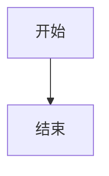

这篇文章记录 Obsidian 版 Markdown 的常见特有语法，以及这些语法迁移到 H2RO Archive 时应该怎么处理。

Obsidian 的基础正文仍然是 Markdown，但它在 Markdown 之上增加了双链、嵌入、属性、标签、PDF 批注链接、Canvas / Excalidraw / Dataview 等笔记软件能力。这些能力在 Obsidian 里很好用，但不一定能被普通 Markdown 渲染器或静态网站直接理解。

所以这篇文档分两部分：先说明 Obsidian 里这些语法本身是什么意思，再说明迁移到网站时如何转换。

## 1. Obsidian 版 Markdown 的边界

Obsidian 的 `.md` 文件大体可以分成三层：

| 层级 | 例子 | 迁移难度 |
| --- | --- | --- |
| 通用 Markdown | 标题、段落、列表、引用、代码块、表格 | 低 |
| 常见 Markdown 扩展 | Frontmatter、任务列表、数学公式、Mermaid | 中 |
| Obsidian 特有语法 | 双链、嵌入、块引用、PDF 批注、Dataview、Excalidraw | 高 |

通用 Markdown 可以直接保留。真正需要迁移处理的是第三层：这些语法依赖 Obsidian 的索引、插件或本地附件系统。

## 2. 属性 / Frontmatter

Obsidian 的属性面板本质上会写入 Markdown 文件顶部的 YAML frontmatter。

示例：

```yaml
---
created: 2025-09-19T10:29:00
modified: 2025-09-20T12:30:00
aliases:
  - Markdown教程
tags:
  - "#Markdown"
  - "#Obsidian"
---
```

常见用途：

- `created`：创建时间。
- `modified`：修改时间。
- `aliases`：别名，用于搜索或双链匹配。
- `tags`：标签。
- 插件字段：例如 `excalidraw-plugin`、Dataview 相关字段、自定义字段。

这些字段在 Obsidian 内用于检索、链接和插件工作；迁移到网站时需要整理成网站 schema 能理解的字段。

## 3. 双链 / Wiki Links

双链是 Obsidian 最核心的特有语法。

```markdown
[[数据结构]]
[[数据结构|显示文本]]
[[数据结构#二、链表]]
[[数据结构#二、链表|链表]]
```

含义：

- `[[数据结构]]`：链接到名为“数据结构”的笔记。
- `[[数据结构|显示文本]]`：链接目标是“数据结构”，显示文字是“显示文本”。
- `[[数据结构#二、链表]]`：链接到某篇笔记里的标题。
- `[[数据结构#二、链表|链表]]`：带显示文字的标题链接。

普通 Markdown 不认识 `[[...]]`。离开 Obsidian 后，它通常只是一段普通文本。

## 4. 块引用和标题引用

Obsidian 可以链接到标题，也可以链接到块。

标题引用：

```markdown
[[算法#双指针]]
```

块引用：

```markdown
这一段是一个可引用的块。^block-id

[[算法#^block-id]]
```

块引用适合个人知识库中的精确定位，但对网站发布不太友好。网站更适合使用标题锚点、明确小节标题或普通链接。

## 5. 嵌入语法

Obsidian 用 `![[...]]` 表示嵌入。

嵌入图片：

```markdown
![[Pasted image 20250325142422.png]]
![[diagram.png|500]]
![[diagram.png|500x300]]
```

嵌入 PDF：

```markdown
![[paper.pdf]]
```

嵌入另一篇笔记：

```markdown
![[某篇笔记]]
![[某篇笔记#某个标题]]
```

竖线后的 `500` 或 `500x300` 是 Obsidian 的显示尺寸，不是通用 Markdown 语法。

## 6. Callout 提示块

Obsidian 支持类似 GitHub 的 callout：

```markdown
> [!NOTE]
> 这是一条说明。

> [!TIP]
> 这是一条提示。

> [!WARNING]
> 这是一条警告。
```

Obsidian 还允许折叠和自定义标题：

```markdown
> [!NOTE]- 可折叠标题
> 这里是默认折叠的内容。

> [!TIP]+ 默认展开标题
> 这里是默认展开的内容。
```

不同平台对 callout 的支持不一致。GitHub 风格的 `NOTE`、`TIP`、`IMPORTANT`、`WARNING`、`CAUTION` 最容易迁移。

## 7. 标签

Obsidian 支持正文标签：

```markdown
#Markdown
#学习/语法
```

也支持在属性中写标签：

```yaml
---
tags:
  - Markdown
  - Obsidian
---
```

注意：

- 正文中的 `#include`、`#define` 不应该当成标签。
- 颜色值如 `#ffffff` 不应该当成标签。
- 层级标签如 `#学习/语法` 是 Obsidian 能力，不一定适合网站 tag。

## 8. PDF 批注链接

Obsidian 可以链接到 PDF 的页码、选区或批注。

示例：

```markdown
[[某篇论文.pdf#page=12&selection=10,0,20,1|论文第 12 页]]
[[某篇论文.pdf#page=7&annotation=428R|某条批注]]
```

这些链接依赖 Obsidian 的 PDF 阅读和批注系统。迁移时要判断 PDF 是否公开、批注是否有公开价值，以及是否需要保留页码信息。

## 9. Dataview、Excalidraw 和其他插件语法

Obsidian 的插件生态会产生一些普通 Markdown 无法理解的内容。

Dataview：

````markdown
```dataview
table file.mtime
from "课外学习"
```
````

Excalidraw 文件通常也是 Markdown，但包含插件字段和绘图数据：

```yaml
---
excalidraw-plugin: parsed
tags:
  - excalidraw
---
```

这些内容在 Obsidian 中可以动态渲染，但网站通常不能直接执行插件逻辑。迁移时应改成静态内容、图片或普通说明。

## 10. 迁移边界

迁移时默认只处理明确要公开的笔记。

不默认迁移：

- `.obsidian` 配置。
- `Templaters` 模板。
- 私密附件。
- 账号、密钥、恢复码。
- 仅用于 Obsidian 插件运行的元数据。
- 没有公开价值的临时草稿。

如果一篇笔记依赖大量本地上下文，先整理正文，再决定是否发布。

## 11. Frontmatter 转换

Obsidian 中常见 frontmatter：

```yaml
---
created: 2025-09-19T10:29:00
modified: 2025-09-20T12:30:00
aliases:
  - Markdown教程
tags:
  - "#Markdown"
  - "#Obsidian"
---
```

迁移到网站时转换为：

```yaml
---
title: 文章标题
published: 2025-09-19
updated: 2025-09-20
description: 一句话摘要。
tags: [Obsidian, Markdown, 语法]
category: self-study
draft: false
lang: zh-CN
---
```

字段映射：

| Obsidian 字段 | 网站字段      | 处理方式                                   |
| ------------- | ------------- | ------------------------------------------ |
| `created`   | `published` | 取日期部分，统一为 `YYYY-MM-DD`          |
| `modified`  | `updated`   | 可选，内容确实更新时保留                   |
| `tags`      | `tags`      | 去掉开头的 `#`，按最终发布口径整理       |
| `aliases`   | `alias`     | 需要兼容旧链接时再使用                     |
| 插件字段      | 不迁移        | 例如 `excalidraw-plugin`、自定义插件字段 |

如果没有 `created`，可以用文件修改时间或人工指定发布日期。

## 12. 分类和标签

Obsidian 的目录层级不直接等于网站分类。

例如原路径：

```text
课外学习/常用指令手册/tmux 学习笔记.md
```

网站中可以整理为：

```yaml
category: self-study
tags: [tmux, Linux, 终端, 语法]
```

分类用于大方向，标签用于主题颗粒度。不要把目录树完整搬进 URL，也不要为了每门课或每个文件夹新增一个分类。

## 13. 双链迁移

Obsidian 双链：

```markdown
[[数据结构]]
[[数据结构#二、链表|链表]]
```

网站不直接使用双链。迁移时按情况处理。

如果目标笔记也公开发布，转成站内链接：

```markdown
[链表](/self-study/data-structure/#二链表)
```

如果目标笔记不公开，转成普通文本：

```markdown
链表
```

如果只是文内跳转，优先改成标准锚点链接：

```markdown
[跳到链表小节](#二链表)
```

迁移时不要留下裸 `[[...]]`，否则网站构建后它只会作为普通文本出现，且读者不知道目标在哪里。

## 14. PDF 注释链接迁移

Obsidian 常见 PDF 注释链接：

```markdown
[[某篇论文.pdf#page=12&selection=10,0,20,1|论文第 12 页]]
```

处理规则：

- PDF 准备公开并生成预览时，转成对应 PDF 档案页或下载链接。
- PDF 不公开时，转成普通来源说明。
- PDF 只是个人阅读批注时，不把本地注释参数带到网站。

示例：

```markdown
参考：论文第 12 页。
```

或者：

```markdown
[查看 PDF 档案](/self-study/example-paper/)
```

## 15. 图片嵌入迁移

Obsidian 图片嵌入：

```markdown
![[Pasted image 20250325142422.png]]
![[diagram.png|500]]
![[diagram.png|500x300]]
```

网站使用标准 Markdown 图片：

```markdown

```

建议迁移结构：

```text
src/content/posts/article-slug/
  index.md
  assets/
    diagram.png
```

宽度信息需要人工判断是否保留。多数情况下不用保留，让文章样式自动处理图片宽度即可。

如果确实需要控制宽度，可以改成 HTML：

```html

```

但这类写法应少用。

## 16. 附件迁移

附件迁移规则：

- 图片复制到文章目录或公共图片目录。
- PDF 按网站文档预览规则处理。
- Word / PPT 先导出 PDF，再决定是否发布。
- Excalidraw 优先导出为 PNG 或 SVG，不直接发布插件源文件。
- PlantUML 可以导出为图片，或改写为 Mermaid。

不要直接把整个 `Attachment` 文件夹复制进网站。附件必须跟随文章逐个确认。

## 17. Callout 提示块迁移

Obsidian / GitHub 风格提示块：

```markdown
> [!NOTE]
> 这是一条说明。

> [!WARNING]
> 这是一条警告。
```

本站支持 GitHub 风格提示块，也可以改成容器指令：

```markdown
:::note
这是一条说明。
:::

:::warning
这是一条警告。
:::
```

推荐类型：

| Obsidian / GitHub | 网站类型      |
| ----------------- | ------------- |
| `NOTE`          | `note`      |
| `TIP`           | `tip`       |
| `IMPORTANT`     | `important` |
| `WARNING`       | `warning`   |
| `CAUTION`       | `caution`   |

Obsidian 里自定义的 callout 类型，如果网站没有样式，迁移时统一归并到上面几类。

## 18. 标签迁移

Obsidian 支持正文内标签：

```markdown
#Markdown
#主标签/子标签
```

网站文章不建议使用正文内标签。迁移时把标签集中放进 frontmatter：

```yaml
tags: [Markdown, 语法]
```

处理规则：

- 去掉开头的 `#`。
- 不把代码里的 `#include`、`#define` 当标签。
- 不把颜色值如 `#ffffff` 当标签。
- 层级标签是否保留，由发布时的 tag 口径决定。

## 19. 数学公式迁移

Obsidian 的常规 LaTeX 数学语法可以保留：

```markdown
行内公式：$E = mc^2$

$$
\sum_{i=1}^{n} i = \frac{n(n+1)}{2}
$$
```

迁移时注意：

- 很长的公式优先使用公式块。
- 检查 `$` 是否成对。
- 不要把普通货币符号误写成公式分隔符。

## 20. Mermaid 迁移

Obsidian 的 Mermaid 代码块通常可以直接保留：

````markdown

````

迁移时主要检查：

- Mermaid 代码块围栏是否闭合。
- 图中标签是否包含不兼容字符。
- 过大的图是否需要拆分。

## 21. Dataview 和插件语法迁移

Dataview 不作为网站正文语法。

Obsidian 中的 Dataview：

````markdown
```dataview
table file.mtime
from "课外学习"
```
````

迁移时需要改成静态内容：

- 手动整理成表格。
- 删除查询块。
- 改成普通说明。

网站是静态发布结果，不应该依赖 Obsidian 插件现场计算。

## 22. 代码块迁移

Obsidian 里有些笔记会出现错误围栏，例如：

````markdown
```这里是一段说明
命令内容
```
````

网站迁移时必须修正：

````markdown
这里是一段说明：

```bash
命令内容
```
````

推荐做法：

- 语言名使用 `bash`、`powershell`、`python`、`toml`、`yaml` 等标准值。
- 不确定语言时使用 `text`。
- 确认每个代码块都有闭合围栏。
- 不把标题、列表项、说明文字写在代码围栏同一行。

## 23. 表格迁移

Obsidian 表格大多可以直接保留。

```markdown
| 字段 | 说明 |
| --- | --- |
| `created` | 创建时间 |
| `tags` | 标签 |
```

迁移时注意：

- 表格前后留空行。
- 单元格里如果要写竖线 `|`，需要转义成 `\|`。
- 很宽的表格可以考虑拆分。

## 24. 注释和私有说明

Obsidian 注释：

```markdown
<!-- 这是一段只有自己看的说明 -->
```

迁移时默认删除，除非它本来就是要公开解释的内容。

同样需要检查：

- TODO。
- 私人备注。
- 本地路径。
- 未公开仓库地址。
- 账号、Token、恢复码。

## 25. 迁移检查清单

迁移一篇笔记时，按这个顺序处理：

1. 确认这篇是否适合公开。
2. 写入网站 frontmatter。
3. 由发布者确认 `category` 和 `tags`。
4. 转换 `[[双链]]`。
5. 转换 `![[附件]]`。
6. 检查代码块围栏。
7. 检查 Mermaid、数学公式、表格。
8. 删除私密注释和本地无效链接。
9. 运行构建或本地预览。
10. 人工阅读页面效果。

迁移的目标不是保留 Obsidian 的每一个细节，而是让公开页面读起来完整、来源清楚、后续还能维护。
