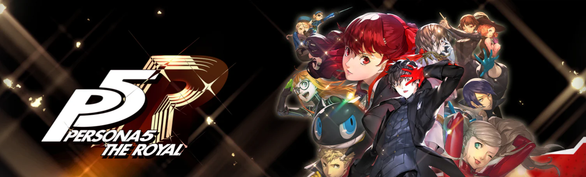
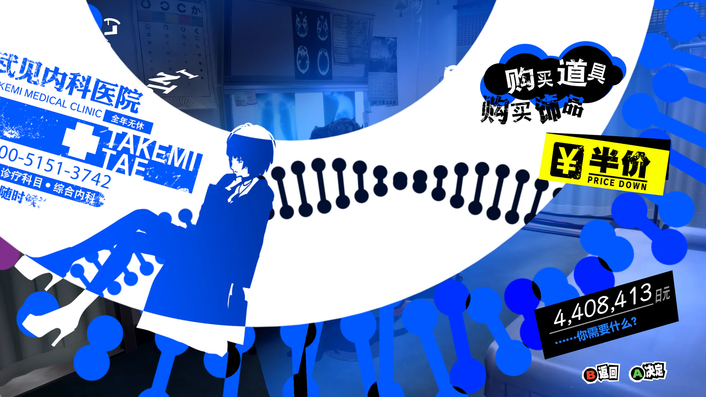
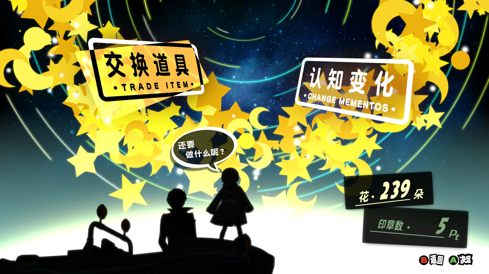
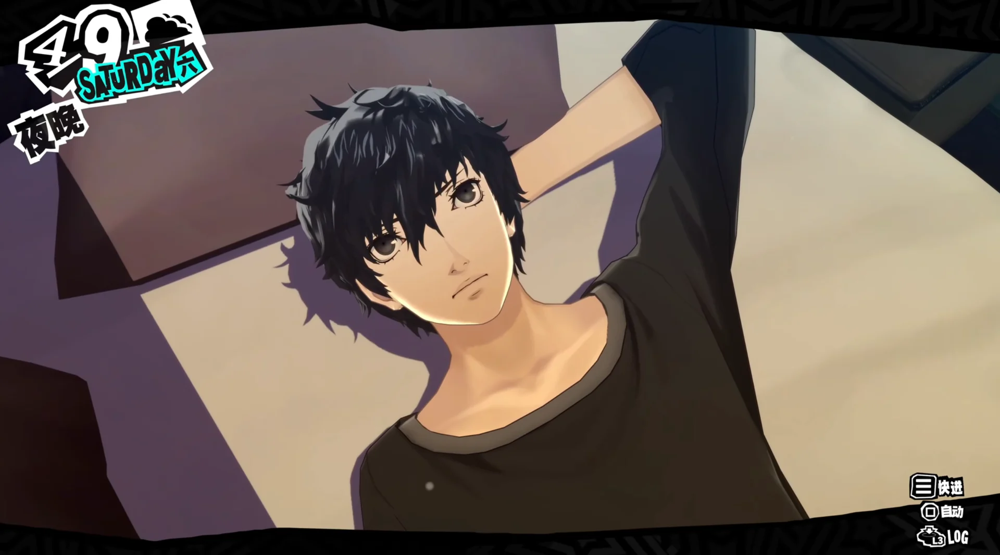
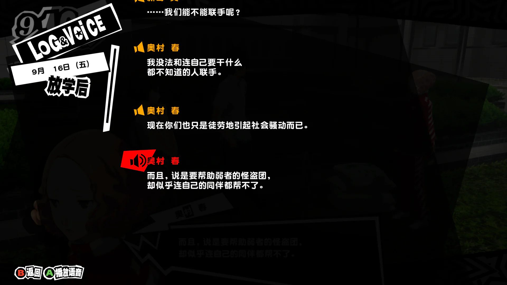
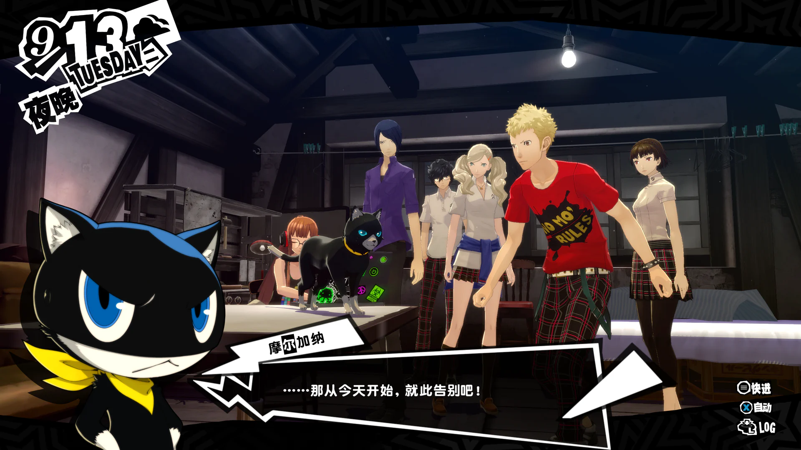
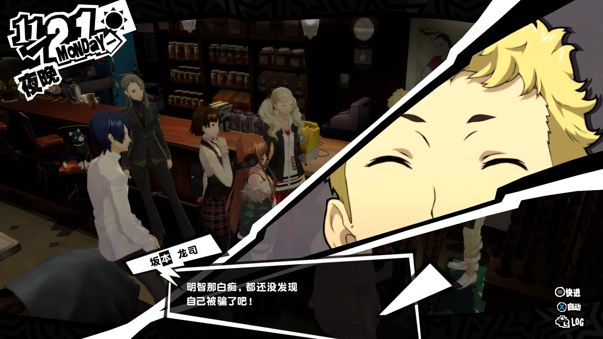
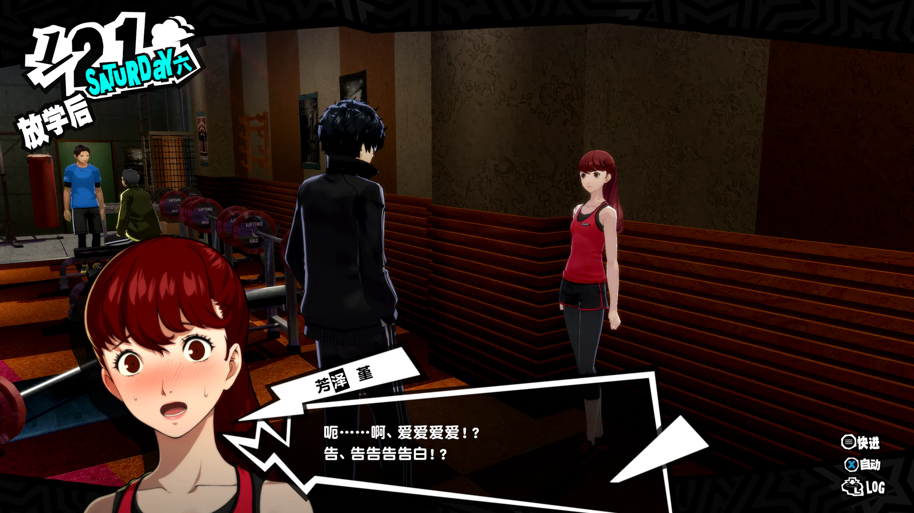
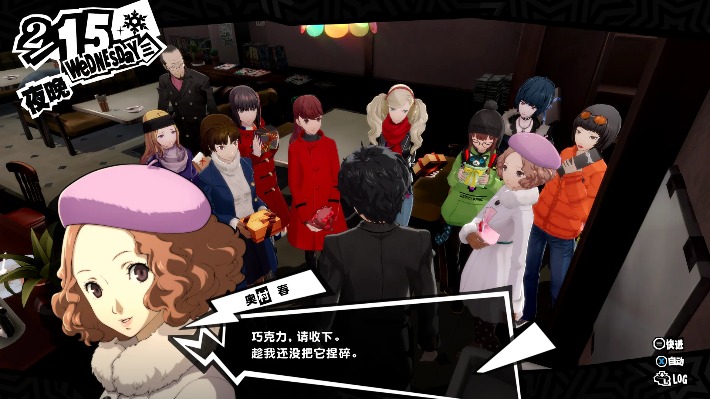

## 引言

> P5 都是天下第一了，P5 的皇家版该有多牛逼我都不敢想……

虽然上面这句有点串了，但不得不说 P5R 的开坑体验确实无可挑剔，一进入游戏看到这“潮出水”的 UI 再配合上顶级的音乐简直是享受，前期带点中二感的落魄少年修正世界的剧情也颇合我意。尽管开始是抱着“来瞧瞧被吹成天下第一的游戏什么水平”的心态，但第一次启动后就彻底停不下来，一口气花了几天做完全成就全 COOP，然后迫不及待地写下这篇感想:spoiler[其实更多是吐槽，对本人而言也许槽点会比优点更让我有动力创作]。

:::important
此文章是本人第一次通关 P 系列游戏后的感想，在后续吐槽时也不会涉及相比原版 P5 的改进。另外，这篇文章也会发布在我的博客上，所以再声明下这只是一篇吐槽和记录性质的玩后感，并不是什么正经的游戏测评，难免会掺杂不少笔者的主观想法与私货。
:::

其实标题已经表明了我的想法，但近百小时的游玩历程，终究不是一句话能概括的。写下这篇文章，既是为了记录此次 P5R 之旅，也是为了纪念我与 P 系列的初次相遇——相信这不会是我最后一次游玩 P 系列的作品，也许未来打完 P4R 后我会再来*善意对比*一下。

言归正传，其实在游戏进度过半时我对本作还是持全肯定态度的，所以在槽点出现前我还是会先聊聊 P5R 的优点与创新之处，很多精彩设计与美好体验的确值得好好记录下来。

---

## 简单夸夸

### 超时髦的美术与音乐

首先自然是最直观的视听体验，这也是 P 系列的长项，早在游玩前我就早有耳闻 P 系列的美术天下无敌，甚至我早已在制作 PPT 还有 Github 个人主页时，就借鉴过 P 系列的美术设计。而 P5R 的美术风格可以说在 P 系列里也是出类拔萃的，无论是怪盗团的人设还是 UI，都可以说是真正的**潮出水**，肯定也有很多人见识过 P5 大概是怎样的画风，诸如标志性的黑白红配色还有 joker 炫酷的人设，下面我再放两张图片让大家感受点不一样的。

不只是为了时髦度，P5R 的美术设计本身就和游戏主题深度绑定。本作大量采用暴漫与报纸式的视觉风格，既呼应了“新闻舆论”“大众热点”这些故事核心，也进一步放大了作品的二次元气质。更难能可贵的是，这些看似花哨的界面并没有牺牲实用性，几乎所有交互都一目了然，功能逻辑也很清晰。整个通关过程中，我几乎没有因为看不懂 UI 而烦恼过。

至于音乐，虽然本人完全是个外行但也能听出其水准之高，反正游戏 OST 我已经全部收藏了。

夸完上面这些，就不得不提本作的第一个也是最直白的**槽点**了——那就是 P5 特有的难绷比目鱼建模。很难想象二维美术方面这么有品的制作组会连个建模都做不好，如果说 P5R 的二维美术设计领先世界十年的话，那它的 3D 水平就是倒退二十年，尤其是这比目鱼眼距，我寻思这都不用什么美术素养是个正常人都觉得诡异吧……而且日厂也不是不擅长 3D 建模，看看同时期隔壁 ff 系列什么水平，甚至还不如轨迹的。每次和人物对话时先看看对话框左边的俊男靓女，再抬头看看实际的 3D 人物，让人不禁感慨这就是**卖家秀 vs 买家秀**吗？

### 丰富的地图设计

作为能让玩家代入的 JRPG 代表，P5R 在场景细节上的讲究十分令人称道，以东京地区作为故事舞台，将东京著名地标全面纳入游戏之中，并只选择展示各地的地标景观，比如吉祥寺的仿古街区与寺庙、秋叶原的女仆咖啡厅和游戏中心等等，既让玩家能体验大量东京名胜，同时也很好地突出各地区的重点与特色，做到了正向优质的文化输出。

### 细致的日历系统

P 系列的日历系统确实让我有种过好每一天的感觉:spoiler[虽然最后还是用攻略了]，再结合精心设计的日常活动，无疑能很好地提升代入感与真实性，比如打工、家庭餐厅自习、钓鱼还有约会等活动，玩家能自己规划好时间体验各种活动、提升主角的五维能力还有攻略角色，保证了充足的耐玩时长。

为了配合这种时序变化，游戏在天气、季节、衣着、饮食乃至迷宫状态上都做了细腻的呼应——主角冷时会盖被子，下雨天会撑伞，这些细节进一步强化了沉浸感。谁不想在下雨天撑着伞在室外漫步至然后回到咖啡厅自习呢，再配合 BGM 简直是顶级的学习氛围。然而，受限于半吊子的引擎和系统，场景对天气与季节的视觉表现还是有些力不从心，到了冬天最多飘点雪花，缺乏大雪纷飞等更具冲击力的环境体验。

### 创新的主题设计

本作虽然是 JRPG，也带有奇幻要素，但故事舞台并非架空异世界，而是直接以日本现实的学生生活作为故事场景，也算是都市奇幻题材。这样的融合可谓是 P 系列最大的创新，既满足真实生活的代入感，又植入冒险探索的奇幻体验——平时你只是一名平凡的日本高中生，暗地里又是拯救世界的大英雄，配上那股日系的中二气息，简直是二次元杀手。

事实上我对 P5R 的主线大纲是非常钟意的。它试图将镜头聚焦于社会偏见、政治黑幕、舆论斗争等社会现实问题的格局令人称赞。同时故事关注的并非抽象的社会现象，而是具体的人所面临的真实困境——主角团几乎全员都是社会问题的受害者。无论是为拯救朋友而战，还是被卷入舆论漩涡身不由己，他们始终是局中人而非居高临下的拯救者。正因如此，主角的冒险与玩家的体验之间，才建立起了一层密不可分的情感联结。

总的来说，以上这些优点其实足以让我有动力通关游戏，甚至过程也是相当沉迷。也正因此我对 P5R 还是持正面评价的。

这么看还能有什么缺点，是人设崩了还是烂尾了？接下来才是正题，请容我娓娓道来……

---

## 说点心里话

> 你的 UI 确实潮出水，但你的细节又泡了水。

像是宫殿、印象空间这类公认的糟粕我就不多聊了，我对 P5R 最大的意见还是剧情和人物塑造，可以看出文案组和美术组的水平差距确实不小。

### 尚不成熟的剧情设计

#### 幼稚的主线剧情

虽然前面提到我很喜欢 P5R 的主线大纲，在前面几十小时战胜各种阴暗心理的大人物和解决各种社会问题的确很爽，但它的主线本质还是王道的**邪不压正**叙事。那么问题来了，实际上诸多复杂严肃的社会问题是不能被这么简单地抽象成“要战胜具体的某个敌人让 ta 悔改”的公式的，这就和怪盗团想要利用能力改造社会的想法冲突了——说到底，主角们能解决的，不过是身边的或网站上收集到的问题罢了。

事实上主线就是这么安排的，所有案件主角方都或多或少与反派相关。举个不那么恰当的例子，如果丸喜的宫殿设置在一个更远的主角接触不到的地方，那你不直接炸了。正是这种**问题深刻**与**做法幼稚**之间的强烈割裂感，构成了本作主线剧情最大的问题。

制作组应该也意识到了这个问题，所以他们最后选择把大众愚昧的锅全都甩给了一个“神”，最终主角团攻略印象空间打败旧神，可喜可贺迎来结局。我对这个高潮和结局的设计是满意的，虽然它本质是回避了上面的问题，但至少用超自然力量作为归因是自洽的，而且最终 Boss 在此前也有伏笔不算机械降神。

这个矛盾本来就不好解决，归根究底是编剧一开始非要写成**主角立志改造社会**，把格局上升得过高。试想如果主角团只是一个事务侦探所之类的，主线是一步步解决各种委托，到最后“顺手”拯救了世界。这样剧情至少自洽，看似格局小了但是好好写也可以很有深度。

:::note
预告信机制堪称天才，不仅在剧情上具备可解释性和必要性，也能很好地增加怪盗团的时髦值，同时由于预告信会暴露自身存在，所以也暗含对怪盗团谨言慎行的警示，只可惜编剧似乎并没有想深入到第三点。
:::

除了这个大问题以外，主线有些细节也是糙得不行。我都数不清主角团开导航被跟踪多少次了，还不涨点教训，每次先找个隐蔽地方再潜入很难吗？还有主角团的内部矛盾也是莫名其妙，点名 MONA 的出走剧情。起因写得一坨，明明编剧前面也有铺垫过 MONA 和龙司互嘴，我也能明白编剧要表达的意思，结果实际能写得这么让人高血压，请问这段是请小学生写的吗？这点后面到了人物塑造我还会再提。

#### 割裂的 COOP 剧情

这点只能算小瑕疵。COOP 系统本来就是为好感剧情和恋爱要素服务的，这也是 JRPG 的老传统了。单论每条 COOP 线的剧本，其实写得都不错，只是可惜这些羁绊在主线里基本没有体现，除了编剧特意安排的约会桥段或结局画面。就算好感度刷满了，主线里和她的互动还是不会变。希望阿特拉斯以后技术力能跟上，这样玩家的沉浸感也能进一步提升。

### 深度不足的人物塑造

#### 雨宫莲

通关后逛社区刷帖子的时候，我发现大家对主角的评价普遍非常高。诚然雨宫莲作为怪盗团团长的外形可以说是 P5 人设的集大成者，福山润的配音更不用多说，帅就完了。

但我对 P5R 人物塑造**最失望**的就是 joker，在我看来这代主角本质就是传统 galgame 里的摄像头式男主。他固然从不拖累团队，多数时候都是队伍里的 MVP。但就是这样一个大有可为的主角，只能在 COOP 剧情攻略对象时说说骚话，到了主线剧情就是沉默寡言，连对话选项都不给玩家，可能是把主线该说的话全都用在审讯室攻略新岛姐姐了吧。请了福山润就这么用是吧，想听两句台词都只能进战斗里找。

问题的集大成者就是前面提过的 MONA 出走事件。其实 MONA 回归后众人的交谈就写得挺自然的，人物动机也讲得很清楚，那你为什么当初出走的时候写成小学生吵架？当然这段里 joker 也是一言不发站在最后，仿佛一切与自己无关，仿佛 MONA 只是一只从没见过的野猫，这就是怪盗团团长的担当？当然也不只是这一处有问题，都说这种男主设计的好处是有代入感，但基本的人设不能崩，我实在代入不了这样一个没有责任没有团魂的团长。

就这样阿特拉斯成功把人设本应最出彩的“王牌”写成了一个沉默寡言的打手:spoiler[这何尝不是一种 joker]。

#### 明智吾郎

明智吾郎这个角色我“久仰大名”，当年排动画角色九宫格时就有人把他排在最讨厌的二次元角色里。可能就是因为我对他根本没有任何预期，导致在实际通关后反而没觉得这人物有多么令人厌恶——说实话我还以为结局是强行给他整活了然后天天和男主卖腐。到了新增剧情他也丝毫不遮掩自己的本性，最后还是死了，这样我反倒没那么反感了。至少这个人物的结局安排是对的。

不过卖腐确实有点膈应，我就当是因为做的全 COOP 所以男主会有点感情，如果打二周目我是绝对不会攻略明智的。

总结下就是一个没有逼格以至于缺少人格魅力的反派。不过能把这样一个同样大有可为的反派最后的复仇手段和目的又写成问题少年过家家式的闹剧，**难道这也是一种 joker**？看得出来阿特拉斯你很喜欢小丑了。虽然很多人把本作烂尾都归因给他的塑造问题，但我觉得罪不至此，这人的塑造和主角坐一桌，都属于不及格。

#### 学妹

平庸，比明智吾郎还要平庸的塑造。前两个角色至少还是有希望写好的，但学妹的剧情我只觉得敷衍。本质只是一个 DLC 的新增 NPC，就这样阿特拉斯偏偏要给她宣传得像是 P5R 的真女主一样，除了有一个和男主的 show time 以外看不出任何用心之处，甚至在结局前一天话别时直接不出现了，只在最后站台匆匆对话两句。这就是真女主的待遇吗？实在辜负了这么好看的人设。

#### 其他配角与主角团羁绊

这个游戏的社群角色多达十余人，但个个塑造只是蜻蜓点水，缺乏更深入的挖掘，也限制了角色的深度和立体感，在我看来其余配角也都是一个个编剧贴好的标签，即使有的角色会在 COOP 剧情里成长，也不会在主线里有所体现。

顺便一提，游戏里的聚会和度假剧情实在让人难绷。烟花大会撞上大雨，修学旅行乏善可陈，基本全是站桩对话。仔细回想，正常的团建场面除了站桩就是一起吃饭，明明团建活动也不少，但其余画面都是草草带过，一点印象都没有。一个音画如此顶级的游戏却没塑造好几个团建氛围浓厚的场景。

综上所述， P5R 中不会有任何一个角色能跻身我心中的 RPG 经典角色长廊。如果一个 JRPG 作品连一个经典角色都塑造不出来，那别说天下第一，连自称 JRPG 分类的第一都够呛。

### 毫无诚意的新版结局

在体验完 P5R 的全部结局后，我还是更喜欢无印结局。皇家版改动的结局毫无诚意，纯粹是狗尾续貂，说白了就是完全服务于卖角色的，甚至在结尾非要让丸喜接男主导致最后主角团没能像无印那样一起驾车远行，最打动我的画面就这样被替换了，ED 也是完全调动不起情绪，不如原版一根。

既然如此，还不如把新剧情真的做成 DLC，这样 P5 老玩家更能接受而且能保留最好的无印结局。

## 总结

写完回头一看，暴论可能不少，但都是我发自内心的想法。这么看下来， P5R 的确是一部充满割裂的作品：玩法是创新的，技术是落后的；问题是深刻的，解决办法是儿戏的；2D 画面是精美的，3D 建模是粗糙的；生活细节是丰富的，体验内容是乏味的。它能跻身 JRPG 的第一梯队，却未能留下一个经典角色，甚至也未曾让我感觉到主角团的羁绊之深；它有着丰富和扎实的体验内容，同时又欠缺塑造和探索深度。

总而言之，P5R 在主题探讨、游戏玩法和表现形式方面，都存在着两极化的割裂感，也因此它无法成为我心中的天下第一。或许它的堆料足够顶级，整体质量足够高，但在我最看中的几点都没能做到最好，而它本能做到更好。

最后一定要感谢下 [爱心迷图](https://space.bilibili.com/742075) 大佬精心制作的 [P5R 一周目全 coop 白金攻略日程安排](https://www.bilibili.com/opus/719119508561723427)。像我这种懒狗就可以不用多花时间和脑细胞规划日程开箱即享了。

未来 P4R 再见，据说这一代的剧情会是 P 系列巅峰，这下不得不期待了。

